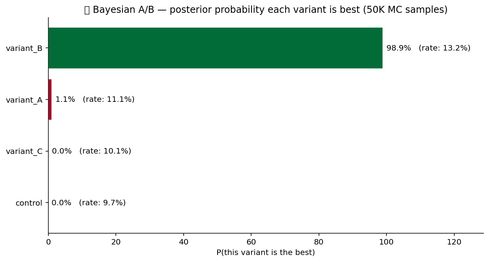

# 🧪 A/B Test Pack

A/B test analysis primitives. Delta-method confidence intervals for
ratio metrics, Bayesian best-arm probability, sample-size calculator
for the planning stage, sequential SPRT for early stopping. The
standard toolkit for online experimentation.

## Steps

| Step | Purpose |
| --- | --- |
| `delta_method_ratio` | Confidence interval for a ratio metric (e.g., revenue / sessions) via the delta method. |
| `best_bayesian_ab` | Posterior probability that each arm is best, plus expected loss. |
| `sample_size_calc` | Sample size needed to detect a given effect at a given power. |
| `sequential_sprt` | Sequential Probability Ratio Test — stop early when evidence is sufficient. |

## Killer demo — Bayesian best-arm probabilities

`best_bayesian_ab` on a 3-arm test (control + two variants). The bar
chart shows the posterior probability that each arm is best — this
is the "if we shipped today, how confident are we we picked the
right one" number. Pairs naturally with the expected-loss metric
(also in the output frame) for the "and how bad if we're wrong" half
of the decision.

The output frame contains per-arm `posterior_mean`, `prob_best`,
`expected_loss` — drop-in for the experiment scorecard.

## Requirements

- `scipy>=1.11`

## Changelog

### 0.1.0 — 2026-05-10

- Initial release.
