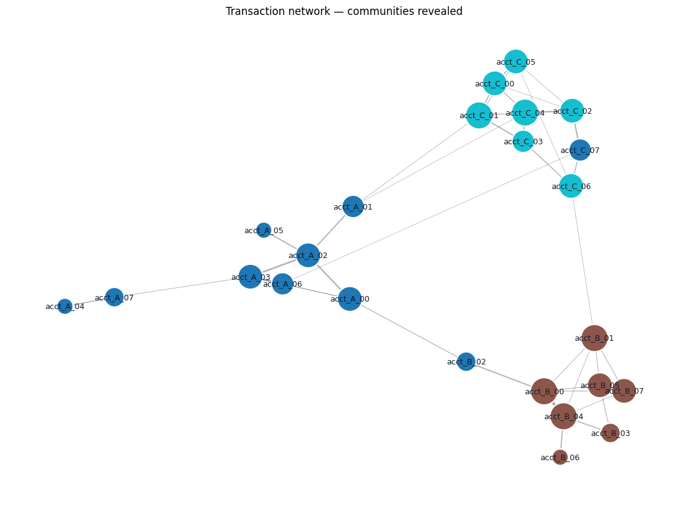

# 📊 Analytics Charts

Visualizations that close the loop on an analysis. Pairs with `stats_pro`
for the full classification deliverable and with the built-in
`linear_regression` / `logistic_regression` / `pca` / `kmeans` for
model-evaluation visuals.

## Steps

| Step | Purpose |
| --- | --- |
| `roc_curve` | Receiver Operating Characteristic + AUC for binary classifiers |
| `pr_curve` | Precision-Recall curve + average precision (preferred over ROC for rare positives) |
| `confusion_matrix` | Heatmap of actual × predicted class counts (with row / column / overall percent normalisation) |
| `coefficient_ci_plot` | Forest-style plot of coefficients with 95% CI; sign-significance colored |
| `calendar_heatmap` | GitHub-style year-view of (date, value) — surfaces day-of-week / week-of-year patterns |
| `treemap` | Area-proportional rectangles for part-to-whole composition |
| `sankey_flow` | Static Sankey from (source, target, value) — user journeys, attribution, transitions |
| `chord_diagram` | Circular many-to-many relationship plot |
| `dendrogram` | Hierarchical clustering tree (ward / average / complete / single linkage) |
| `kpi_card` | Big-number cards with optional baseline comparison |
| `network_graph` *(new in v0.2.0)* | Force-directed network plot with greedy-modularity community coloring |

## Killer demo — transaction network with community detection

Force-directed layout reveals three clusters of accounts that transact
heavily within their own group plus a few cross-cluster links. Node
size scales with degree; node color marks the auto-detected community.



## Requirements

```bash
pip install "matplotlib>=3.8" "scikit-learn>=1.3" "scipy>=1.11" "squarify>=0.4"
```

DIG installs these automatically when you install the pack.

## Example use cases

### A · Complete classifier evaluation
You ran `logistic_regression` (in `stats_pro`) and want the standard
binary-classification output: ROC curve, PR curve, confusion matrix,
and a forest plot of the coefficients.

```
csv (training_data.csv) → logistic_regression
                            target: churned
                            features: [tenure_months, monthly_spend, support_tickets]
                          ─┐
                           ├─ roc_curve (actual: churned, proba: predicted_proba)
                           ├─ pr_curve  (actual: churned, proba: predicted_proba)
                           ├─ derive_column (predicted_class = predicted_proba > 0.5)
                           │  → confusion_matrix (actual: churned, predicted: predicted_class,
                           │                      normalize: row_percent)
                           └─ (the fit-artifact coefficients)
                              → coefficient_ci_plot (sign-significance colored)
```

The four charts together form the canonical binary-classification
deliverable. The confusion matrix's `row_percent` normalisation
shows recall (per-row); switching to `column_percent` shows precision.

### B · Marketing engagement dashboard
KPI cards on top, calendar heatmap to spot weekly patterns, treemap
of channel revenue, sankey of the funnel.

```
csv (events_2026.csv) → ─┐
                          ├─ group_aggregate (sum revenue by channel)
                          │  → kpi_card (label: channel, value: revenue,
                          │              baseline: revenue_2025, format_value: currency_usd)
                          │
                          ├─ group_aggregate (sum sessions by date)
                          │  → calendar_heatmap (date: date, value: sessions, color_scale: Greens)
                          │
                          ├─ group_aggregate (sum revenue by channel × campaign)
                          │  → treemap (label: campaign, value: revenue, colorColumn: channel)
                          │
                          └─ derive_column (funnel_stage from page_path)
                             → group_aggregate (count by from_stage × to_stage)
                             → sankey_flow (source: from_stage, target: to_stage, value: n)
```

Each chart isolates one question: KPIs answer "are we up or down",
calendar shows when traffic concentrates, treemap shows where the
revenue lives, sankey shows where users drop off.

### C · Customer-segment dendrogram
You want to know which customer cohorts behave alike based on a
multi-feature embedding.

```
csv (customers.csv) → group_aggregate (mean of every behavioural metric per segment)
                    → vector_arithmetic (normalize_l2)            # so feature scales don't dominate
                    → dendrogram (vectorColumn: features, labelColumn: segment, method: ward)
```

The dendrogram cuts at any height to choose K clusters; sister
branches are the most similar segments by the linkage metric.

### D · Bilateral trade flows
Country × country trade matrix as a chord diagram — every node both
exports and imports, the chord widths show net flow.

```
csv (trade_flows.csv) → group_aggregate (sum export_value by exporter × importer)
                      → chord_diagram (source: exporter, target: importer, value: export_value)
```

For any many-to-many relationship where source and target are drawn
from the same set of categories — chord is the natural choice over
sankey (which assumes distinct source / target levels).

## Demo pipelines

Two importable demo `.dig.json` files live under `demos/`:
[`demos/classifier-evaluation-demo.dig.json`](demos/classifier-evaluation-demo.dig.json)
and [`demos/engagement-dashboard-demo.dig.json`](demos/engagement-dashboard-demo.dig.json).
Drag either onto the `/pipelines` page in DIG to import.

## Changelog

### 0.1.0 — 2026-05-09

- Initial release: `roc_curve`, `pr_curve`, `confusion_matrix`,
  `coefficient_ci_plot`, `calendar_heatmap`, `treemap`,
  `sankey_flow`, `chord_diagram`, `dendrogram`, `kpi_card`.
