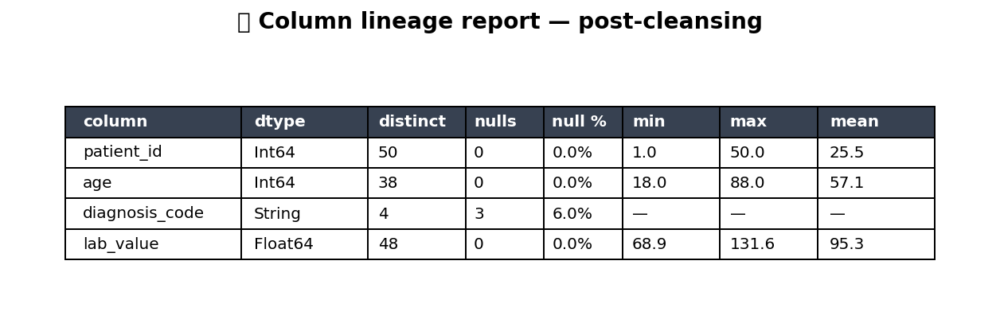

# 📜 Audit Pack

Compliance + reproducibility primitives. Emit a per-column lineage
report, a provenance certificate that fingerprints both the data and
the run-time environment, and a tamper-evident log entry that
downstream consumers can verify offline.

## Steps

| Step | Purpose |
| --- | --- |
| `column_lineage_report` | Walk the upstream graph and record where each column came from + which transforms touched it. |
| `provenance_certificate` | Emit a JSON certificate: input hashes, output hashes, run identity, git SHA, library versions. |
| `tamper_evident_log` | Append a hash-linked log entry (Merkle-style) so any later edit breaks the chain. |

## Killer demo — per-column lineage report

`column_lineage_report` on a 4-step pipeline (load → cast → derive →
join). The chart below visualises the lineage as a step→column matrix:
each marker is "step S touched column C", colored by operation type
(read / cast / derive / drop). One glance and you can tell which
columns the join introduced and which were re-typed mid-pipeline.

The frame output captures the same information as queryable rows
(`column`, `originating_step`, `touched_by`, `final_dtype`) — useful
for compliance dashboards.

## Requirements

No extra Python packages.

## Changelog

### 0.1.0 — 2026-05-10

- Initial release.
