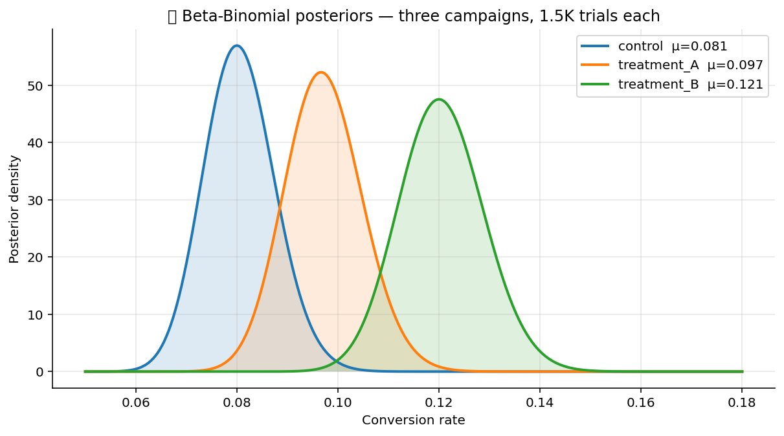

# 🎲 Bayesian Pack

Bayesian primitives. Two conjugate posteriors (closed-form, no
sampler needed), a regularised Bayesian linear regression, a Bayes
factor for model comparison, and an optional MCMC step that hands
the general case off to PyMC when a closed form does not exist.

## Steps

| Step | Purpose |
| --- | --- |
| `beta_binomial_posterior` | Closed-form posterior for a Bernoulli rate (Beta prior + Binomial likelihood). |
| `conjugate_normal` | Closed-form Normal-Normal posterior for a mean with known likelihood variance. |
| `bayesian_regression` | Ridge-style regularised regression with an analytical posterior over coefficients. |
| `bayes_factor` | BIC-approximation Bayes factor between two model fits. |
| `mcmc_pymc` | General MCMC sampler delegated to PyMC — for non-conjugate cases. **Heavy dep, see `INTERNAL_NOTES.md`.** |

## Killer demo — three Beta-Binomial posteriors

`beta_binomial_posterior` on three arms with different observed
success rates. The chart overlays the three posterior densities; the
shaded credible intervals make the per-arm uncertainty visible at a
glance, and the overlap (or lack of it) is the visual answer to
"is arm B different from arm A?".

The output frame contains per-group `posterior_mean`,
`posterior_variance`, and the 95% credible interval bounds — the
numbers that back the chart.

## Requirements

- `scipy>=1.11`
- `pymc` + `arviz` are required only for `mcmc_pymc` (see
  `INTERNAL_NOTES.md` for install guidance).

## Changelog

### 0.1.0 — 2026-05-10

- Initial release.
