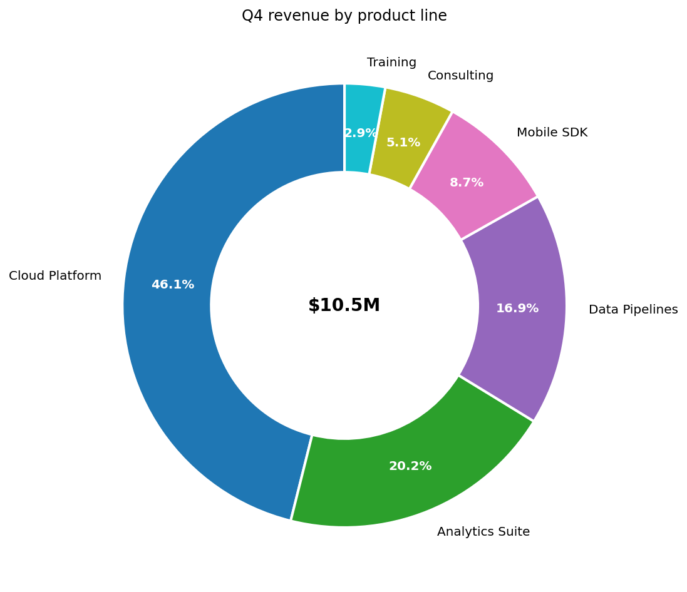
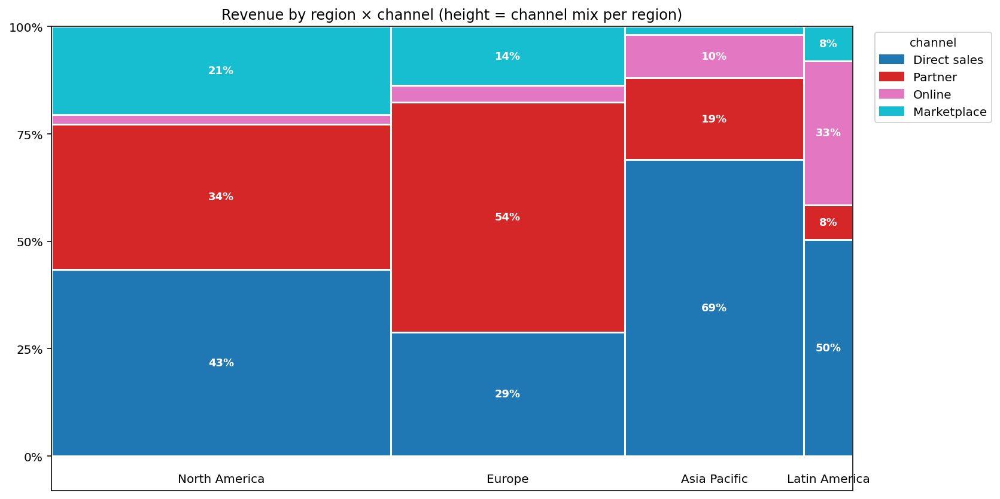
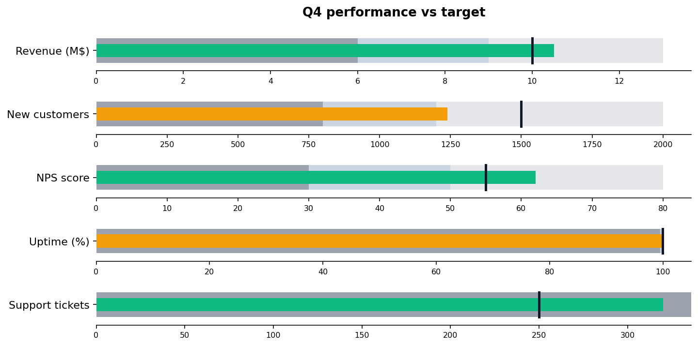
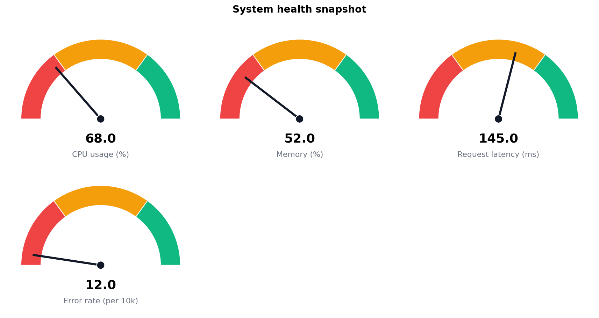

# 📈 Business charts

BI-dashboard chart kinds DIG's built-in `export_to_image` doesn't ship.

## Steps

| Step | Purpose |
| --- | --- |
| `waterfall_chart` | Cumulative-contribution chart (start → +A → −B → +C → end) |
| `pareto_chart`    | Bar + cumulative-line; the classic 80/20 visualization |
| `funnel_chart`    | Sequential conversion funnel with drop-off labels |
| `pie_donut`       *(new in v0.2.0)* | Classic part-to-whole pie or donut with a center label |
| `mosaic_marimekko` *(new in v0.2.0)* | 2-D part-to-whole; column widths track row totals |
| `bullet_chart`    *(new in v0.2.0)* | Tufte's compact target-vs-actual + bands chart |
| `gauge_chart`     *(new in v0.2.0)* | Speedometer-style single-metric chart with red/amber/green bands |

## Killer demos

### Donut — Q4 revenue composition by product line
Six product lines, donut variant with a $10.5M total in the middle.



### Marimekko — revenue by region × channel
Each region's column width reflects total revenue; within the column,
the channel-mix percentages stack to 100%. Lets one chart answer
"which region is biggest *and* what's its channel mix?".



### Bullet chart — Q4 KPIs vs target
Five KPIs, each with poor / OK / good bands, the actual value as a
filled bar, and the target as a vertical marker. Green = beat target,
amber = OK, red = below the poor threshold.



### Gauge — operational system health
Four metrics rendered as speedometers with red/amber/green zones.



## Requirements

```bash
pip install "matplotlib>=3.8"
```

## Changelog

### 0.2.0 — 2026-05-10

- Add `pie_donut`, `mosaic_marimekko`, `bullet_chart`, `gauge_chart` —
  the executive-dashboard idioms missing from v0.1.

### 0.1.0 — 2026-05-05

- Initial release.
