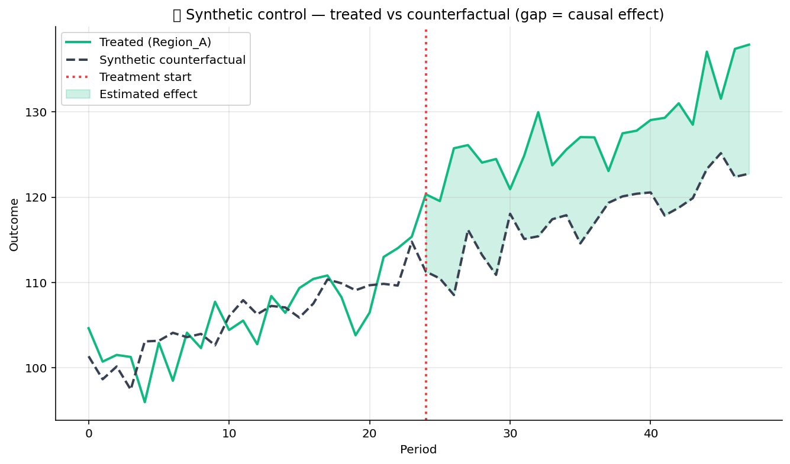

# 🔬 Causal Inference

Causal-inference toolkit. Five quasi-experimental designs:
propensity-score matching, difference-in-differences, regression
discontinuity, instrumental variables, synthetic control. The
standard kit when an A/B test is not feasible.

## Steps

| Step | Purpose |
| --- | --- |
| `propensity_score_matching` | Fit a propensity model, match treated to control on the propensity, report ATT. |
| `diff_in_diff` | Two-period × two-group regression for the canonical DiD estimate. |
| `regression_discontinuity` | Local linear regression around a cutoff to identify the discontinuity jump. |
| `instrumental_variables` | Two-stage least squares with a specified instrument. |
| `synthetic_control` | Construct a weighted donor-pool counterfactual for a single treated unit. |

## Killer demo — synthetic control

`synthetic_control` on a single treated unit (treatment starts at
period 30) with 9 donor units. The chart overlays the treated
trajectory with the synthetic-control counterfactual, marks the
treatment-start period with a vertical line, and shades the gap —
the implied causal effect.

The output frame contains the per-period treated value, synthetic
value, and the gap (the per-period treatment effect estimate).

## Requirements

- `statsmodels>=0.14`
- `scikit-learn>=1.3`
- `scipy>=1.11`

## Changelog

### 0.1.0 — 2026-05-10

- Initial release.
