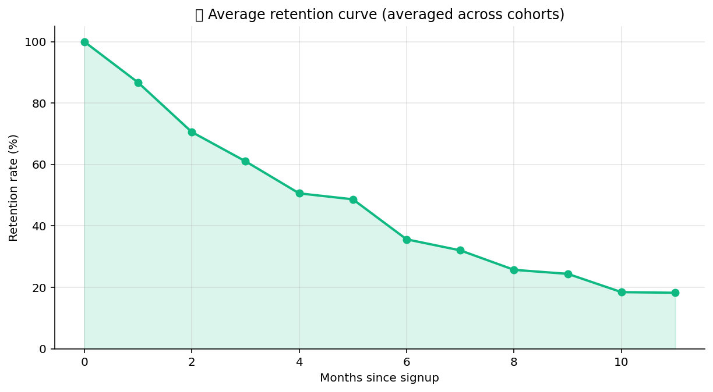

# 👥 Cohort Retention

Product-analytics primitives for activation + retention. Build the
cohort table, fit a retention curve, run a survival-style retention
analysis, compute lifetime value with discounting.

## Steps

| Step | Purpose |
| --- | --- |
| `cohort_table` | Bucket users by signup period, then count active in each subsequent period (the classic triangle). |
| `retention_curve` | Fit a retention curve (power-law or exponential) and report the half-life. |
| `survival_retention` | Kaplan-Meier-style retention with right-censoring for users still in the window. |
| `ltv_with_discount` | NPV of expected revenue per cohort using a discount rate + retention curve. |

## Killer demo — fitted retention curve

`retention_curve` on a 12-month cohort. The chart overlays the raw
per-period retention (markers) with the fitted curve (line) and marks
the half-life — the period at which 50% of the cohort has churned.
Power-law fits are typical for consumer products; the half-life is
the single number stakeholders actually understand.

The output frame has `period`, `observed_retention`, `fitted_retention`
and the curve's parameters in run metadata — driveable straight into a
dashboard.

## Requirements

No extra Python packages.

## Changelog

### 0.1.0 — 2026-05-10

- Initial release.
