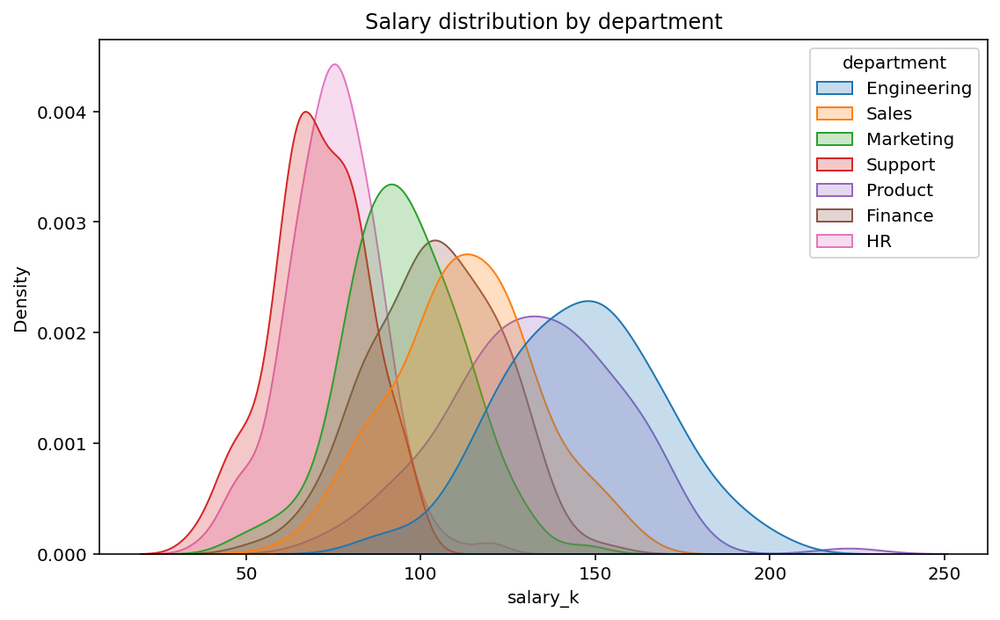
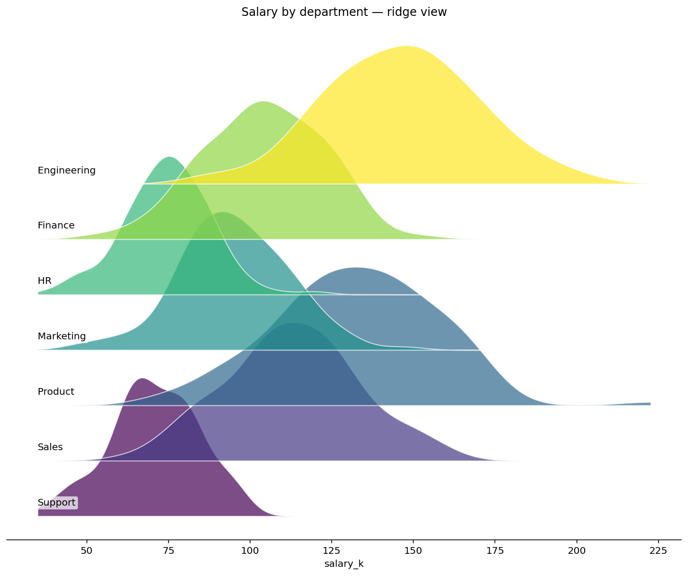

# 📊 Diagnostic charts

Chart kinds the built-in `export_to_image` doesn't cover — used during
analysis, not for stakeholder dashboards.

## Steps

| Step | Purpose |
| --- | --- |
| `box_plot`     | Box-whisker plot (per-group distribution, robust outlier markers) |
| `violin_plot`  | Violin plot (KDE + box-plot hybrid) |
| `qq_plot`      | Q-Q plot vs. normal distribution — visual normality check |
| `ecdf_plot`    | Empirical cumulative distribution function |
| `density_plot` *(new in v0.2.0)* | Smooth distribution via Gaussian KDE; optional grouping |
| `ridge_plot`   *(new in v0.2.0)* | Stacked density per group (Joy-Division-style) |

Each step writes a PNG to the run's output directory and passes the
input data through unchanged. Pair with multiple chart steps in a row
to produce a diagnostic dossier.

## Killer demos

### Density per group — salary distribution by department
KDE shows the *shape* of each department's salary distribution, with one
overlapping curve per category. Better than histograms when N is large
or bin counts dominate appearance.



### Ridge plot — same data, vertical small-multiples
Stacks the per-department densities top-to-bottom so 5–30 groups can be
compared at a glance. The classic "Joy Division cover" arrangement.



## Requirements

```bash
pip install "scipy>=1.11" "seaborn>=0.13"
```

DIG installs these automatically when you install the pack.

## Changelog

### 0.2.0 — 2026-05-10

- Add `density_plot` (Gaussian KDE with optional grouping).
- Add `ridge_plot` (stacked per-group densities, Joy-Division layout).

### 0.1.0 — 2026-05-05

- Initial release.
