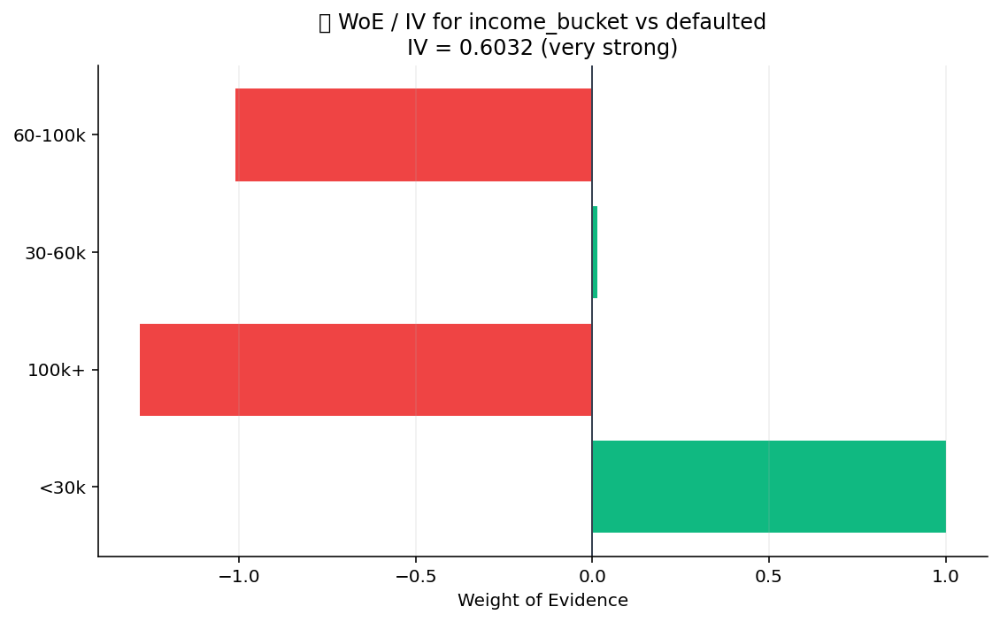

# 🛠 Feature Engineering

ML-ready feature transforms. Lag features for time series, target
encoding for high-cardinality categoricals, polynomial features for
non-linear baselines, weight-of-evidence + information value for
credit-risk pipelines, three scalers, and Yeo-Johnson for
near-normalising arbitrary distributions.

## Steps

| Step | Purpose |
| --- | --- |
| `lag_features` | Shift columns by N rows (per-group if a group column is given). |
| `target_encoding` | Replace each category with the mean of the target — leakage-safe via cross-fold. |
| `polynomial_features` | Generate degree-N polynomial + interaction terms. |
| `woe_iv` | Weight-of-evidence transform + information value per feature. |
| `scale_standard` | (x − mean) / std. |
| `scale_robust` | (x − median) / IQR. |
| `scale_minmax` | Map to [0, 1]. |
| `yeo_johnson` | Power transform that handles zero / negative inputs (unlike Box-Cox). |

## Killer demo — weight-of-evidence + information value

`woe_iv` on a synthetic credit dataset (5 features × 2,000 rows × a
binary default target). The bar chart ranks features by Information
Value: anything above 0.3 is "strong predictor", 0.1–0.3 is "medium",
below 0.02 is "useless". This is the credit-risk standard for picking
features before fitting a logistic-regression scorecard.

The output frame contains the per-bin WoE values + per-feature IV,
ready to drive feature selection or to be applied as a transform on
the modelling frame.

## Requirements

- `scikit-learn>=1.3`

## Changelog

### 0.1.0 — 2026-05-10

- Initial release.
