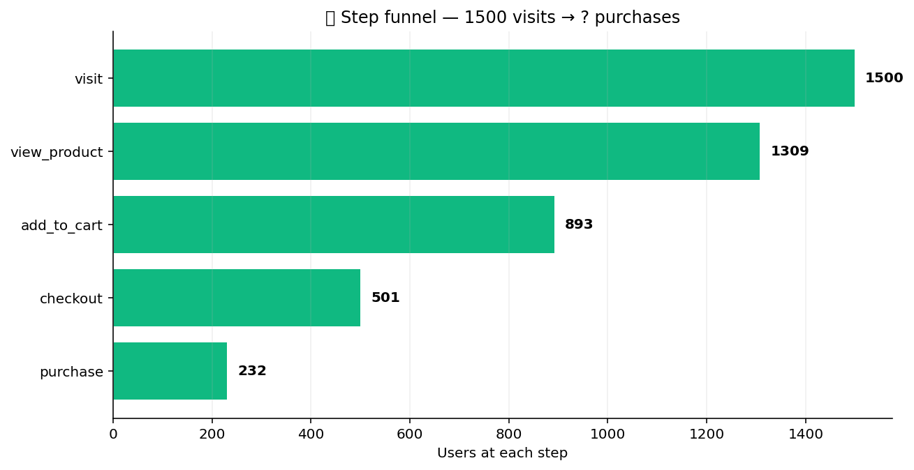

# 🪜 Funnel Pack

Sequential-step funnel analysis. Count completions per step,
measure time-to-convert, attribute drop-off between consecutive
steps, and handle multi-path funnels where users complete steps
out of order.

## Steps

| Step | Purpose |
| --- | --- |
| `step_funnel` | Count users completing each step in the prescribed order. |
| `time_to_convert` | Per-step latency distribution (median, p90, p99). |
| `drop_off_attribution` | For each consecutive step pair, attribute drop-off to specific user segments. |
| `multi_path_funnel` | Allow steps to complete in any order; report path frequency. |

## Killer demo — classic funnel chart

`step_funnel` on a 5-step signup → activation funnel for 5,000 users.
Each bar is the count entering that step; the percentage between bars
is the conversion rate from the prior step. The chart makes the
narrowest pass-through obvious — the place to invest a follow-up
experiment.

The output frame contains one row per step with `step`, `users_at_step`,
`conversion_from_prev`, and `cumulative_conversion` — the data that
backs the bar chart.

## Requirements

No extra Python packages.

## Changelog

### 0.1.0 — 2026-05-10

- Initial release.
