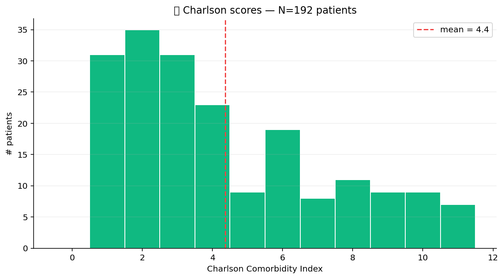

# 🏥 Healthcare Pack

Healthcare-data primitives: ICD-10 + CPT code lookup against small
bundled tables, HIPAA-style de-identification of safe-harbor
identifiers, Charlson Comorbidity Index computation from an ICD-10
diagnosis frame.

## Steps

| Step | Purpose |
| --- | --- |
| `icd10_lookup` | Join an ICD-10 code column against the bundled chapter / category description table. |
| `cpt_lookup` | Same for CPT procedure codes. |
| `hipaa_deidentify` | Strip / generalise the 18 HIPAA Safe Harbor identifiers (names, dates → year, zip → 3-digit, etc.). |
| `charlson_index` | Roll up per-patient ICD-10 diagnoses into the Charlson Comorbidity Index score + weighted variant. |

## Killer demo — Charlson Comorbidity Index distribution

`charlson_index` on a 500-patient cohort with a synthetic ICD-10
diagnosis frame. The histogram shows the per-patient CCI distribution
— a heavy right tail is the high-comorbidity, high-risk subgroup that
clinical decision support should prioritise.

The output frame contains `patient_id`, `cci_score`, `cci_weighted`,
and the per-condition flags that contributed — useful for downstream
risk stratification.

## Requirements

No extra Python packages.

## Changelog

### 0.1.0 — 2026-05-10

- Initial release.
