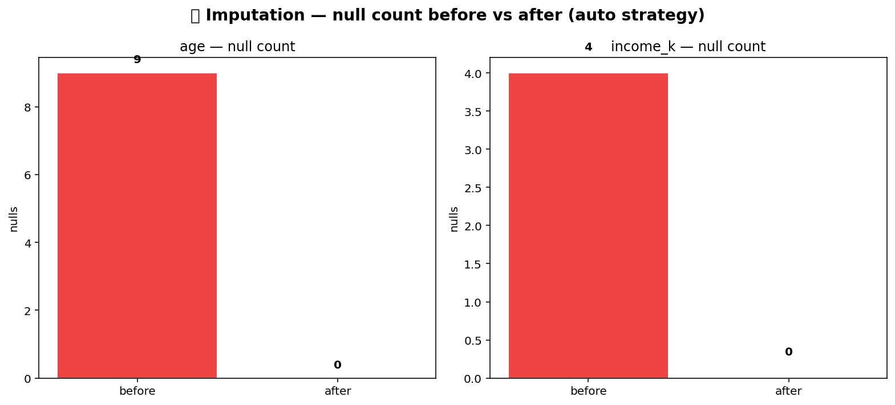

# 🩹 Imputation Pack

Five ways to fill missing values, picked so that the right tool always
exists for the data shape: per-column statistics for the simple case,
forward / backward fill for time-ordered data, interpolation for smooth
signals, KNN for tabular ML pre-processing, MICE for multivariate
chained imputation.

## Steps

| Step | Purpose |
| --- | --- |
| `impute_mean_median_mode` | Fill with the column mean (numeric), median (numeric, robust to outliers), or mode (categorical). |
| `impute_forward_backward` | Carry the prior or next non-null value forward / back — for time-ordered data. |
| `impute_interpolation` | Linear or spline interpolation between known points. |
| `impute_knn` | KNN imputer from scikit-learn — fill from the average of the K nearest rows. |
| `impute_mice` | Multiple Imputation by Chained Equations — iterative regression-per-column. |

## Killer demo — before / after on a noisy time series

`impute_interpolation` on a 100-point sine wave with 30% of the
values randomly nulled. The chart shows the gappy original (blue
markers) vs. the filled output (orange line) — the linear interpolant
recovers the underlying shape cleanly even with a third of the data
missing.

The output frame is the same shape as the input but with every null
in the target column replaced — drop-in for downstream model code that
can't handle missing values.

## Requirements

- `scikit-learn>=1.3` (for KNN + MICE)

## Changelog

### 0.1.0 — 2026-05-10

- Initial release.
