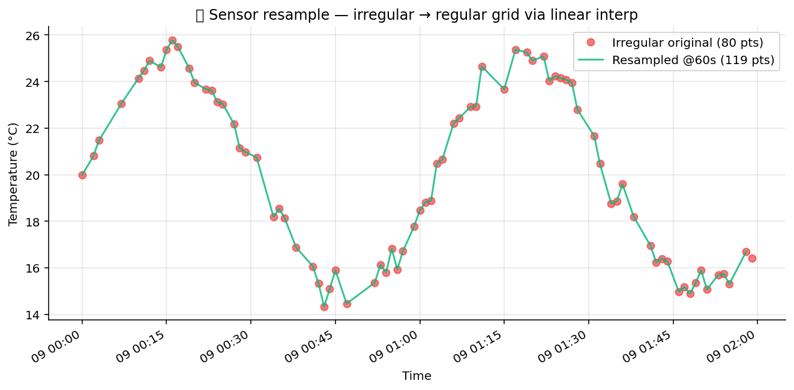

# 📡 IoT Sensor Pack

Sensor-data primitives. Resample irregular readings to a regular
grid, detect distributional drift in a streaming source, fuse
multiple sensor channels into a single estimate, downsample with a
CIC (cascaded-integrator-comb) decimation filter.

## Steps

| Step | Purpose |
| --- | --- |
| `sensor_resample_regular` | Linear-interpolate irregular timestamped readings onto a regular interval. |
| `stream_drift_detect` | Sliding-window KS / PSI test against a reference window — flag distributional drift. |
| `multi_sensor_fusion` | Inverse-variance-weighted fusion of N redundant sensors into one signal. |
| `downsample_cic` | N-stage CIC decimation filter: integrators → decimate by R → comb filters. |

## Killer demo — irregular → regular sensor stream

`sensor_resample_regular` on a 1-hour temperature trace with
non-uniform sampling (network-induced jitter). The chart overlays the
original readings (markers) with the resampled regular-grid output
(line) — every downstream FFT, average, or alert rule now operates on
a clean uniform-rate signal.

The output frame is `(timestamp, value)` on a uniform grid — the
shape every signal-processing step downstream wants.

## Requirements

- `scipy>=1.11`

## Changelog

### 0.1.0 — 2026-05-10

- Initial release.
