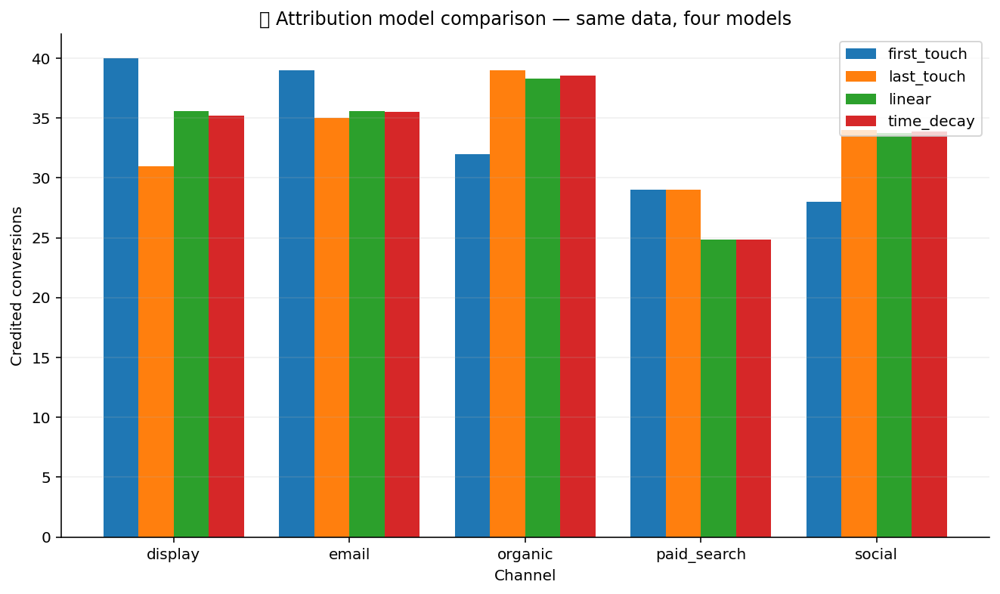

# 📣 Marketing Attribution

Six attribution models that distribute conversion credit across the
touch points in each user journey. First-touch and last-touch are
the simple baselines; linear and time-decay split smoothly;
position-based (U-shaped) credits the bookends; Markov is the
data-driven removal-effect model.

## Steps

| Step | Purpose |
| --- | --- |
| `attribution_first_touch` | 100% credit to the first touch in the journey. |
| `attribution_last_touch` | 100% credit to the last touch in the journey. |
| `attribution_linear` | Equal credit to every touch. |
| `attribution_time_decay` | Exponential decay so later touches earn more credit. |
| `attribution_position_based` | 40% first / 40% last / 20% split across the middle. |
| `attribution_markov` | Removal-effect attribution from a fitted Markov chain on the channel paths. |

## Killer demo — model comparison across channels

Four attribution models (first-touch, last-touch, linear, time-decay)
applied to the same 1,000 user journeys across 5 channels. The
grouped bar chart makes the punchline obvious: switching from
last-touch (the default in most ad platforms) to time-decay can
shift 30%+ of credit between channels — a budget-allocation
decision in disguise.

The output frame contains per-channel credit for each model so the
analyst can pick the model that matches the team's belief about how
attribution actually works.

## Requirements

No extra Python packages.

## Changelog

### 0.1.0 — 2026-05-10

- Initial release.
