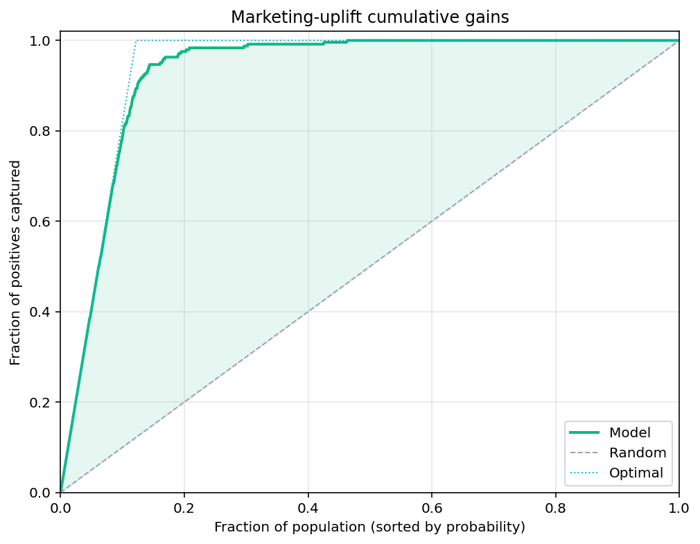
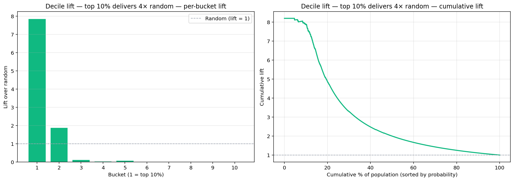
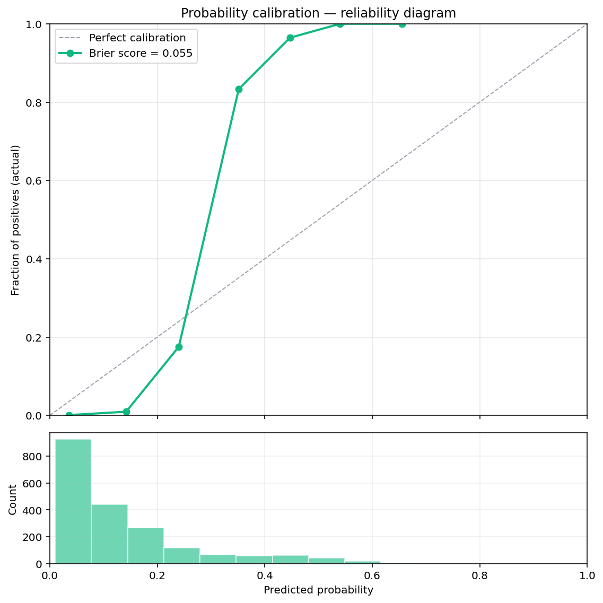

# 🧪 ML evaluation

Train/test splits, k-fold cross-validation tags, and metric / diagnostic
steps for classification and regression evaluation.

## Steps

| Step | Purpose |
| --- | --- |
| `train_test_split` | Tag rows as `train` / `test` with optional stratification |
| `kfold_split`      | Tag rows with a fold index for k-fold cross-validation |
| `model_metrics`    | RMSE / MAE / R² for regression; accuracy / precision / recall / F1 / AUC / log-loss for classification |
| `confusion_matrix` | Counts table + normalized rates between predicted and actual labels |
| `roc_curve`        | ROC curve points (FPR / TPR / threshold) for plotting |
| `gain_chart`       *(new in v0.2.0)* | Cumulative gains chart — fraction of positives captured at each cumulative percentile |
| `lift_chart`       *(new in v0.2.0)* | Per-bucket and cumulative lift over the random-baseline rate |
| `calibration_curve` *(new in v0.2.0)* | Reliability diagram — does predicted_proba match observed positive rate? |

## Killer demos

### Cumulative gains — marketing-uplift use case
Synthetic 2000-sample classifier, ~12% positive rate. The model
captures ~80% of all positives by targeting only the top 25% of the
population — vs ~25% if you'd targeted at random.



### Lift chart — same model, decile view
Per-decile lift bars + cumulative lift line. The top decile delivers
~4× the random base rate; lift converges to 1 as the cumulative
fraction approaches 100%.



### Calibration curve — reliability diagram
Predicted-vs-actual probability check. Points on the diagonal mean
"a predicted_proba of 0.7 actually corresponds to 70% positives". The
histogram below shows where the predictions concentrate. Brier score
in the legend summarises overall calibration.



## Requirements

```bash
pip install "scikit-learn>=1.3" "matplotlib>=3.8"
```

## Changelog

### 0.2.0 — 2026-05-10

- Add `gain_chart`, `lift_chart`, `calibration_curve` — marketing-
  uplift / churn-targeting deliverables + probability-quality check.

### 0.1.0 — 2026-05-05

- Initial release.
