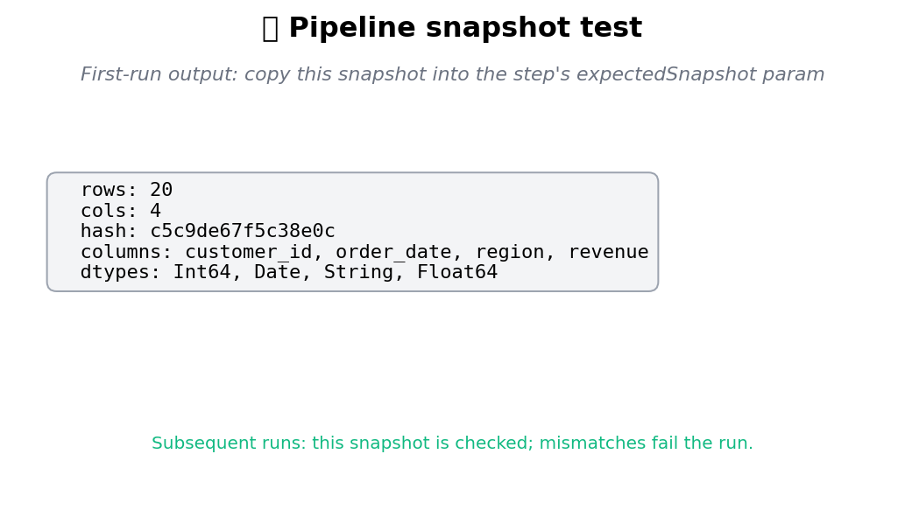

# 🧪 Pipeline Test Pack

Assertion steps for pipeline regression tests. Snapshot the data shape +
content hash, gate the schema (column names + types), assert specific
golden rows still match. Use these in scheduled runs to catch silent
upstream-data breakage before it propagates.

## Steps

| Step | Purpose |
| --- | --- |
| `pipeline_snapshot_test` | Hash the frame + row/col counts; compare against an expected snapshot. First run emits the snapshot to copy back into the param. |
| `schema_gate` | Assert required columns exist with expected dtypes; optionally reject extras. |
| `golden_row_assert` | Assert specific rows (matched by an ID column) still carry the expected values in named target columns. |

## Killer demo — first-run snapshot output

`pipeline_snapshot_test` on a 20-row × 4-column orders frame. The first
run produces this snapshot block; copy the JSON into the step's
`expectedSnapshot` param to lock the contract for subsequent runs.

Subsequent runs compare the live frame against the locked snapshot. Any
drift (rows ±, columns added/removed/renamed, content hash mismatch)
fails the run with a precise diff message.

## Requirements

No extra Python packages.

## Changelog

### 0.1.0 — 2026-05-10

- Initial release.
