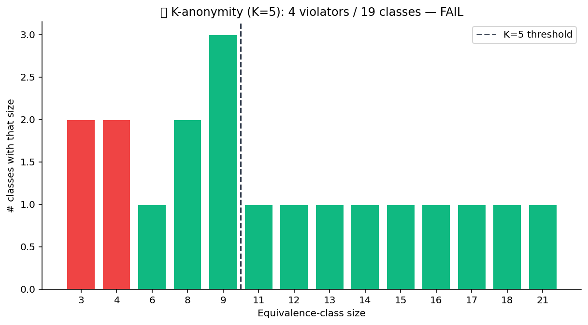

# 🔒 Privacy Pack

Privacy-preserving primitives. K-anonymity / l-diversity / t-closeness
checks for the disclosure side, differential-privacy aggregation for
the release side, seeded pseudonymization + PII redaction + salted
hashing for the engineering side.

## Steps

| Step | Purpose |
| --- | --- |
| `k_anonymity_check` | For each row, count the number of indistinguishable rows on the quasi-identifier set. Fail if any < K. |
| `l_diversity_check` | Within each quasi-identifier group, require ≥ L distinct sensitive values. |
| `t_closeness` | Distribution of a sensitive attribute within each group must stay within distance T of the population. |
| `dp_aggregate_laplace` | Sum / count / mean with calibrated Laplace noise for ε-DP. |
| `dp_aggregate_gaussian` | Same with Gaussian noise for (ε, δ)-DP. |
| `pseudonymize_seeded` | Deterministic pseudonyms from a seed + value (no real name in the output). |
| `pii_redact` | Regex-driven redaction for emails / phone numbers / SSNs. |
| `salt_hash` | Salted SHA-256 of an identifier column. |

## Killer demo — K-anonymity violations heatmap

`k_anonymity_check` on a 1,000-row dataset with three quasi-identifiers
(zip prefix, age band, gender). The chart shows the row count per
quasi-identifier group, with the K=5 threshold marked. Bars below the
line are the violating cells — the rows that need to be generalised
or suppressed before release.

The output frame flags every row with its group size; downstream steps
can suppress, generalise, or release based on the threshold.

## Requirements

No extra Python packages.

## Changelog

### 0.1.0 — 2026-05-10

- Initial release.
