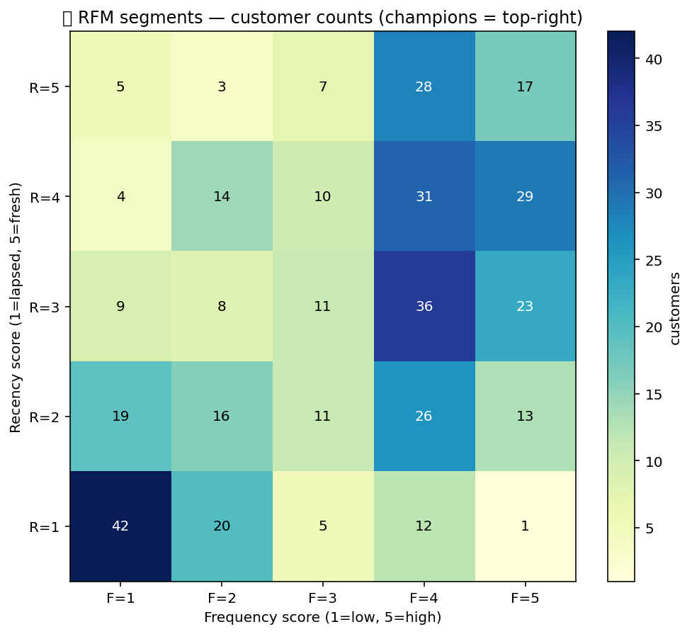

# 🎯 RFM Pack

Customer-segmentation primitives. Score every customer on Recency,
Frequency, Monetary value (the classic RFM trio), surface lite churn
signals, and compute repeat-purchase rate. Turn a raw transaction log
into actionable cohorts in three steps.

## Steps

| Step | Purpose |
| --- | --- |
| `rfm_score` | Per-customer R/F/M deciles + a combined RFM string ("555" = top tier in all three). |
| `churn_lite` | Flag customers whose recency exceeds a threshold relative to their typical cadence. |
| `repeat_purchase_rate` | Fraction of customers with ≥2 purchases in the window. |

## Killer demo — RFM segment heatmap

`rfm_score` on a 500-customer transaction log. The heatmap below is the
2-D R×F density (each cell = customer count for that recency / frequency
decile combination). The diagonal lit-up region is the healthy core;
the lower-right quadrant is the churn-risk segment that earns a
re-engagement campaign.

The output frame contains one row per customer with `r_score`,
`f_score`, `m_score`, and the combined `rfm` string ready to drive
downstream segmentation.

## Requirements

No extra Python packages.

## Changelog

### 0.1.0 — 2026-05-10

- Initial release.
