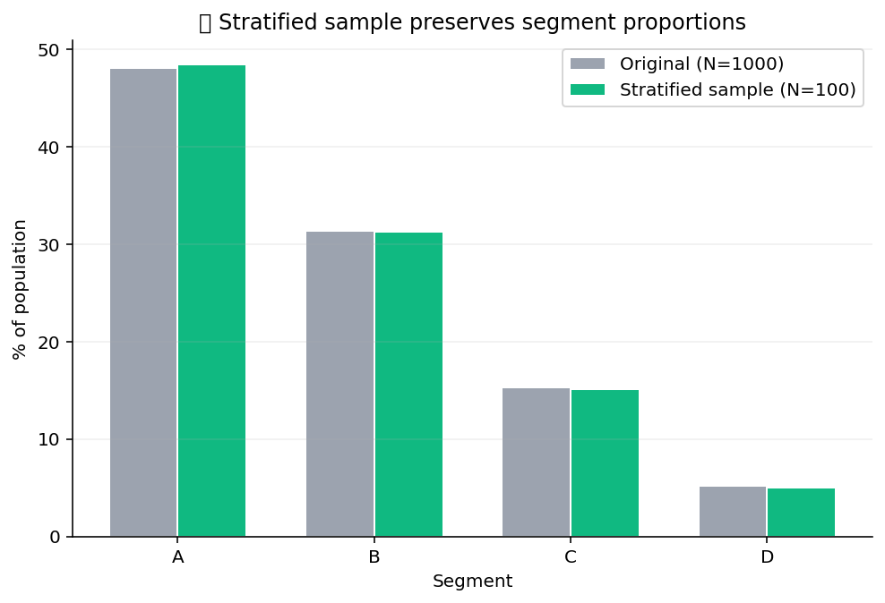

# 🎲 Sampling Pro

Statistical sampling beyond head / tail / random. Stratified preserves
group proportions, weighted accepts a per-row probability, reservoir
streams in one pass, systematic walks every Nth row, cluster pulls
whole groups together, SMOTE oversamples the minority class for
imbalanced classification, undersample brings the majority back down.

## Steps

| Step | Purpose |
| --- | --- |
| `sample_stratified` | Sample N rows while preserving group proportions across a stratifying column. |
| `sample_weighted` | Sample with a per-row probability column. |
| `sample_reservoir` | One-pass reservoir sampling — for streaming sources where you can't fit the whole population. |
| `sample_systematic` | Random start, then every Nth row. |
| `sample_cluster` | Sample whole groups (every row in selected groups, none in unselected). |
| `smote_oversample` | Synthetic Minority Oversampling Technique for imbalanced classification. |
| `undersample` | Random undersample of the majority class. |

## Killer demo — proportion preservation across strata

`sample_stratified` on a 5,000-row frame with three classes (A: 60%,
B: 30%, C: 10%) sampled down to 500 rows. The bar chart compares
input proportions vs. sampled proportions side-by-side — the stratified
sampler stays inside ±1 percentage point on every class, while a
naive uniform sample would have ~30% variance on the minority class.

The output frame is just the sampled rows in their original schema —
ready to feed downstream training or analysis steps.

## Requirements

- `scikit-learn>=1.3`
- `imbalanced-learn>=0.11` (for SMOTE)

## Changelog

### 0.1.0 — 2026-05-10

- Initial release.
