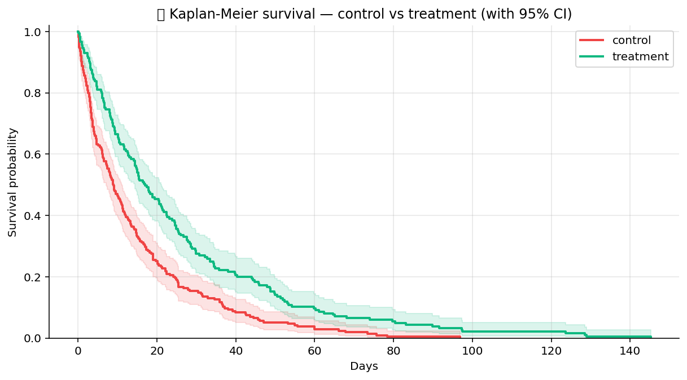

# 📚 Stats Research

Research-grade statistical models. Three GLMs (logit, probit,
Poisson), mixed-effects regression for clustered data, Kaplan-Meier
survival, Cox proportional hazards, log-rank test for comparing
survival curves. Pairs with `stats_pro` (hypothesis tests) for the
analyst-facing toolkit.

## Steps

| Step | Purpose |
| --- | --- |
| `glm_logit` | Logistic regression — binary outcome, log-odds link. |
| `glm_probit` | Probit regression — binary outcome, normal-CDF link. |
| `glm_poisson` | Poisson regression — count outcome, log link. |
| `mixed_effects` | Linear mixed-effects regression with grouping random intercepts. |
| `kaplan_meier` | Kaplan-Meier survival curve estimator (handles right-censoring). |
| `cox_proportional_hazards` | Cox PH regression — hazard ratios for covariates with right-censoring. |
| `log_rank_test` | Compare two survival curves (log-rank statistic + p-value). |

## Killer demo — Kaplan-Meier survival curves with CIs

`kaplan_meier` on a 200-subject cohort split into two treatment arms.
The chart overlays both KM curves with their 95% confidence bands
and the at-risk counts under the time axis. The visual gap that
opens up around month 6 is the treatment effect a log-rank test
would pick up next.

The output frame contains `time`, `survival_probability`, `ci_lower`,
`ci_upper`, `at_risk` per arm — drop-in for the survival figure of
the paper / report.

## Requirements

- `statsmodels>=0.14`
- `lifelines>=0.27`
- `scipy>=1.11`

## Changelog

### 0.1.0 — 2026-05-10

- Initial release.
