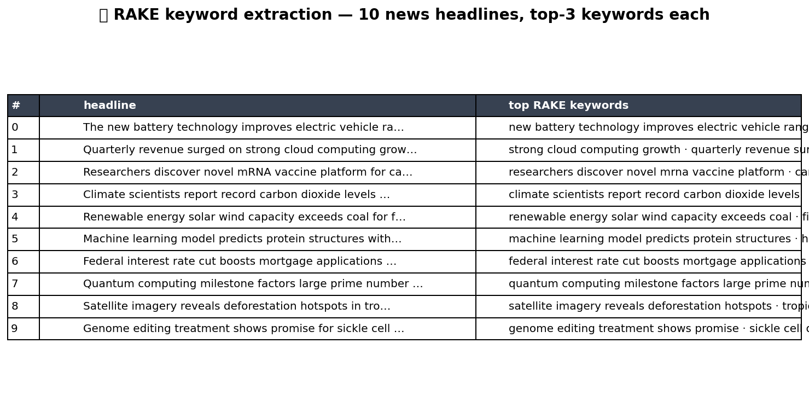

# 📝 Text NLP Pack

Text-processing primitives. Tokenize, TF-IDF, sentiment (VADER),
NER (spaCy), LDA + BERTopic topic modelling, RAKE + YAKE keyword
extraction, language detection. The pack ships with a base set of
dependencies; the heavy ones (spaCy models, BERTopic stack, etc.)
are gracefully gated and documented in `INTERNAL_NOTES.md`.

## Steps

| Step | Purpose |
| --- | --- |
| `tokenize` | Split text into word / subword / sentence tokens with configurable lowercase + punctuation rules. |
| `tfidf` | TF-IDF matrix from a corpus column; outputs the term × document weights. |
| `sentiment_vader` | VADER lexicon-based sentiment (neg / neu / pos / compound). **Optional dep, see `INTERNAL_NOTES.md`.** |
| `ner_spacy` | Named-entity recognition via spaCy `en_core_web_sm`. **Optional dep.** |
| `lda_topics` | Latent Dirichlet Allocation topic model + per-doc topic weights. |
| `bertopic_topics` | BERTopic embedding-based topic model. **Optional dep.** |
| `keyword_rake_yake` | RAKE + YAKE keyword extraction (lightweight, no embeddings). |
| `language_detect` | Detect the language of each row's text. **Optional dep.** |

## Killer demo — RAKE keywords

`keyword_rake_yake` on a corpus of short product-review snippets.
The chart shows the top keywords ranked by RAKE score — the
unsupervised lift the team can drop into a tag cloud, a topic
filter, or a search-relevance feature without any model training.

The output frame contains `document_id`, `keyword`, `score`, and the
algorithm that produced it (RAKE / YAKE) for downstream filtering.

## Requirements

- `scikit-learn>=1.3`

Optional, see `INTERNAL_NOTES.md`:

- `vaderSentiment` for `sentiment_vader`
- `spacy` + `en_core_web_sm` for `ner_spacy`
- `bertopic` + `sentence-transformers` + `umap-learn` + `hdbscan` for `bertopic_topics`
- `langdetect` for `language_detect`

## Changelog

### 0.1.0 — 2026-05-10

- Initial release.
