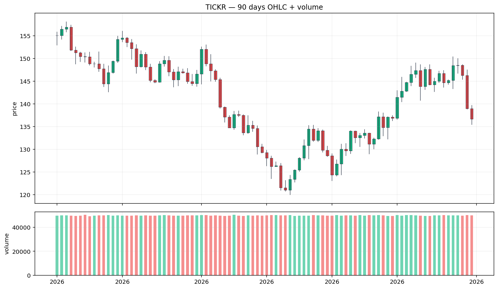
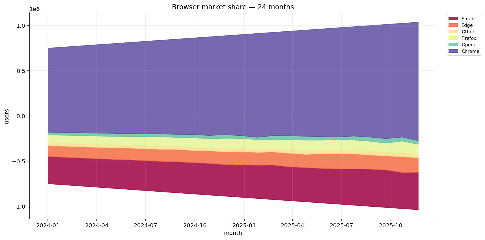
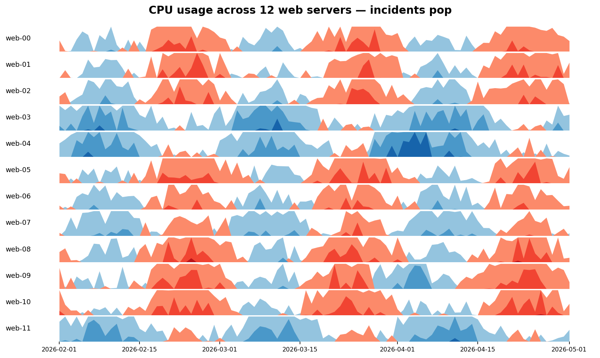

# ⏳ Time-series Pro

Diagnostic tests + ACF/PACF analysis + changepoint detection — the
"is this series even forecastable?" toolkit — plus three time-series
visualization step kinds.

## Steps

| Step | Purpose |
| --- | --- |
| `adf_test`              | Augmented Dickey-Fuller — tests for unit root (H0: non-stationary) |
| `kpss_test`             | Kwiatkowski-Phillips-Schmidt-Shin — tests for stationarity (H0: stationary). Use both ADF + KPSS for a confident verdict |
| `acf_pacf`              | Autocorrelation + partial-autocorrelation values for lags 1..N — feeds ARIMA order selection |
| `changepoint_detection` | Detect sudden shifts in mean or variance using rolling-window CUSUM |
| `anomaly_zscore` *(v0.2)*       | Flag points whose rolling z-score exceeds threshold |
| `replace_outliers` *(v0.2)*     | Median-based outlier replacement |
| `candlestick_chart` *(new in v0.3)* | Financial OHLC chart with optional volume sub-panel |
| `stream_graph`     *(new in v0.3)* | Center-baselined stacked area chart for many-series totals |
| `horizon_chart`    *(new in v0.3)* | Compact banded small-multiples view for many time series |

## Killer demos

### Candlestick — 90 days OHLC + volume
Open/high/low/close + volume sub-panel. Standard financial chart
deliverable; green = up day, red = down day.



### Stream graph — browser market share over 24 months
Center-baselined stacked area chart. Six browsers, monthly user counts;
the *shape* of each band reveals trends without a hard zero baseline
crowding the lower-share series.



### Horizon chart — CPU usage across 12 web servers
Each row is one server's daily CPU%. The compact banded layout lets
you spot the two servers (web-04, web-09) with mid-period spikes
that a 12-line plot would bury in clutter.



## Requirements

```bash
pip install "statsmodels>=0.14" "matplotlib>=3.8"
```

## Changelog

### 0.3.0 — 2026-05-10

- Add `candlestick_chart`, `stream_graph`, `horizon_chart` — financial
  + multi-series time-series visualizations.

### 0.2.0 — 2026-05-08

- Add `anomaly_zscore`, `replace_outliers`.

### 0.1.0 — 2026-05-05

- Initial release.
