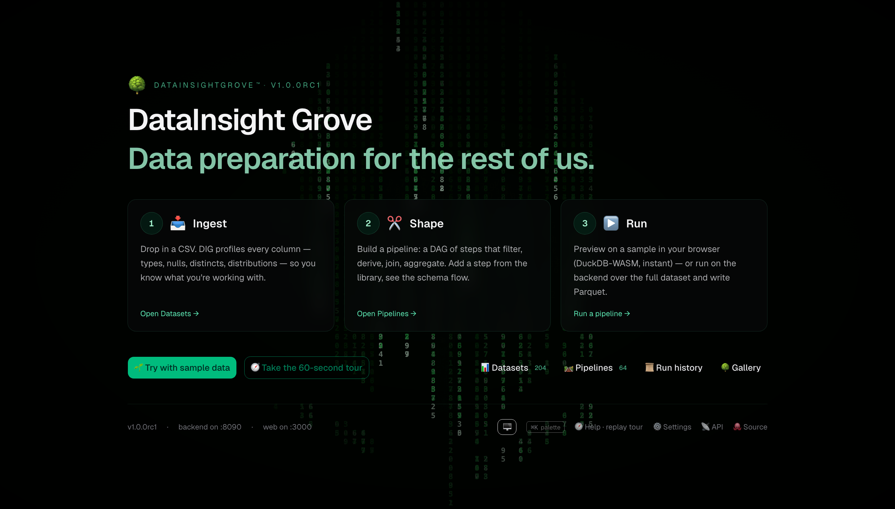
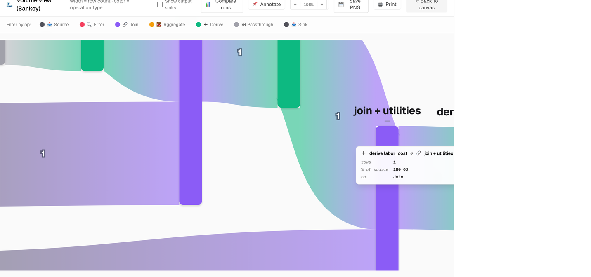
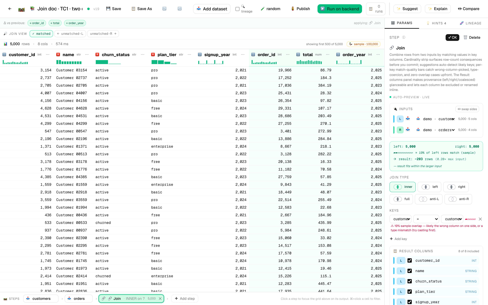
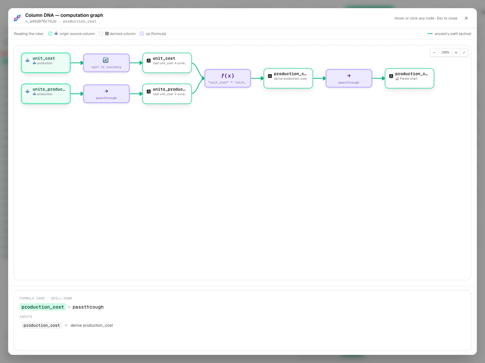

# 🌳 DataInsightGrove™ (DIG™)

> *Self-hosted. Plugin-first. Yours. Data preparation for the rest of us.*

[](https://github.com/SFCyris/DataInsightGrove)
[](LICENSE)
[](https://github.com/SFCyris/DataInsightGrove/releases)
[](TRADEMARK.md)
[](https://github.com/SFCyris/DataInsightGrove/releases/latest)

> **⬇ [Download the latest release](https://github.com/SFCyris/DataInsightGrove/releases/latest/download/datainsightgrove-latest.zip)** — unzip, then run `./install.sh`. No git clone required. &nbsp;·&nbsp; [Release notes](https://github.com/SFCyris/DataInsightGrove/releases/latest)

> 🧪 **Release candidate (v1.0.0-rc2).** The architecture, schemas, protocols, and IP posture are locked. This release-candidate cycle is for final polish, soak-testing, and community feedback before the 1.0.0 tag — the API contract that goes live then is described in [`docs/API_STABILITY.md`](docs/API_STABILITY.md). **Comments, bug reports, and feature requests are very welcome** — open an [issue](https://github.com/SFCyris/DataInsightGrove/issues) or join a [discussion](https://github.com/SFCyris/DataInsightGrove/discussions) on GitHub.

**Self-hosted, plugin-first data preparation — the same visual pipeline runs in your browser (DuckDB-WASM, instant preview) or on the backend (DuckDB, full data). AI-assisted (explain, suggest, fix) with a bring-your-own provider. Reads CSV, Excel, JSON, Parquet, plus scientific binary formats out of the box (HDF5, NumPy, FITS, NetCDF, MATLAB, Feather). ML, time-series, per-row lineage, cron-scheduled runs, and one-click `.py` / `.ipynb` export.**

Drop in a CSV — or a `.h5`, `.fits`, `.mat`, `.parquet`. Shape it visually. Press play. Plugin-first ("drop a folder, get a step"), original implementation, yours.




<table>
  <tr>
    <td width="50%" align="center"></td>
    <td width="50%" align="center"></td>
  </tr>
  <tr>
    <td><b>🌊 Sankey flow</b> — every column traced through every step, zoom + pan, click any band to focus the matching step.</td>
    <td><b>🔗 Join workbench</b> — sample row counts, join type, key pairs with match-quality bars, and a per-column result grid in one panel.</td>
  </tr>
  <tr>
    <td width="50%" align="center"></td>
    <td width="50%" align="center"></td>
  </tr>
  <tr>
    <td><b>🧬 Column DNA</b> — bipartite walk showing exactly which upstream values shaped a single output column.</td>
    <td><b>✅ Data quality</b> — per-row assertions enforced on every run; failures surface in the run record and fire webhooks.</td>
  </tr>
</table>

---

## Why

Spreadsheet-grade direct manipulation, with a real pipeline behind every move. The editor leads with the **data** (top half) and the **steps** that produced it (bottom strip). Every column action — filter, sort, cast, rename, drop, group, derive — becomes a step in the pipeline. ⌘Z undoes anything. The **same pipeline** runs unchanged in your browser (sample preview, sub-second) or on the backend (full data, parquet output) — DIG ships byte-for-byte parity tests for every step.

## Stack

| Layer | Tech |
|---|---|
| Backend | Python 3.11+, FastAPI, **DuckDB** (primary), **Polars** (secondary), SQLAlchemy 2 (async), SQLite + WAL |
| Frontend | Next.js 15+, React 19, TypeScript, Tailwind v4, shadcn/ui, AG Grid Community, React Flow, **DuckDB-WASM** |
| Schemas | JSON Schema 2020-12 in `shared/schemas/` — single source of truth |
| Lifecycle | POSIX shell scripts (Linux + macOS) + JSON config + optional native Mac `.app` + Linux `.desktop` |
| Tooling | pnpm workspace (JS), venv + pip (Python; `uv`-ready) |

## What's in DIG

- **62 built-in steps** + **39 pack steps** across 11 categories (6 bundled packs: business_charts · dates_pack · geospatial_pack · stats_pro · statspack · time_series_pro) — the built-ins live under `backend/steps/` (always available); pack steps land under `plugins/packs/<pack>/steps/` and are installable via `.dpack` archives. The full auto-generated catalog (see [`docs/STEPS.md`](docs/STEPS.md)) covers shape (incl. **pack_struct · unpack_struct · unnest_array · array_length** for nested types), clean, derive (incl. **PCA · k-means · DBSCAN · t-SNE · UMAP · linear regression · forecast · seasonal decompose · rolling**, **convert_coordinates** for polar↔Cartesian↔geographic, **vector_similarity · embed_text · geo_distance · json_extract**), combine (incl. **sub-pipelines**), aggregate (incl. **resample · correlation matrix**), **output** (file / database / image render via matplotlib + seaborn). Plus an `expectations` step for inline data-quality assertions.
- **20 connectors**:
  - *Text*: csv (with delimiter sniffing for `.dat` / `.data` / `.tab` / `.psv`) · excel (multi-sheet + multi-data-island detection) · json · parquet · feather.
  - *Scientific binary* (under the optional `[science]` extra): NumPy (`.npy` / `.npz`) · HDF5 · MATLAB · NetCDF · FITS.
  - *Network + database*: https · rest_api (auth + JSONPath + pagination) · sqlite · postgres · mysql · jdbc.
  - *Warehouse + reverse-ETL* (export targets — write-only sinks for `export_to_db`): snowflake · bigquery · sheets (Google Sheets). Plus **dbt** for running models and reading their materialised output. To *read* from Snowflake / BigQuery use the JDBC connector or a warehouse query.
- **AI assistant** (optional, bring-your-own provider — local Ollama, OpenAI-compatible, or Anthropic): **Explain** the pipeline · **Suggest the next step** from a plain-English goal · **Suggest multi-step transform routes** for a focused dataset · **Suggest visualizations** with pre-populated params · **Explain a dataset** (domain inference + per-column meanings) · **Fix** SQL expressions in filter / derive · **Generate** a connector or step from a description (with static-lint safety check before install). **Optional keep-alive ping** keeps local Ollama from unloading idle models. See [`docs/AI_FEATURES.md`](docs/AI_FEATURES.md).
- **Live editor** with auto-recompute, column-action menu, ⌘+click cell-to-filter, drag-to-reorder pills, undo/redo, multi-session sync via WebSocket + ETag conflicts. Per-pipeline **🧪 sampling** (head / tail / random / systematic) controls how the live preview draws rows — see [`docs/SAMPLING.md`](docs/SAMPLING.md). **Transparent backend fallback** when DuckDB-WASM can't run the SQL (e.g. spatial GEOMETRY) — preview routes to backend, status badge marks it.
- **💾 Save / 📋 Save As** — explicit labelled checkpoints (kept up to 50) on top of silent autosaves (last 5 only). The history view shows the saves you intended, not every keystroke. ⌘S / ⌘⇧S keyboard shortcuts. See [`docs/SAVE_AND_VERSIONS.md`](docs/SAVE_AND_VERSIONS.md).
- **🪆 Sub-pipelines** — any pipeline can be **published as a reusable step** that other pipelines install from the regular picker. Pinned-by-default versioning (consumers stay on a known version until they Upgrade), per-param exposure for customisation, automatic cycle detection at save and run-start. See [`docs/SUB_PIPELINES.md`](docs/SUB_PIPELINES.md).
- **Rule-based hints** in a side panel — deterministic data-preparation suggestions surfaced from the column profile (not ML predictions, not selection-driven, not a ranked card stack). One-click composites for common patterns (e.g. *(LATITUDE, LONGITUDE) → pack & cast to geographic*).
- **Per-row lineage** — opt-in tracing so you can click 🔍 on any output row and jump back to the input row(s) it came from.
- **Schedules** — cron-driven recurring runs from the Schedules page (or `dig-schedule.sh` from the CLI).
- **Pipeline export / import** as portable `.dig.json` files; whole-page drop zone on `/pipelines`.
- **Templates library** — worked starter pipelines that auto-import the demo dataset (incl. spatial-distance and vector-similarity demos).
- **Command palette (⌘K)** with per-pipeline verbs (run · duplicate · schedule · export · copy link), a recent-items group at the top, and a global `/` shortcut to focus the search.
- **G-chord navigation** — `g h` Home · `g p` Pipelines · `g d` Datasets · `g r` Runs · `g c` Catalog · `g s` Settings.
- **Keyboard cheatsheet** (`?`). Full reference in [`docs/KEYBOARD_SHORTCUTS.md`](docs/KEYBOARD_SHORTCUTS.md).
- **Dark mode**, **settings page** (`/settings`), **column annotations** that travel with the dataset.
- **Mac `.app` wrapper** (WKWebView, ad-hoc signed) and **Linux `.desktop`** integration that both wrap the same shell scripts.
- **Backend parity tests** verify byte-identical output between backend DuckDB and DuckDB-WASM target for every transform step.

## Quickstart

Get DIG either way — [**download the latest release**](https://github.com/SFCyris/DataInsightGrove/releases/latest/download/datainsightgrove-latest.zip) and unzip it, or `git clone` the repo. Then from the project root:

```bash
./install.sh
```

That's it. The guided installer detects what's already on your machine (Homebrew, Python, pnpm, optional JDBC tooling, project deps), prints what it's about to do, asks once before changing anything, then finishes with DIG running. Re-run any time to verify or repair the environment — already-installed tools are reported as ✓ and skipped.

**Supported platforms.** macOS (Apple Silicon + Intel via Homebrew). Linux:
Debian 12+, Ubuntu 22.04+ (the bootstrap auto-enables the deadsnakes PPA on
22.04 since the default `python3` is 3.10), Fedora 39+, RHEL / Rocky / Alma
9+, RHEL/CentOS 7 (yum), Arch / Manjaro (pacman), openSUSE (zypper).
Windows users should run the installer inside WSL2 with Ubuntu 24.04+.

Open [http://localhost:3000](http://localhost:3000) and click **🌱 Try with sample data**.

<details>
<summary><strong>Other entry points</strong> (power users / CI / day-to-day)</summary>

```bash
make setup        # one-time: backend venv + pnpm install (assumes prereqs are present)
make start        # detached, writes PID file, prints URLs
make status       # is it up? where?
make stop         # graceful TERM, escalates to KILL after 5s
make dev          # foreground mode (Ctrl-C to stop)
```

`./install.sh` flags: `-y` accept defaults, `--jdbc` / `--no-jdbc` skip the JDBC prompt, `--no-start` finish without starting, `--rebuild` nuke `.venv` + `node_modules` first, `--non-interactive` for CI (= `-y --no-start`).

For the same operations split into separate primitives, see [`scripts/dig-bootstrap.sh`](scripts/dig-bootstrap.sh) (system tools) and [`scripts/dig-install.sh`](scripts/dig-install.sh) (project deps).
</details>

**Custom ports**:

```bash
./scripts/dig-start.sh --api-port 9000 --web-port 4000          # one shot
./scripts/dig-start.sh --api-port 9000 --save                   # persist
./scripts/dig_config.py show                                    # see effective config
```

**Native launchers** (optional):

```bash
make mac-app       # builds DataInsightGrove.app (macOS only)
./linux/install.sh # adds the .desktop entry (Linux only)
```

Both wrap the same shell scripts and respect the same `~/.config/dig/config.json`. See [`docs/lifecycle.md`](docs/lifecycle.md) for every flag, env var, and exit code.

## Layout

```
shared/schemas/          JSON Schemas — pipeline, step manifest, connector manifest, config
backend/
  dig/                   FastAPI app · engine (pipeline, dag, executor, registry) · jobs · storage
  steps/<id>/            Built-in step plugins  (manifest.json + step.py + tests.py)
  connectors/<id>/       Built-in connector plugins
frontend/
  app/                   Next.js App Router routes
  components/            UI — grid, canvas, profile, suggestions, templates, command palette …
  lib/engine/            DuckDB-WASM bootstrap + browser/backend dispatcher
plugins/                 Your own step + connector plugins (auto-discovered)
samples/                 Bundled demo CSV + starter pipeline templates
scripts/                 dig-start.sh · dig-stop.sh · dig-status.sh · dig-config.py · dig-run.sh · dig-schedule.sh · dig-dev.sh
mac/                     Mac .app source (Swift + WKWebView) + build.sh
linux/                   .desktop file + dig-launch.sh + install.sh
docs/                    Architecture, getting started, lifecycle, plugin authoring, glossary
```

## Cross-platform discipline

- All shell is POSIX-compatible bash 3.2+ — verified parse-clean.
- No GNU-only flag use (`sed -i`, `find -printf`, etc.).
- `python3` does the JSON heavy-lifting (no `jq` dependency).
- All paths live under `~/.config/dig/` so a Linux user gets the same layout as macOS.
- The Mac `.app` and Linux `.desktop` are the **only** platform-specific artifacts; everything else runs unchanged on either OS.

## Docs

- 🚀 [Getting started](docs/getting_started.md) — install → first pipeline in 10 minutes
- 🎓 [First-steps tutorials](docs/tutorials.md) — three short walkthroughs (image / CSV / Parquet output)
- ⏳ [Time-series killer demos](docs/tutorials/11-time-series-killer-demos.md) — 8 worked examples (retail forecast · IoT anomaly · finance · healthcare × 3 · housing × 2)
- 📚 [Step library](docs/STEPS.md) — every step DIG ships with, auto-generated from manifests
- 📊 [Visualization catalog](docs/VISUALIZATIONS.md) — every chart-producing step (built-in + packs), the columns it needs, and the data shapes for non-standard chart types (choropleth WKB, OHLC, etc.)
- 🏷 [Data types](docs/DATA_TYPES.md) — the 29 base + meta-types (including currency-as-DECIMAL, vector embeddings, JSON, and polar/Cartesian/geographic coordinates) with constraints, ranges, storage, and use cases
- 💾 [Save and version history](docs/SAVE_AND_VERSIONS.md) — Save vs Save As vs autosave; labelled checkpoints
- 🪆 [Sub-pipelines](docs/SUB_PIPELINES.md) — publish a pipeline as a reusable step + pinning + cycle detection
- ✨ [AI features](docs/AI_FEATURES.md) — five LLM-driven editor surfaces + provider configuration
- 🧪 [Sampling](docs/SAMPLING.md) — per-pipeline preview sampling (head / tail / random / systematic)
- 🧪 [E2E validation](docs/E2E_VALIDATION.md) — every step exercised against real data
- 🔤 [Variables](docs/VARIABLES.md) — `{{ today }}` / `{{ now }}` / `{{ vars.region }}` substitution in dataset URIs, output paths, and cell content
- ⬆️ [Upgrading](docs/UPGRADING.md) — `./upgrade.sh` flow + auto-migration on boot
- 🧩 [Extensibility](docs/EXTENSIBILITY.md) — `metadata` + `extensions` slots for vendor / fork / enterprise fields
- 🔒 [Security policy](SECURITY.md) — threat model + disclosure process + supported versions
- 📋 [API stability](docs/API_STABILITY.md) — pre-1.0 contract + post-1.0 SemVer + deprecation policy
- ⚙️ [Configuration reference](docs/CONFIG.md) — every `DIG_*` env var, what it does, what's safe to leave default
- 🛠 [Administration](docs/ADMINISTRATION.md) — config-file schema, product tree, on-disk folder layout, log rotation, backup boundaries (start here if you're operating an install)
- ⚠️ [Error codes](docs/ERROR_CODES.md) — the `DIG_E_NNNN` taxonomy that surfaces in logs + API errors (auto-generated)
- 📰 [Changelog](CHANGELOG.md) — what changed between releases
- ♻️ [Lifecycle reference](docs/lifecycle.md) — start/stop/status/config + Mac app + Linux desktop
- 🏗 [Architecture](docs/ARCHITECTURE.md) — what's where and why
- 🛠 [Authoring guide (deep, with diagrams)](docs/AUTHORING_GUIDE.md) — build steps + connectors from scratch
- 🧩 [Plugin authoring (short reference)](docs/PLUGIN_AUTHORING.md) — drop a folder, get a step
- 📝 [Pipeline format](docs/PIPELINE_FORMAT.md) — the portable JSON DAG (incl. `metadata.publishedAsStep` + `node.ui.exposedParams`)
- 🔌 [JDBC setup](docs/JDBC_SETUP.md) — Java + JAR install for the JDBC connector and `export_to_jdbc` step
- 🎨 [UI guidelines](docs/UI_GUIDELINES.md) — emojis as iconography + motion principles
- 🔤 [Glossary](docs/GLOSSARY.md) — what DIG means by Dataset, Pipeline, Step, Profile, Run, Hint, …
- ⚖️ [Third-party notices](THIRD_PARTY.md) — full attribution + license texts for every dep (auto-generated)
- ™️ [Trademark notice](TRADEMARK.md) — word marks DataInsightGrove™, DIG™ (the 🌳 emoji is generic Unicode and not claimed)

## License

DataInsightGrove™ source code is licensed under the **GNU Affero General Public License v3.0 or later** ([AGPL-3.0-or-later](LICENSE)). Forking, modifying, and redistributing the source is freely permitted under those terms.

If you run a modified version over a network (e.g., as a hosted service), AGPL §13 obligates you to make the **complete corresponding source** of your modified version available to its users.

For a per-dependency license breakdown, see [`THIRD_PARTY.md`](THIRD_PARTY.md). AGPL was picked because it leaves the source open for forks and Linux distros while still requiring network operators of modified versions to release their changes — see the LICENSE file for the full text.

DIG additionally publishes a **[Patent Non-Aggression Pledge](docs/PATENT_PLEDGE.md)** that supplements the AGPL with an explicit patent grant and a defensive-only commitment from the maintainer. It is modeled on the Apache 2.0 patent clause + Tesla / Twitter IPA / OIN frameworks. For the public mapping of every DIG feature to publicly-available prior art, see [`docs/PRIOR_ART_MAP.md`](docs/PRIOR_ART_MAP.md).

## Contributing

**Issues, feature requests, and discussions are very welcome** — this is the most useful way to shape DIG right now. **External code contributions (pull requests) aren't being accepted yet** during the 1.0-rc cycle while CLA / DCO + contribution-review process is finalised. See [`CONTRIBUTING.md`](CONTRIBUTING.md) for the full picture (bug-report template, security disclosure, fork guidance) — that policy will be revisited at the 1.0.0 GA tag.

## Trademarks

**DataInsightGrove™** and **DIG™** are unregistered word-mark trademarks of Sebastian Cyris. All rights reserved. The 🌳 tree emoji that appears throughout the UI is **not** trademarked — it is a generic Unicode codepoint (U+1F333) rendered differently by every platform vendor, and you may use it freely. The grant of an AGPL-3.0 source license does **not** include a trademark license to the word marks — see [`TRADEMARK.md`](TRADEMARK.md) for the full notice and permitted-use guide. Forks of the source code are welcome under AGPL-3.0; please rebrand them under your own name.

## Source

The canonical, authoritative source repository is:

> **<https://github.com/SFCyris/DataInsightGrove>**

If you obtained DIG from anywhere else, please verify the integrity of the source against this canonical repository. AGPL-3.0 §13 requires every distributor to make their complete corresponding source available, but only this repository is published, signed, and supported by the original author.

## Status

Personal project, in active development. First public source release: **2026-05-01**. See [`TRADEMARK.md`](TRADEMARK.md) for the trademark posture on the *DataInsightGrove* and *DIG* word marks.
