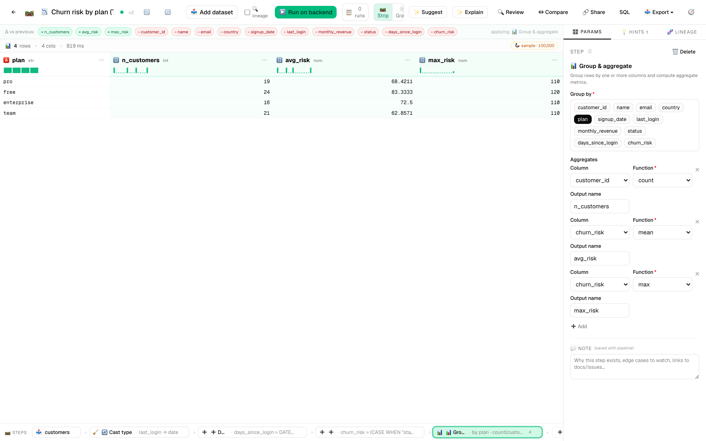

# 🌳 DataInsightGrove™ (DIG™)

> *Data preparation for the rest of us.*

[](https://github.com/SFCyris/DataInsightGrove)
[](LICENSE)
[](https://github.com/SFCyris/DataInsightGrove/releases)
[](TRADEMARK.md)

> 🧪 **Beta software (v0.5.0).** DIG works end-to-end and the architecture is stable, but the API surface, plugin contracts, and on-disk format may still shift before v1.0.0. **Comments, bug reports, and feature requests are very welcome** — open an [issue](https://github.com/SFCyris/DataInsightGrove/issues) or join a [discussion](https://github.com/SFCyris/DataInsightGrove/discussions) on GitHub.

**Self-hosted, plugin-first data preparation — the same visual pipeline runs in your browser (DuckDB-WASM, instant preview) or on the backend (DuckDB, full data), with ML, time-series, per-row lineage, and one-click `.py` / `.ipynb` export.**

Drop in a CSV. Build a transform pipeline visually. Press play. Plugin-first ("drop a folder, get a step"), original implementation, yours.



---

## Why

Spreadsheet-grade direct manipulation, with a real pipeline behind every move. The editor leads with the **data** (top half) and the **steps** that produced it (bottom strip). Every column action — filter, sort, cast, rename, drop, group, derive — becomes a step in the pipeline. ⌘Z undoes anything. The **same pipeline** runs unchanged in your browser (sample preview, sub-second) or on the backend (full data, parquet output) — DIG ships byte-for-byte parity tests for every step.

## Stack

| Layer | Tech |
|---|---|
| Backend | Python 3.11+, FastAPI, **DuckDB** (primary), **Polars** (secondary), SQLAlchemy 2 (async), SQLite + WAL |
| Frontend | Next.js 15+, React 19, TypeScript, Tailwind v4, shadcn/ui, AG Grid Community, React Flow, **DuckDB-WASM** |
| Schemas | JSON Schema 2020-12 in `shared/schemas/` — single source of truth |
| Lifecycle | POSIX shell scripts (Linux + macOS) + JSON config + optional native Mac `.app` + Linux `.desktop` |
| Tooling | pnpm workspace (JS), venv + pip (Python; `uv`-ready) |

## What ships today

- **38 steps** across 6 categories: shape, clean, derive (incl. **PCA · k-means · DBSCAN · t-SNE · UMAP · linear regression · forecast · seasonal decompose · rolling**), combine (incl. **sub-pipelines**), aggregate (incl. **resample · correlation matrix**), **output** (file / database / image render via matplotlib + seaborn). Plus a `expectations` step for inline data-quality assertions.
- **8 connectors**: csv · parquet · excel · json · https · sqlite · postgres · mysql.
- **Live editor** with auto-recompute, column-action menu, ⌘+click cell-to-filter, drag-to-reorder pills, undo/redo, multi-session sync via WebSocket + ETag conflicts.
- **Rule-based hints** in a side panel — deterministic data-preparation suggestions surfaced from the column profile (not ML predictions, not selection-driven, not a ranked card stack).
- **Pipeline export / import** as portable `.dig.json` files; whole-page drop zone on `/pipelines`.
- **Templates library** — three worked starter pipelines that auto-import the demo dataset.
- **Command palette (⌘K)** + keyboard cheatsheet (`?`).
- **Dark mode**, **settings page** (`/settings`), **column annotations** that travel with the dataset.
- **Mac `.app` wrapper** (WKWebView, ad-hoc signed) and **Linux `.desktop`** integration that both wrap the same shell scripts.
- **Cron scheduling** via `dig-schedule.sh` for recurring runs.
- **31 backend parity tests pass** (every transform step verified byte-identical between backend DuckDB and DuckDB-WASM target).

## Quickstart

```bash
make setup        # one-time: backend venv + pnpm install
make start        # detached, writes PID file, prints URLs
make status       # is it up? where?
make stop         # graceful TERM, escalates to KILL after 5s
```

Open [http://localhost:3000](http://localhost:3000) and click **🌱 Try with sample data**.

**Custom ports**:

```bash
./scripts/dig-start.sh --api-port 9000 --web-port 4000          # one shot
./scripts/dig-start.sh --api-port 9000 --save                   # persist
./scripts/dig_config.py show                                    # see effective config
```

**Native launchers** (optional):

```bash
make mac-app       # builds DataInsightGrove.app (macOS only)
./linux/install.sh # adds the .desktop entry (Linux only)
```

Both wrap the same shell scripts and respect the same `~/.config/dig/config.json`. See [`docs/lifecycle.md`](docs/lifecycle.md) for every flag, env var, and exit code.

## Layout

```
shared/schemas/          JSON Schemas — pipeline, step manifest, connector manifest, config
backend/
  dig/                   FastAPI app · engine (pipeline, dag, executor, registry) · jobs · storage
  steps/<id>/            Built-in step plugins  (manifest.json + step.py + tests.py)
  connectors/<id>/       Built-in connector plugins
frontend/
  app/                   Next.js App Router routes
  components/            UI — grid, canvas, profile, suggestions, templates, command palette …
  lib/engine/            DuckDB-WASM bootstrap + browser/backend dispatcher
plugins/                 Your own step + connector plugins (auto-discovered)
samples/                 Bundled demo CSV + starter pipeline templates
scripts/                 dig-start.sh · dig-stop.sh · dig-status.sh · dig-config.py · dig-run.sh · dig-schedule.sh · dig-dev.sh
mac/                     Mac .app source (Swift + WKWebView) + build.sh
linux/                   .desktop file + dig-launch.sh + install.sh
docs/                    Architecture, getting started, lifecycle, plugin authoring, IP / terminology
```

## Cross-platform discipline

- All shell is POSIX-compatible bash 3.2+ — verified parse-clean.
- No GNU-only flag use (`sed -i`, `find -printf`, etc.).
- `python3` does the JSON heavy-lifting (no `jq` dependency).
- All paths live under `~/.config/dig/` so a Linux user gets the same layout as macOS.
- The Mac `.app` and Linux `.desktop` are the **only** platform-specific artifacts; everything else runs unchanged on either OS.

## Docs

- 🚀 [Getting started](docs/getting_started.md) — install → first pipeline in 10 minutes
- 🎓 [First-steps tutorials](docs/tutorials.md) — three short walkthroughs (image / CSV / Parquet output)
- 📚 [Step library](docs/STEPS.md) — every step DIG ships with, auto-generated from manifests
- 🧪 [E2E validation](docs/E2E_VALIDATION.md) — every step exercised against real data
- ♻️ [Lifecycle reference](docs/lifecycle.md) — start/stop/status/config + Mac app + Linux desktop
- 🏗 [Architecture](docs/ARCHITECTURE.md) — what's where and why
- 🛠 [Authoring guide (deep, with diagrams)](docs/AUTHORING_GUIDE.md) — build steps + connectors from scratch
- 🧩 [Plugin authoring (short reference)](docs/PLUGIN_AUTHORING.md) — drop a folder, get a step
- 📝 [Pipeline format](docs/PIPELINE_FORMAT.md) — the portable JSON DAG
- 🔌 [JDBC setup](docs/JDBC_SETUP.md) — Java + JAR install for the JDBC connector and `export_to_jdbc` step
- 🎨 [UI guidelines](docs/UI_GUIDELINES.md) — emojis as iconography + motion principles
- ⚖️ [Third-party notices](THIRD_PARTY.md) — full attribution + license texts for every dep (auto-generated)
- ™️ [Trademark notice](TRADEMARK.md) — word marks DataInsightGrove™, DIG™ (the 🌳 emoji is generic Unicode and not claimed)

## License

DataInsightGrove™ source code is licensed under the **GNU Affero General Public License v3.0 or later** ([AGPL-3.0-or-later](LICENSE)). Forking, modifying, and redistributing the source is freely permitted under those terms.

If you run a modified version over a network (e.g., as a hosted service), AGPL §13 obligates you to make the **complete corresponding source** of your modified version available to its users.

For a per-dependency license breakdown, see [`THIRD_PARTY.md`](THIRD_PARTY.md). AGPL was picked because it leaves the source open for forks and Linux distros while still requiring network operators of modified versions to release their changes — see the LICENSE file for the full text.

## Contributing

**Issues, feature requests, and discussions are very welcome** — this is the most useful way to shape DIG right now. **External code contributions (pull requests) aren't being accepted yet** while the project is in beta and the architecture is still settling. See [`CONTRIBUTING.md`](CONTRIBUTING.md) for the full picture (bug-report template, security disclosure, fork guidance) — that policy will be revisited as the project moves toward v1.0.

## Trademarks

**DataInsightGrove™** and **DIG™** are unregistered word-mark trademarks of Sebastian Cyris. All rights reserved. The 🌳 tree emoji that appears throughout the UI is **not** trademarked — it is a generic Unicode codepoint (U+1F333) rendered differently by every platform vendor, and you may use it freely. The grant of an AGPL-3.0 source license does **not** include a trademark license to the word marks — see [`TRADEMARK.md`](TRADEMARK.md) for the full notice and permitted-use guide. Forks of the source code are welcome under AGPL-3.0; please rebrand them under your own name.

## Source

The canonical, authoritative source repository is:

> **<https://github.com/SFCyris/DataInsightGrove>**

If you obtained DIG from anywhere else, please verify the integrity of the source against this canonical repository. AGPL-3.0 §13 requires every distributor to make their complete corresponding source available, but only this repository is published, signed, and supported by the original author.

## Status

Personal project, in active development. First public source release: **2026-05-01**. See [`TRADEMARK.md`](TRADEMARK.md) for the trademark posture on the *DataInsightGrove* and *DIG* word marks.
