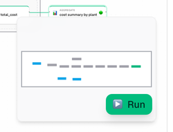
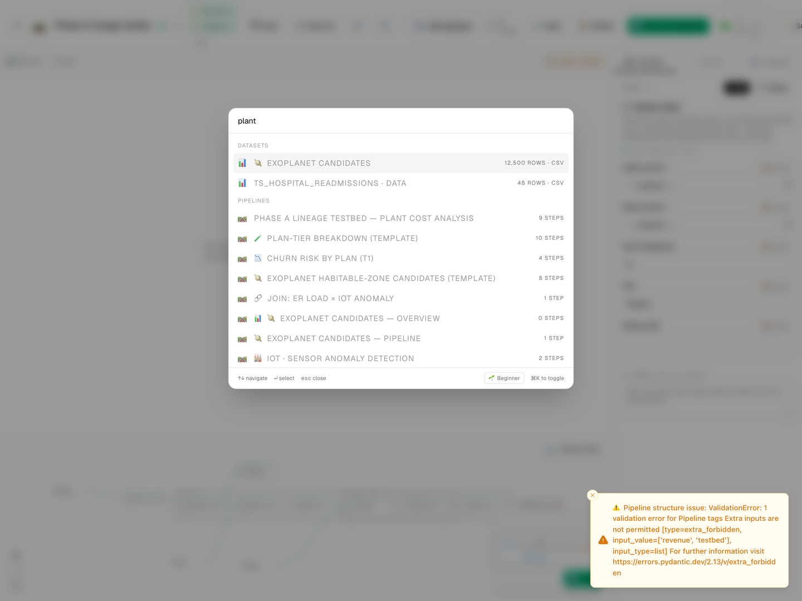

# How DIG is put together

This page is a guided tour of how the pieces of DIG fit together — the kind of overview you'd want before opening a pull request, deciding whether DIG fits your workflow, or just satisfying curiosity about why your CSV uploads end up in a SQLite database somewhere on disk.

You don't need to read this to *use* DIG. The [getting-started guide](getting_started.md) and the [tutorials](tutorials.md) are better starting points if you want to do something with your data right now. Come back here when you want to know **why** the tool behaves the way it does.

> **Reading order, depending on why you're here**
> - 🧑‍💻 *"I'm thinking about contributing"* — read this page top to bottom, then [`PLUGIN_AUTHORING.md`](PLUGIN_AUTHORING.md) and [`AUTHORING_GUIDE.md`](AUTHORING_GUIDE.md).
> - 🛠 *"I want to add a new step or connector"* — skim this page, then jump to [`AUTHORING_GUIDE.md`](AUTHORING_GUIDE.md).
> - 🔍 *"I'm evaluating whether DIG fits"* — read **Why these choices** and **What's in DIG** below; the rest is implementation detail.
> - 📦 *"I need to understand the on-disk pipeline format"* — go to [`PIPELINE_FORMAT.md`](PIPELINE_FORMAT.md).

---

## What DIG is trying to be

A few design intentions, as the code was written. They explain a lot of the choices below.

- **Self-hosted, single-process.** One binary, no docker compose, no microservices. Runs on your laptop, your home server, or a cheap VM. No cloud account required.
- **Web UI on a real port.** The interface is in the browser so multiple devices on the same LAN can share a session — useful for pair-programming a pipeline, or just opening it on a second monitor.
- **Up to ~50 GB on a single dataset.** The backend can chew through real data; the browser stays responsive by previewing on samples.
- **Drop-a-folder plugins.** Add a new transform or a new data source by writing one JSON file + one Python file. No registration, no plumbing — see [`PLUGIN_AUTHORING.md`](PLUGIN_AUTHORING.md).
- **Provably-equal preview and run.** What you see in the in-browser sample preview is what you'll get from the full backend run. We ship parity tests for every step that runs in both engines.

## The stack, by tier

| Tier | What runs there | Why |
|---|---|---|
| **Backend** | Python 3.11+, FastAPI, **DuckDB** (the primary execution engine), **Polars** (used for ingest + the rare step that needs Python rather than SQL), SQLAlchemy 2 async + SQLite (WAL mode), an asyncio-based job manager. | DuckDB is fast, embeddable, and the same engine has a WebAssembly build — which makes the next row possible. |
| **Frontend** | Next.js 16 (App Router), React 19, TypeScript, Tailwind v4, shadcn/ui, AG Grid Community for the data grid, React Flow for the canvas, **DuckDB-WASM** for in-browser preview, Observable Plot for profile-card sparklines, TanStack Query + Zustand for state. | Modern React stack; the WASM engine means a browser tab can run real SQL on real Parquet files without round-tripping every keystroke to the backend. |
| **Shared schemas** | JSON Schema 2020-12 files in `shared/schemas/`. | One source of truth for the pipeline document, the step manifest, and the connector manifest. Both the Python backend and the TypeScript frontend generate types from these files, so they can't drift apart. |

## Big picture

## How a pipeline is stored on disk

Every pipeline is a single JSON file (`.dig.json`) — easy to commit, diff, share, or generate from a script. The structure is described in plain English in [`PIPELINE_FORMAT.md`](PIPELINE_FORMAT.md) (recommended reading) and validated against [`shared/schemas/pipeline.schema.json`](../shared/schemas/pipeline.schema.json) on every save.

The one thing worth knowing here: **there is no separate edge list**. Each node names the upstream nodes or datasets it reads from, inside its `inputs` block, and that *is* the wiring. Two lists that have to stay in sync would be a whole bug class waiting to happen; one list can't disagree with itself.

## Where each step actually runs

DIG uses two execution engines and decides per-step which one handles each node:

- **DuckDB-WASM in your browser** — for instant preview on a sample. As you edit a step, the live grid updates within a few hundred milliseconds because the SQL never leaves the page.
- **DuckDB on the backend** — for the full data, the production output, the parquet file you want at the end.

Both engines run the *same SQL fragments*. A step is "browser-runnable" when its `engine.browser` is `"sql"` or `"js"`, it's marked deterministic, and none of its parameters reference a server-only resource (e.g., a 50-GB local file the browser couldn't reach). The frontend's dispatcher walks the pipeline left-to-right and runs as many nodes as it can in the browser before handing the rest to the backend.

What keeps the two engines in lock step:

1. **One engine where possible.** Every SQL-mode step compiles to a SQL fragment that runs unchanged in DuckDB and DuckDB-WASM. There's no second implementation to drift.
2. **Honest labels on samples.** Browser results are badged "Preview on N-row sample" so you always know whether you're looking at the real thing or a fast approximation.
3. **Parity tests.** For every step that runs in both engines, CI compares the byte-level output Parquet hashes. Tests block merge if the two engines disagree.

## What's in DIG

The capabilities DIG provides — every one is exercised by the [end-to-end validation harness](E2E_VALIDATION.md) and the bundled [tutorials](tutorials.md):

- **A complete pipeline engine.** DAG validator, schema inference, an executor that compiles your whole pipeline into one DuckDB SQL statement (with a Polars escape hatch for the few steps that genuinely need Python).
- **A step catalog of 45+ transforms** — see [`docs/STEPS.md`](STEPS.md) for the auto-generated, always-current list. New ones appear by dropping a folder under `backend/steps/<id>/` (or `plugins/steps/<id>/` for your own).
- **Connectors for the common cases.** CSV, TSV, JSON, Parquet, Excel, SQLite, PostgreSQL, MySQL, HTTPS — plus a generic JDBC connector for the long tail of enterprise databases (Oracle, MS SQL Server, DB2, Snowflake, Teradata, …).
- **Live in-browser preview.** DuckDB-WASM bundles ship pinned in `frontend/public/duckdb-wasm/`; no CDN dependency.
- **Multi-session editing.** Open the same pipeline in two browser tabs; both stay in sync via WebSocket. Conflicts are detected with ETags and surface as a "your copy is stale" toast rather than silent overwrites.
- **Per-column lineage.** As your pipeline runs, DIG tracks which upstream column each downstream column came from. The lineage panel lights up the path when you click a column. The Sankey, Column DNA, and workspace-wide Catalog views are documented in [`LINEAGE_AND_CATALOG.md`](LINEAGE_AND_CATALOG.md).
- **A workspace command palette.** ⌘K (or Ctrl+K) opens a single search across pipelines, datasets, columns, tags, steps, and quick actions.

  

- **A real settings UI.** Paths, JDBC drivers, global webhooks, performance knobs, theme — all in Settings → ⚙️ instead of buried in config files.
- **Outbound integrations.** Webhooks fire on run completion (succeeded / failed / always), or only when explicitly invoked from inside a pipeline via the 🔔 Trigger webhook step.
- **Many ways out.** Export to Parquet, CSV, JSON, NDJSON, Excel; generate runnable Python (`.py`) or a walked-through Jupyter notebook (`.ipynb`); push rows to any JDBC database.
