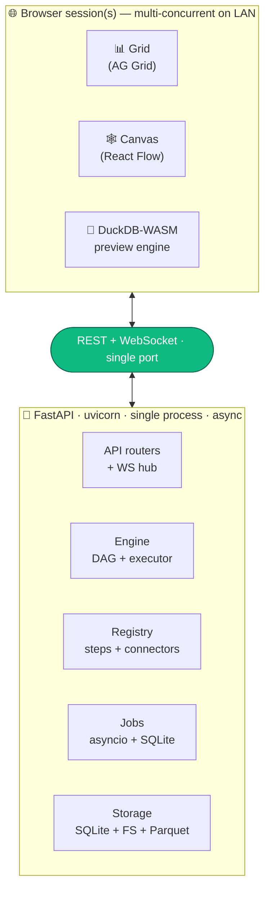

# Architecture

High-level summary of DIG's architecture — what's where and why. Companion docs: [`docs/PIPELINE_FORMAT.md`](PIPELINE_FORMAT.md) for the JSON DAG shape, [`docs/PLUGIN_AUTHORING.md`](PLUGIN_AUTHORING.md) + [`docs/AUTHORING_GUIDE.md`](AUTHORING_GUIDE.md) for the plugin contract, [`docs/STEPS.md`](STEPS.md) for the auto-generated step catalog.

## Goals

- Self-hosted, single-process, web-based data preparation tool.
- Multi-session web UI on the LAN (concurrent edits, last-write-wins).
- Up to ~50 GB single dataset on the backend; in-browser preview on samples.
- Plugin-first: new transforms by dropping a folder with a JSON manifest + Python implementation.
- Provable parity between in-browser preview and backend execution.

## Stack

**Backend** — Python 3.11+, FastAPI, DuckDB (primary), Polars (secondary), SQLAlchemy 2 async + SQLite WAL, asyncio job manager.

**Frontend** — Next.js 15+, React 19, TypeScript, Tailwind v4, shadcn/ui (Base UI), AG Grid Community (infinite row model), React Flow (DAG canvas), DuckDB-WASM (browser executor), Observable Plot (profile cards), TanStack Query + Zustand.

**Schemas** — JSON Schema 2020-12 in `shared/schemas/`. Single source of truth for the pipeline document, step manifest, and connector manifest.

## Big picture

## Pipeline format (the portable JSON DAG)

See `shared/schemas/pipeline.schema.json` for the authoritative schema and `docs/PIPELINE_FORMAT.md` for the human reference. Key shape: every node declares its `inputs` as `{port: {ref, port?}}` references to dataset ids or upstream node ids — the reference list *is* the edge list. There is no separate `edges` array.

## Hybrid execution

A step is browser-runnable iff `engine.browser ∈ {"sql","js"}`, `engine.deterministic == true`, and its bound params don't reference a server-only resource. The frontend dispatcher (`frontend/lib/engine/dispatcher.ts`) topo-walks the pipeline and accepts the longest prefix of browser-runnable nodes; the rest forms the backend frontier. Same-result guarantee rests on:

1. One engine where possible — DuckDB SQL fragments run identically under DuckDB-WASM.
2. Sample-aware semantics — every browser result is badged "Preview on N-row sample."
3. Parity tests — golden Parquet hashes compared between backend and DuckDB-WASM runs.

## What ships today

- **Pipeline engine** — DAG validator, schema inference, executor that compiles the whole pipeline into a single DuckDB SQL statement (with Polars escape hatch for steps that need it).
- **Step library** — auto-discovered from `backend/steps/<id>/`. See [`docs/STEPS.md`](STEPS.md) for the current catalog.
- **Connectors** — auto-discovered from `backend/connectors/<id>/`. CSV, TSV, JSON, Parquet, Excel, SQLite, PostgreSQL, MySQL, generic JDBC, HTTPS.
- **Browser preview** — DuckDB-WASM bundles served from `frontend/public/duckdb-wasm/`. Dispatcher decides what runs in-browser vs. backend per pipeline.
- **Multi-session editing** — WebSocket broadcast on every save; per-session undo/redo; ETag-based conflict detection (stale save → 409 with reload toast).
- **Lineage** — per-column provenance computed during execution and surfaced in the UI's lineage panel.
- **Server-side settings UI** — paths, JDBC drivers, global webhooks, perf knobs (see Settings → ⚙️).
- **Outbound integrations** — webhooks (auto-fire on terminal status, or `triggered`-only for in-pipeline invocation via the 🔔 Trigger webhook step).
- **Exports** — Parquet, CSV, JSON, NDJSON, Excel; Python script (`.py`); Jupyter notebook (`.ipynb`); JDBC for any Java-driver DB.
