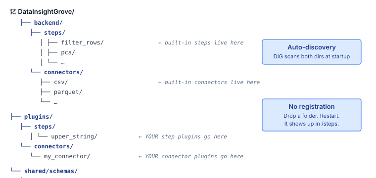
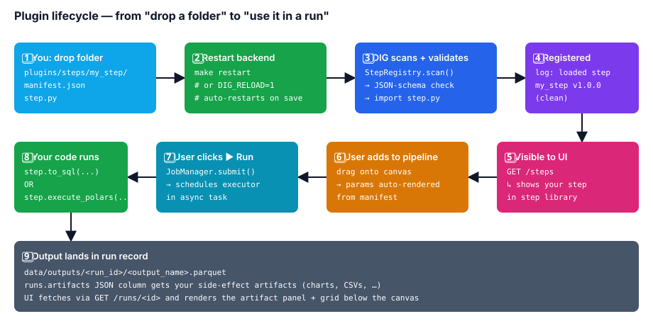
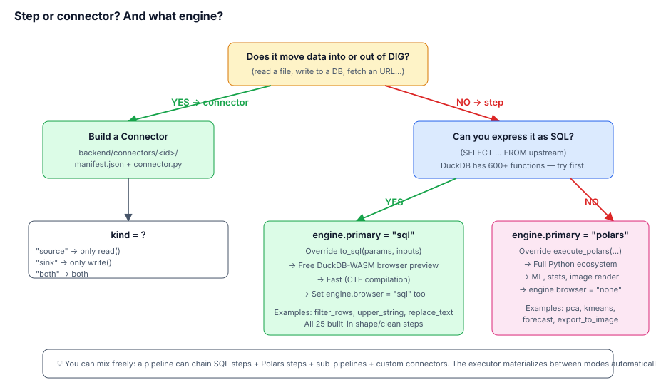
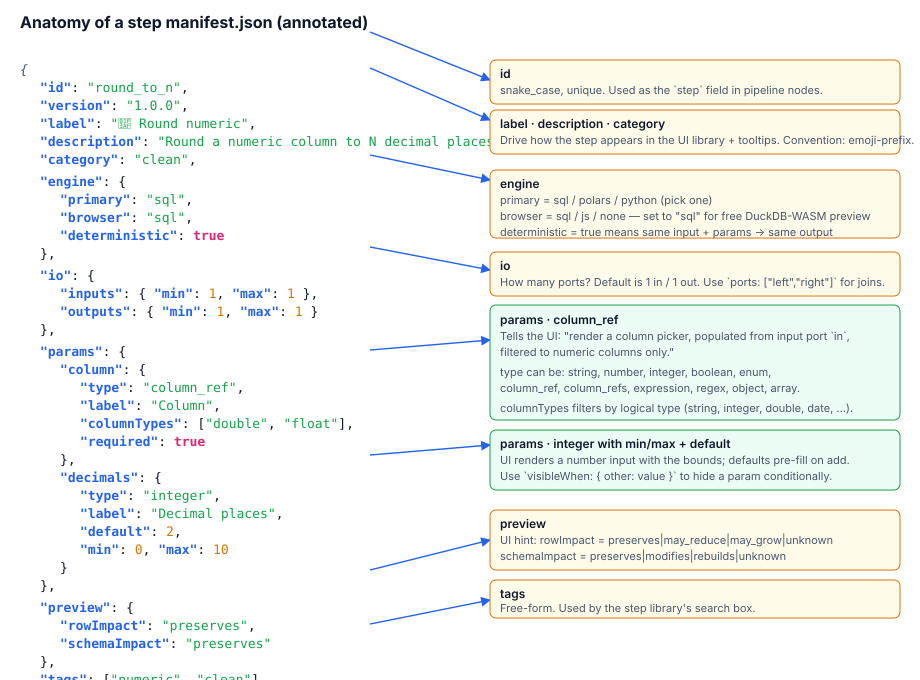
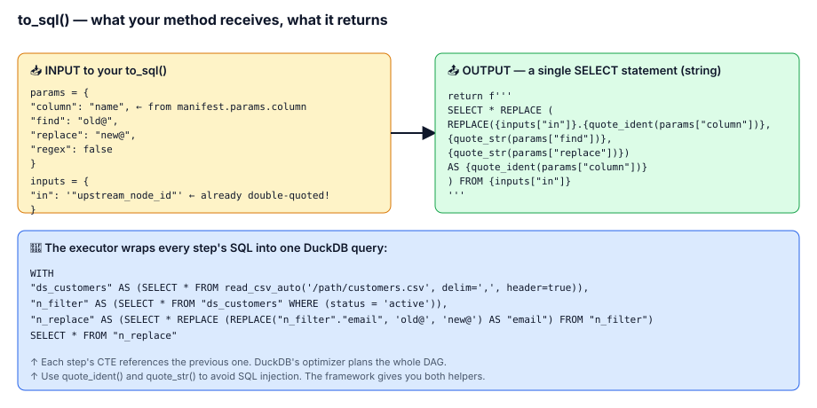
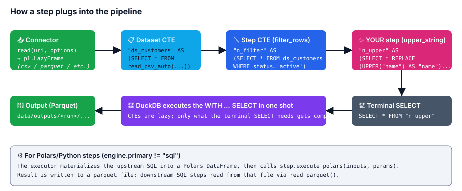
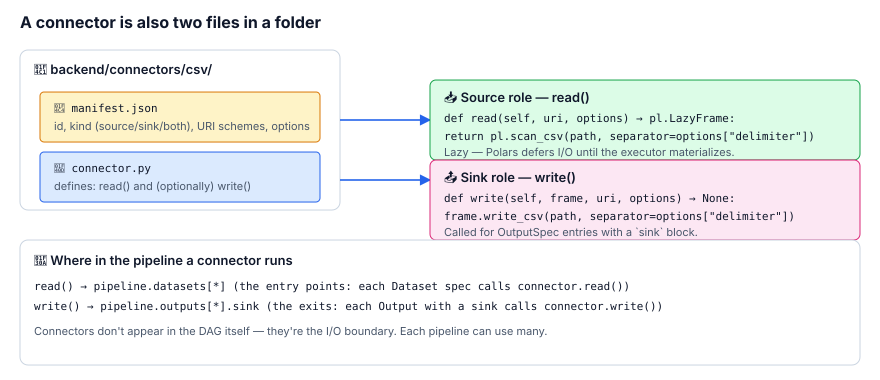

# 🛠 Building your own steps + connectors — the deep guide

This is the long-form companion to [`PLUGIN_AUTHORING.md`](PLUGIN_AUTHORING.md). We'll build a working step from an empty folder, then a working connector from an empty folder, and explain every line as we go. By the end you'll have two custom plugins running inside your local DIG and a clear mental model of how to write more.

> **Who this is for**
> Anyone who has opened a Python file before. You don't need to know FastAPI, DuckDB, Polars internals, JSON Schema, or React — we'll explain each concept the first time it shows up. If you've used pandas or written a small Flask/Django view, you're more than ready.
>
> **Already shipped a plugin or two?** Skip to the [**cheat sheet**](#-cheat-sheet-skip-the-explanations) at the end — or just read [`PLUGIN_AUTHORING.md`](PLUGIN_AUTHORING.md), which is the same material in one short page.

**What you'll learn**

1. The two kinds of plugins — **step** and **connector** — and how to choose
2. How DIG discovers, validates, and loads your plugin
3. How to write a manifest the UI auto-renders into a form
4. How to write a step that compiles to SQL (fastest path)
5. How to write a step that runs in Python (when SQL isn't enough)
6. How to write a connector that reads + writes a new format
7. How to test, debug, and version your plugin

---

## Table of contents

1. [The mental model](#-the-mental-model)
2. [Where files live](#-where-files-live)
3. [Plugin lifecycle from drop-folder to run](#-plugin-lifecycle)
4. [Should I write a step or a connector?](#-step-or-connector)
5. [**Tutorial 1** — Build a SQL step from scratch (`round_to_n`)](#-tutorial-1--build-a-sql-step-from-scratch)
6. [**Tutorial 2** — Build a Polars step from scratch (`zscore`)](#-tutorial-2--build-a-polars-step-from-scratch)
7. [**Tutorial 3** — Build a connector from scratch (`tsv` aliasing CSV)](#-tutorial-3--build-a-connector-from-scratch)
8. [The manifest in detail — every field, every parameter type](#-the-manifest-in-detail)
9. [Helpers you can use in `step.py`](#-helpers-you-can-use-in-steppy)
10. [Testing your plugin](#-testing-your-plugin)
11. [Debugging when it doesn't load](#-debugging-when-it-doesnt-load)
12. [Versioning + breaking changes](#-versioning--breaking-changes)
13. [What plugins still can't do](#-what-plugins-still-cant-do-yet)
14. [Cheat sheet](#-cheat-sheet-skip-the-explanations)

---

## 🧠 The mental model

DIG processes data through a **pipeline** — a directed acyclic graph (DAG) of **steps**. Each step takes one or more inputs (other steps or datasets), does something to them, and produces one or more outputs.

Two kinds of plugins extend DIG:

| Plugin | What it does | When it runs |
|---|---|---|
| 🪛 **Step** | A node inside the DAG that transforms data (filter, derive, aggregate, etc.) | Once per pipeline run, for every node that uses it |
| 📥 **Connector** | The I/O boundary — reads source data into the DAG, or writes results back out | Once per dataset on input; once per output sink |

Both follow the **same shape**: a folder with two files.

```
my_plugin/
├── manifest.json   ← describes what it is (UI + validation)
└── step.py / connector.py   ← the implementation (Python)
```

DIG auto-discovers plugins on backend start. You drop a folder, you restart, your plugin shows up in the UI. **There is no register-this-with-that boilerplate.**

---

## 📁 Where files live



Two roots get scanned:

| Path | Purpose |
|---|---|
| `backend/steps/<id>/`   ·   `backend/connectors/<id>/` | **Built-in** plugins shipped with the repo. Read these as reference; modify them only in your own fork. |
| `plugins/steps/<id>/`   ·   `plugins/connectors/<id>/` | **Your** plugins. Live alongside DIG without modifying its source. Survives `git pull`. |

We'll use `plugins/` for everything in this guide — it's the right home for end-user extensions.

> **Single source of truth — the schemas:** `shared/schemas/step-manifest.schema.json` and `shared/schemas/connector-manifest.schema.json`. The registry validates every manifest against these on load. If you write a manifest that doesn't match the schema, the backend logs a precise error and refuses to register that one plugin (other plugins keep working).

---

## 🔄 Plugin lifecycle



The flow:

1. **You** drop a folder under `plugins/steps/<id>/` containing `manifest.json` + `step.py`.
2. **Restart the backend** — `make restart`, or `make backend-dev` for hot-reload during iteration.
3. **DIG scans** both `backend/steps/` and `plugins/steps/` on startup.
4. **JSON-Schema validation** runs against each manifest. Bad manifests are skipped with a logged error.
5. **`step.py` is imported** as a module. The framework reads the module's `step` symbol and registers it.
6. **The frontend pulls `/steps`** on next page load. Your step shows up in the step library.
7. **A user adds your step** to a pipeline. The UI auto-generates a parameter form from your manifest.
8. **The user clicks ▶ Run.** The JobManager schedules the executor.
9. **Your code runs** — either `to_sql()` (compiles into the WITH chain) or `execute_polars()` (runs against materialized DataFrames).
10. **The output lands** as a Parquet under `data/outputs/<run_id>/` and any side-effect artifacts (charts, JSON stats, sub-pipeline references) get attached to the run record.

---

## 🌿 Step or connector?



Pick a **connector** if your code reads or writes data outside DIG (a file, a DB, an HTTP API, S3, a queue).

Pick a **step** if your code transforms data that's already inside DIG (filter, derive, group, ML, render).

For steps, the next decision is: **SQL or Polars?**

- **SQL** is the default. DuckDB has 600+ functions; most data work fits. SQL steps get free DuckDB-WASM browser preview, run faster (CTE compilation), and need less code.
- **Polars** when you genuinely need Python: scikit-learn, statsmodels, matplotlib, custom math, calling out to a library. Polars steps run only on the backend; the browser preview falls back to backend execution.

> **Rule of thumb:** start with SQL. If you find yourself fighting the SQL — you need a regression model, a chart, a non-trivial reshape — promote to Polars. Mixing both in one pipeline works fine (the executor materializes between modes automatically).

---

## 📝 Tutorial 1 — Build a SQL step from scratch

We'll build **`round_to_n`** — round a numeric column to N decimal places. Tiny but real: similar shape to `replace_text`, `cast_type`, `clean_whitespace` in the built-in catalog.

### What we want at the end

When a user adds the step to a pipeline, they see a form like:

```
🎯 Round numeric
  Column ▾  [ amount         ]   ← only shows numeric columns
  Decimal places  [ 2 ]           ← integer, default 2, bounded 0-10
```

And the resulting pipeline node, when run, replaces the chosen column with its rounded values.

---

### Step 1 — Make the folder

```bash
mkdir -p plugins/steps/round_to_n
cd plugins/steps/round_to_n
```

You'll create exactly two files in this folder. (A third — `tests.py` — is optional but recommended; we'll add it later.)

### Step 2 — Write the manifest

Create `manifest.json`:

```json
{
  "id": "round_to_n",
  "version": "1.0.0",
  "label": "🎯 Round numeric",
  "description": "Round a numeric column to N decimal places. The column is replaced in place.",
  "category": "clean",
  "engine": { "primary": "sql", "browser": "sql", "deterministic": true },
  "io": {
    "inputs":  { "min": 1, "max": 1, "ports": ["in"] },
    "outputs": { "min": 1, "max": 1, "ports": ["out"] }
  },
  "params": {
    "column": {
      "type": "column_ref",
      "label": "Column",
      "columnFrom": "in",
      "columnTypes": ["double", "float", "decimal"],
      "required": true,
      "help": "Numeric column to round."
    },
    "decimals": {
      "type": "integer",
      "label": "Decimal places",
      "default": 2,
      "min": 0,
      "max": 10,
      "required": true
    }
  },
  "preview": { "rowImpact": "preserves", "schemaImpact": "preserves" },
  "tags": ["clean", "numeric", "round"]
}
```

Here's what each piece does, annotated visually:



The most important lines:

| Field | Why it matters |
|---|---|
| `"id": "round_to_n"` | The identifier pipelines reference. Must be `snake_case`, must be globally unique among all steps. |
| `"version": "1.0.0"` | Pipelines pin `stepVersion` per node. If you bump this, old pipelines keep using the old version (in theory — see [Versioning](#-versioning--breaking-changes)). |
| `"label": "🎯 Round numeric"` | Shown in the step library and on the canvas node. Convention: emoji prefix matching the category. |
| `"category": "clean"` | One of `ingest`, `shape`, `clean`, `derive`, `combine`, `aggregate`, `output`, `custom`. Drives where it shows up in the library. |
| `"engine": {...}` | `primary: "sql"` → we'll write a SQL fragment. `browser: "sql"` → DuckDB-WASM runs the same SQL → free in-browser preview. `deterministic: true` → same input + params → same output. |
| `"io"` | One input, one output. Default port names are `in` / `out` — you only need to set `ports` when you have multiple (`["left", "right"]` for a join). |
| `"params.column"` | Renders as a column picker. `columnFrom: "in"` says "populate from the input port called `in`." `columnTypes` filters the picker to only numeric columns. |
| `"params.decimals"` | Renders as an integer input with bounds and default. |
| `"preview"` | Hint to the UI: "this step neither adds nor removes rows or columns." Drives the badges shown on the node before it runs. |

### Step 3 — Write the implementation

Create `step.py`:

```python
"""Round a numeric column to N decimal places."""

from __future__ import annotations

import json
from pathlib import Path
from typing import Any

from dig.engine.step import Step, quote_ident


class RoundToNStep(Step):
    def to_sql(self, params: dict[str, Any], inputs: dict[str, str]) -> str:
        src = inputs["in"]
        col = quote_ident(params["column"])
        decimals = int(params["decimals"])
        # DuckDB's ROUND(x, n); SELECT * REPLACE swaps the column in place
        # so all the other columns flow through unchanged.
        return f"SELECT * REPLACE (ROUND({col}, {decimals}) AS {col}) FROM {src}"


# This module-level `step` is what the registry imports. The path math
# loads our manifest from disk (same folder as this file).
step = RoundToNStep(json.loads((Path(__file__).parent / "manifest.json").read_text()))
```

Here's what `to_sql` receives and returns, annotated:



A few important details about that one method:

- **`inputs["in"]` is already double-quoted**, so it can be used directly as an identifier in your SQL. No need to wrap it again.
- **`params["column"]` is raw user input** — always pass column names through `quote_ident()` to escape any embedded quotes. Same for string literals: use `quote_str()` (we'll see it in the connector example).
- **`SELECT * REPLACE (... AS col)`** is a DuckDB shortcut that says "select every column, but replace `col` with this expression." Cleaner than listing every column explicitly.
- **Don't add a trailing semicolon.** Your SELECT becomes the body of a CTE (`<node_id> AS (<your sql>)`); a `;` mid-CTE breaks the query.
- **Don't run network I/O.** `to_sql` is called many times (validation, preview, run). Keep it pure.

### Step 4 — Restart and verify

```bash
make restart
```

In the API logs you should see:

```
INFO:dig.engine.registry:loaded step round_to_n v1.0.0 (clean)
```

Verify via the API:

```bash
curl -s http://127.0.0.1:8190/steps | jq '.[] | select(.id=="round_to_n")'
```

Open the editor at `http://localhost:3100`, drag your new step out of the library, point it at a numeric column, run the pipeline. You should see the rounded values in the live grid.

That's a complete working step in **40 lines of JSON + 15 lines of Python**.

---

## 📝 Tutorial 2 — Build a Polars step from scratch

When SQL isn't enough — you need scikit-learn, statsmodels, matplotlib, or anything that doesn't fit in a SELECT — switch to a **Polars step**.

We'll build **`zscore`** — add a new column with the standardized (mean=0, std=1) version of a numeric column. Could be done in SQL with subqueries; we'll do it in Polars to show the pattern.

### Step 1 — Folder + manifest

```bash
mkdir -p plugins/steps/zscore
```

`plugins/steps/zscore/manifest.json`:

```json
{
  "id": "zscore",
  "version": "1.0.0",
  "label": "📐 Z-score",
  "description": "Add a standardized (mean=0, std=1) version of a numeric column as a new column.",
  "category": "derive",
  "engine": { "primary": "polars", "browser": "none", "deterministic": true },
  "io": {
    "inputs":  { "min": 1, "max": 1, "ports": ["in"] },
    "outputs": { "min": 1, "max": 1, "ports": ["out"] }
  },
  "params": {
    "column": {
      "type": "column_ref",
      "label": "Column",
      "columnFrom": "in",
      "columnTypes": ["double", "float", "integer", "decimal"],
      "required": true
    },
    "output_column": {
      "type": "string",
      "label": "Output column name",
      "default": "z_score"
    }
  },
  "preview": { "rowImpact": "preserves", "schemaImpact": "modifies" },
  "tags": ["stats", "derive", "standardize"]
}
```

The differences from Tutorial 1:

- `engine.primary` is `"polars"` instead of `"sql"`.
- `engine.browser` is `"none"` — no in-browser preview for this one.
- `schemaImpact` is `"modifies"` — we add a column.

### Step 2 — Implementation

`plugins/steps/zscore/step.py`:

```python
"""Z-score (standardization) step.

Adds (col - mean) / std as a new column. Mean and std are computed over the
non-null values of the input column.
"""

from __future__ import annotations

import json
from pathlib import Path
from typing import Any

import polars as pl

from dig.engine.step import PolarsContext, PolarsResult, Step


class ZScoreStep(Step):
    def execute_polars(
        self,
        inputs: dict[str, pl.DataFrame],
        params: dict[str, Any],
        ctx: PolarsContext | None = None,
    ) -> PolarsResult:
        df = inputs["in"]                # the upstream output, already a DataFrame
        col = params["column"]
        out_col = params.get("output_column") or "z_score"

        if col not in df.columns:
            raise ValueError(f"zscore: column '{col}' not found")

        series = df.get_column(col).cast(pl.Float64)
        mean = series.mean()
        std = series.std()

        if std is None or std == 0:
            # Avoid divide-by-zero: emit zeros (constant column).
            zscores = pl.Series(out_col, [0.0] * df.height)
        else:
            zscores = ((series - mean) / std).rename(out_col)

        out = df.with_columns(zscores)
        return PolarsResult(output=out)


step = ZScoreStep(json.loads((Path(__file__).parent / "manifest.json").read_text()))
```

What changed from the SQL version:

| | SQL step | Polars step |
|---|---|---|
| Method to override | `to_sql(params, inputs)` | `execute_polars(inputs, params, ctx)` |
| `inputs` shape | `{port: "<sql_alias>"}` (string aliases) | `{port: pl.DataFrame}` (real DataFrames) |
| Returns | A SELECT string | A `PolarsResult(output=df, artifacts=[...])` |
| Side effects allowed? | No — keep `to_sql` pure | Yes — write files, render charts, anything |

### Step 3 — `PolarsContext` is your friend

The third arg, `ctx`, is a small dataclass with two useful fields:

```python
@dataclass
class PolarsContext:
    run_id: str                 # the current run id (a ULID)
    out_dir: Path               # data/outputs/<run_id>/  — write artifacts here
    pipeline_chain: tuple[str, ...] = ()   # for sub-pipeline cycle detection
```

Use it when your step writes side-effect files (charts, exports, scratch tables). Example: `export_to_image` writes a PNG into `ctx.out_dir`, then returns it as an artifact:

```python
out_path = ctx.out_dir / f"{self.id}.png"
fig.savefig(out_path, format="png")
return PolarsResult(
    output=df,
    artifacts=[{"kind": "image", "path": str(out_path), "title": params.get("title")}],
)
```

Artifacts get persisted to the `runs.artifacts` JSON column and surfaced in the UI's artifact panel. Common kinds: `image`, `file`, `db`, `sink`, `stats`, `expectations`, `subpipeline`. You can invent new ones — the artifacts panel's fallback renders any unknown kind as JSON.

### Step 4 — Where Polars steps fit in the executor



The executor walks the DAG in topological order. For each Polars node:

1. It compiles the upstream (SQL) chain into a single DuckDB query.
2. Runs that query, getting a Polars DataFrame.
3. Hands the DataFrame to your `execute_polars`.
4. Writes the result to a temp Parquet (`_intermediate/<node_id>.parquet`).
5. Downstream SQL steps reference that Parquet via `read_parquet()` instead of going through your code again.

This means **a Polars step in the middle of a pipeline works exactly the same as one at the end**. The executor handles the materialize-and-resume.

---

## 📝 Tutorial 3 — Build a connector from scratch

We'll build a **TSV connector** — basically the CSV connector with the delimiter pre-set to tab. Tiny, but it teaches the connector pattern.

### What you'll learn

- The `Connector` base class: `read()` + `write()`
- Source vs sink vs both
- URI handling

### Step 1 — Folder + manifest

```bash
mkdir -p plugins/connectors/tsv
```

`plugins/connectors/tsv/manifest.json`:

```json
{
  "id": "tsv",
  "version": "1.0.0",
  "label": "📑 TSV",
  "description": "Tab-separated values. Like CSV but with a literal tab between fields.",
  "kind": "both",
  "uriSchemes": ["file"],
  "fileExtensions": ["tsv", "tab"],
  "options": {
    "header": {
      "type": "boolean",
      "label": "First row is header",
      "default": true
    },
    "encoding": {
      "type": "enum",
      "label": "Encoding",
      "enumValues": ["utf-8", "utf-8-sig", "latin-1", "windows-1252"],
      "default": "utf-8"
    }
  },
  "tags": ["text", "tabular", "tsv"]
}
```

Here's how the manifest maps onto the runtime roles:



Notes:

| Field | Why it matters |
|---|---|
| `"kind": "both"` | We support both reading and writing. Use `"source"` if read-only, `"sink"` if write-only. |
| `"uriSchemes": ["file"]` | This connector handles `file://...` URIs. Add `"s3"`, `"https"`, etc. if you support more. |
| `"fileExtensions": ["tsv", "tab"]` | When the user uploads a file, the dataset wizard uses this to suggest your connector. |
| `"options"` | Same `paramSpec` shape as a step's `params` — you get the same UI form generator for free. |

### Step 2 — Implementation

`plugins/connectors/tsv/connector.py`:

```python
"""TSV (tab-separated values) connector.

Wraps Polars's CSV reader/writer with the delimiter pinned to '\\t'.
"""

from __future__ import annotations

import json
from pathlib import Path
from typing import Any
from urllib.parse import urlparse

import polars as pl

from dig.engine.connector import Connector


class TsvConnector(Connector):
    def _path(self, uri: str) -> Path:
        if uri.startswith("file://"):
            return Path(urlparse(uri).path)
        return Path(uri)

    def read(self, uri: str, options: dict[str, Any]) -> pl.LazyFrame:
        # LazyFrame, not DataFrame: Polars defers the actual read until the
        # executor materializes. This is what lets DIG handle 50 GB inputs.
        return pl.scan_csv(
            self._path(uri),
            separator="\t",
            has_header=options.get("header", True),
            encoding=options.get("encoding", "utf8"),
            infer_schema_length=10_000,
            try_parse_dates=True,
            ignore_errors=False,
        )

    def write(self, frame: pl.DataFrame, uri: str, options: dict[str, Any]) -> None:
        path = self._path(uri)
        path.parent.mkdir(parents=True, exist_ok=True)
        frame.write_csv(
            path,
            separator="\t",
            include_header=options.get("header", True),
        )


# Same loader pattern as a step.
_manifest = json.loads((Path(__file__).parent / "manifest.json").read_text())
connector = TsvConnector(_manifest)
```

The whole thing is two methods — `read` and `write` — plus a path helper.

### Step 3 — Restart, verify, use

```bash
make restart
curl -s http://127.0.0.1:8190/connectors | jq '.[] | select(.id=="tsv")'
```

The connector is now usable in a pipeline document:

```json
{
  "datasets": [
    {
      "id": "ds_logs",
      "connector": "tsv",
      "uri": "file:///path/to/access.tsv",
      "options": { "header": true, "encoding": "utf-8" }
    }
  ],
  "outputs": [
    {
      "id": "o", "name": "clean",
      "from": { "ref": "n_filter" },
      "sink": {
        "connector": "tsv",
        "uri": "file:///path/to/clean.tsv",
        "options": { "header": true }
      }
    }
  ]
}
```

The dataset upload wizard in the UI will also auto-suggest your TSV connector for any `.tsv` or `.tab` file (because of `fileExtensions`).

### What to do for a real-world connector

The TSV example is intentionally small. Real connectors typically need:

- **Error handling** — wrap I/O in `try/except` and re-raise with context the user can act on (`f"connector failed reading {uri}: {e}"`). The frontend surfaces these via the `runs.error` field.
- **Authentication** — for cloud / API connectors, read credentials from env vars (`os.environ`) or the user's `~/.config/dig/secrets.json`. Never embed in the URI; the URI ends up in plain text in the pipeline document.
- **Streaming** — for very large sources, return a true `LazyFrame` (Polars's `scan_csv`, `scan_parquet`, `scan_ndjson`, etc.). For sources without a Polars scan (HTTP API, custom format), `read_*().lazy()` is fine — Polars wraps the eager read.
- **URI scheme handling** — if you support more than `file://`, dispatch on `urlparse(uri).scheme`. The HTTPS connector (`backend/connectors/https/connector.py`) is a good reference.

---

## 📑 The manifest in detail

This is the reference section — skim it now, come back to it as you write more plugins.

### Top-level fields (steps)

```json
{
  "id":          "snake_case_id",
  "version":     "MAJOR.MINOR.PATCH",
  "label":       "Display name (shown in UI)",
  "description": "One paragraph; surfaces as tooltip + step library detail.",
  "category":    "ingest|shape|clean|derive|combine|aggregate|output|custom",
  "engine":      {...},
  "io":          {...},
  "params":      {...},
  "preview":     {...},
  "tags":        ["search", "keywords"]
}
```

### `engine` block

```json
"engine": {
  "primary":       "sql",      // sql | polars | python
  "browser":       "sql",      // sql | js | none
  "deterministic": true        // false → cannot run in browser
}
```

- `primary = "sql"` — implement `to_sql(params, inputs)`. Output gets compiled into a CTE.
- `primary = "polars"` — implement `execute_polars(inputs, params, ctx)`. Runs against materialized DataFrames.
- `primary = "python"` — same dispatch path as Polars. Use it when a step genuinely has no SQL form.
- `browser = "sql"` — DuckDB-WASM runs the same SQL fragment in the browser for live preview. **Free if your step is SQL.**
- `browser = "js"` — you provide a JS mirror under `frontend/lib/steps/<id>.ts`. Rarely needed; reserved for steps that genuinely have no SQL form.
- `browser = "none"` — backend always; the live preview rolls back to a backend round-trip.

### `io` block

```json
"io": {
  "inputs":  { "min": 1, "max": 1, "ports": ["in"] },
  "outputs": { "min": 1, "max": 1, "ports": ["out"] }
}
```

- For a join: `"inputs": {"min": 2, "max": 2, "ports": ["left", "right"]}`.
- For a union (variable arity): `"inputs": {"min": 2, "max": null, "ports": ["a", "b", "c"]}`. `max: null` means "unbounded".
- For a sub-pipeline (no upstream needed): `"inputs": {"min": 0, "max": 1, "ports": ["in"]}`.
- Output ports are usually `["out"]`. If your step splits the data (e.g. "happy path" / "errors"), declare `["ok", "errors"]` and have your impl produce both.

### `params` block

Each param is a `paramSpec`:

```json
"params": {
  "column": {
    "type": "column_ref",
    "label": "Column",
    "help":  "tooltip text",
    "required": true,
    "columnFrom": "in",
    "columnTypes": ["string"],
    "default": null,
    "visibleWhen": { "mode": "advanced" },
    "widget": "filter_builder"
  }
}
```

Available types — what each renders + what value the backend receives:

| `type` | UI widget | Backend value type |
|---|---|---|
| `string` | Text input | `str` |
| `number` | Float input | `float` |
| `integer` | Integer stepper | `int` |
| `boolean` | Checkbox | `bool` |
| `enum` | Dropdown (uses `enumValues`) | `str` or `number` |
| `column_ref` | Single-column picker (uses `columnFrom`, optional `columnTypes`) | `str` (column name) |
| `column_refs` | Multi-column picker | `list[str]` |
| `expression` | SQL/expression editor (mono font) | `str` |
| `regex` | String input with regex syntax highlighting | `str` |
| `object` | Renders nested fields from `properties` | `dict` |
| `array` | List editor; items typed via `items` | `list` |

Modifiers that work on multiple types:

| Field | Applies to | What it does |
|---|---|---|
| `default` | all | Pre-fills on add. JSON value matching `type`. |
| `required` | all | UI marks it; saves are rejected if missing. |
| `min` / `max` | number, integer | Numeric bounds enforced in UI + backend. |
| `pattern` | string | Regex; UI blocks save on mismatch. |
| `enumValues` | enum | Allowed values. |
| `columnFrom` | column_ref(s) | Which input port to pull the schema from (default `"in"`). |
| `columnTypes` | column_ref(s) | Filter the picker by logical type. |
| `items` | array | The paramSpec for each list item. |
| `properties` | object | Map of nested paramSpecs. |
| `visibleWhen` | all | `{ otherParam: value }` — show only when sibling has that exact value. |
| `widget` | all | Optional UI hint requesting a richer editor. Frontend falls back if unknown. |

### `preview` block

UI-only hint for the badges shown on the canvas node before it runs:

```json
"preview": {
  "rowImpact":    "preserves",   // preserves | may_reduce | may_grow | unknown
  "schemaImpact": "preserves"    // preserves | modifies   | rebuilds | unknown
}
```

Be honest — these drive user expectations and validation hints.

---

## 🛠 Helpers you can use in `step.py`

Imported from `dig.engine.step`:

```python
from dig.engine.step import (
    Step,                # base class
    PolarsContext,       # per-run context for Polars steps
    PolarsResult,        # return type of execute_polars
    quote_ident,         # safely quote a column / table name
    quote_str,           # safely quote a SQL string literal
)
```

| Helper | Use for |
|---|---|
| `quote_ident("col with spaces")` | Becomes `"col with spaces"`. Doubles any embedded `"`. |
| `quote_str("Bob's value")` | Becomes `'Bob''s value'`. Doubles any embedded `'`. |
| `PolarsContext(run_id, out_dir, pipeline_chain)` | Passed to `execute_polars`. Use `out_dir` for side-effect files. |
| `PolarsResult(output, artifacts)` | Return type. `output` is the DataFrame; `artifacts` is a list of dicts you want surfaced in the run UI. |

You can also override `infer_schema(input_schemas, params) -> dict[str, str]` if your step adds, removes, or renames columns. The default passes the first input's schema through. Doing this right makes downstream column pickers work better.

---

## ✅ Testing your plugin

A `tests.py` next to your `step.py` is auto-discovered by pytest. The framework's tests live under `backend/tests/` — your plugin tests can live alongside your plugin.

### Testing a SQL step

```python
# plugins/steps/round_to_n/tests.py
import duckdb
import pytest
from dig.engine.registry import steps

@pytest.fixture(scope="module")
def con():
    c = duckdb.connect(":memory:")
    c.execute("CREATE TABLE prices AS SELECT * FROM (VALUES (1.234567), (9.876543)) t(price)")
    return c

def test_rounds_to_two(con):
    step = steps().get("round_to_n")
    sql = step.to_sql({"column": "price", "decimals": 2}, {"in": '"prices"'})
    rows = con.execute(sql).fetchall()
    assert rows == [(1.23,), (9.88,)]
```

Run it:

```bash
cd backend && source .venv/bin/activate
pytest ../plugins/steps/round_to_n/tests.py -v
```

### Testing a Polars step

```python
# plugins/steps/zscore/tests.py
import polars as pl
from dig.engine.registry import steps

def test_zscore_mean_zero():
    step = steps().get("zscore")
    df = pl.DataFrame({"x": [1.0, 2.0, 3.0, 4.0, 5.0]})
    res = step.execute_polars({"in": df}, {"column": "x", "output_column": "z"})
    z = res.output.get_column("z")
    assert abs(z.mean()) < 1e-9        # mean ≈ 0
    assert abs(z.std() - 1.0) < 1e-9   # std ≈ 1
```

### Testing a connector

```python
# plugins/connectors/tsv/tests.py
import polars as pl
import pytest
from dig.engine.registry import connectors

def test_tsv_roundtrip(tmp_path):
    c = connectors().get("tsv")
    df = pl.DataFrame({"id": [1, 2], "name": ["alice", "bob"]})
    p = tmp_path / "out.tsv"
    c.write(df, f"file://{p}", {"header": True})
    back = c.read(f"file://{p}", {"header": True}).collect()
    assert back.equals(df)
```

---

## 🐛 Debugging when it doesn't load

When something's wrong, check the API logs first:

```bash
tail -f /var/folders/.../dig-api.log    # Mac
# Or wherever DIG writes logs (the dig-start output prints the path).
```

Common errors:

| Log message | Probable cause | Fix |
|---|---|---|
| `failed to load step <id>: <id>/manifest.json invalid: ...` | JSON-Schema mismatch | The error names the field. Check it against [`step-manifest.schema.json`](../shared/schemas/step-manifest.schema.json). |
| `failed to load step <id>: ... must export `step` of type Step` | `step.py` doesn't have a module-level `step = ...` | Add the bottom line: `step = MyStep(json.loads(...))`. |
| `failed to load step <id>: manifest id 'X' != step.id 'Y'` | Mismatch between manifest's `id` and the loaded class's `manifest["id"]` | Make sure `step.py` loads the same `manifest.json` your folder contains. |
| `KeyError: 'in'` at runtime | Your `to_sql` reads `inputs["in"]` but the manifest declares no input port called `in` | Either add `"ports": ["in"]` (default) or read whatever port name you declared. |
| `polars step '<id>' failed: ...` | Your `execute_polars` raised | The trailing message is the original exception. The `runs.error` field on the run row has the full traceback. |

When iterating, run `make backend-dev` (foreground, hot-reload) instead of `make start` — saving a step file restarts the backend automatically and re-validates.

---

## 🏷 Versioning + breaking changes

The `version` in your manifest is **SemVer**:

- **Patch** (`1.0.0` → `1.0.1`) — bug fix, no behavior or schema change.
- **Minor** (`1.0.0` → `1.1.0`) — new param with a default, or new optional behavior. Old pipelines still run unchanged.
- **Major** (`1.0.0` → `2.0.0`) — incompatible param shape, removed param, changed semantics.

Pipelines pin `stepVersion` per node:

```json
{ "id": "n1", "step": "round_to_n", "stepVersion": "1.0.0", ... }
```

Today the registry indexes only by `id` — `stepVersion` in the document is a record of intent, but the only registered version is whatever you currently have on disk. **Practical implication:** a major version bump silently changes behavior for old pipelines until the multi-version registry lands. Until then: be conservative. Add new params as optional with sensible defaults. Don't change what an existing param means.

---

## 🚧 What plugins still can't do (yet)

Honest list of current limitations:

- **No new param types beyond the built-in set.** If you need a hex color picker, today you'd use `string` with a `pattern` regex.
- **No custom canvas node renderer.** Every step renders as the same React Flow node — your manifest controls the label and badges, not the node geometry.
- **No multi-version registry.** See above. Newer versions silently win.
- **No JS-mirror authoring tooling for `engine.browser = "js"`.** The slot exists but you'd be hand-writing TypeScript that mirrors your Python; tests for it are manual.
- **No async step execution.** `to_sql` and `execute_polars` are sync. The executor runs them in a worker thread but each step is a blocking call.
- **No mid-pipeline hooks** (e.g. "run this before that step"). Steps are pure data transforms; cross-step coordination has to go through the data itself.

Most of these have backlog issues; if you hit one, the right move is usually to file an issue describing the use case rather than work around it.

---

## 🔗 See also

- [`docs/PLUGIN_AUTHORING.md`](PLUGIN_AUTHORING.md) — the short reference
- [`docs/STEPS.md`](STEPS.md) — every built-in step (auto-generated from manifests)
- [`docs/PIPELINE_FORMAT.md`](PIPELINE_FORMAT.md) — the JSON DAG your steps slot into
- [`docs/ARCHITECTURE.md`](ARCHITECTURE.md) — how the executor compiles + runs the DAG
- [`shared/schemas/step-manifest.schema.json`](../shared/schemas/step-manifest.schema.json) — authoritative manifest schema
- [`shared/schemas/connector-manifest.schema.json`](../shared/schemas/connector-manifest.schema.json) — authoritative connector schema
- [`backend/dig/engine/step.py`](../backend/dig/engine/step.py) — `Step` base class source
- [`backend/dig/engine/connector.py`](../backend/dig/engine/connector.py) — `Connector` base class source
- [`plugins/steps/upper_string/`](../plugins/steps/upper_string/) — minimal complete example

---

## 🎯 Cheat sheet (skip the explanations)

**Step folder:**

```
plugins/steps/<id>/
  manifest.json  ← validated against shared/schemas/step-manifest.schema.json
  step.py        ← exports `step = MyStep(manifest)` at module level
  tests.py       ← optional pytest cases
```

**Step skeleton (SQL):**

```python
from dig.engine.step import Step, quote_ident
import json
from pathlib import Path

class MyStep(Step):
    def to_sql(self, params, inputs):
        return f'SELECT * FROM {inputs["in"]} WHERE ...'

step = MyStep(json.loads((Path(__file__).parent / "manifest.json").read_text()))
```

**Step skeleton (Polars):**

```python
from dig.engine.step import Step, PolarsContext, PolarsResult
import polars as pl, json
from pathlib import Path

class MyStep(Step):
    def execute_polars(self, inputs, params, ctx=None) -> PolarsResult:
        df = inputs["in"]
        # ... transform df ...
        return PolarsResult(output=df, artifacts=[])

step = MyStep(json.loads((Path(__file__).parent / "manifest.json").read_text()))
```

**Connector folder:**

```
plugins/connectors/<id>/
  manifest.json
  connector.py   ← exports `connector = MyConnector(manifest)`
```

**Connector skeleton:**

```python
from dig.engine.connector import Connector
import polars as pl, json
from pathlib import Path

class MyConnector(Connector):
    def read(self, uri, options) -> pl.LazyFrame: ...
    def write(self, frame, uri, options) -> None: ...

connector = MyConnector(json.loads((Path(__file__).parent / "manifest.json").read_text()))
```

**Restart and verify:**

```bash
make restart
curl -s http://127.0.0.1:8190/steps      | jq '.[] | select(.id=="<id>")'
curl -s http://127.0.0.1:8190/connectors | jq '.[] | select(.id=="<id>")'
```
