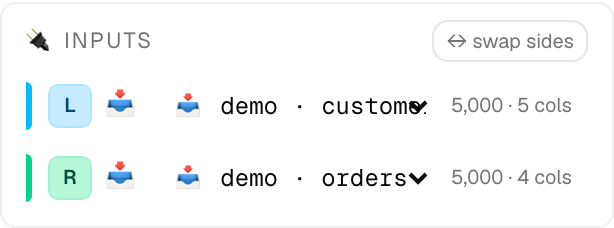
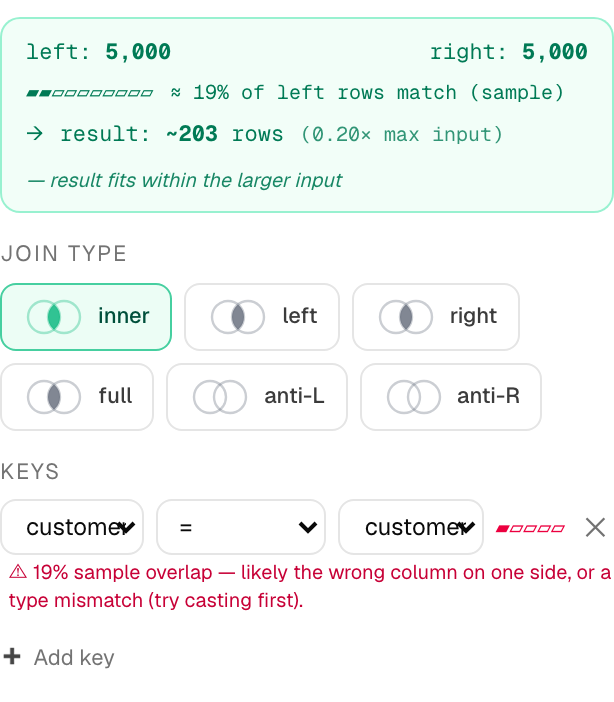
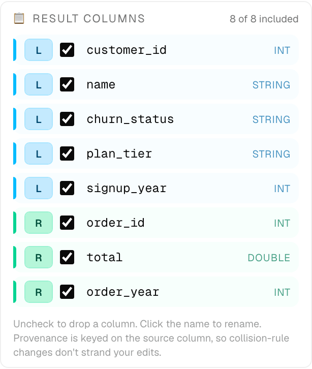
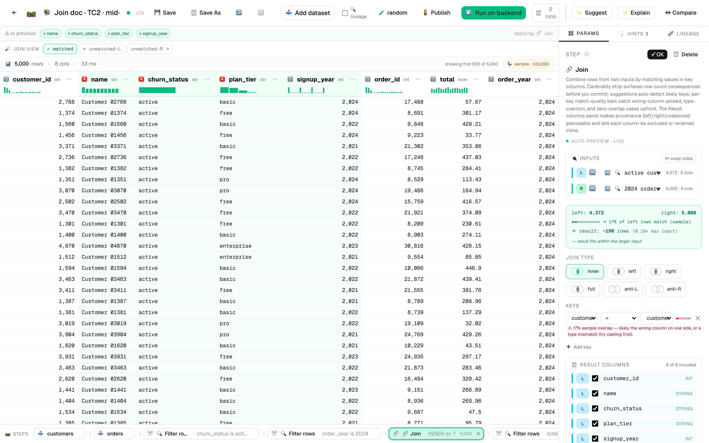
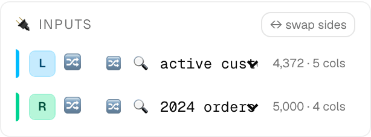
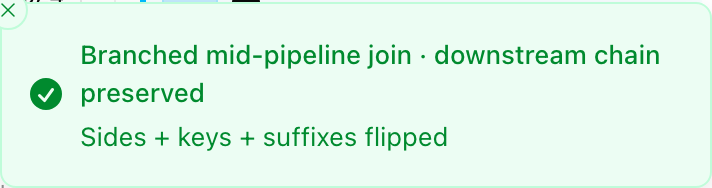
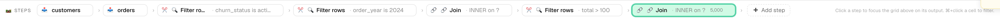

# 🔗 Joins — combining two inputs by matching key columns

A **join** is the step that combines rows from two inputs (datasets or
upstream step nodes) by matching values in key columns. It's the
highest-stakes UX surface in DIG: every dial — keys, kind, collisions —
silently changes how many rows leave the step and which columns survive.
For that reason, the join is the only step in DIG with a hand-built
params panel rather than the generic field-renderer.

This doc walks through what the panel shows, how the swap-sides /
rewire flow handles inline-vs-branched edits, and two end-to-end
test cases with screenshots.

> **Manifest reference.** For the parameter table, default values, and
> the SQL that gets compiled, see the [Join entry in
> STEPS.md](STEPS.md#join). This doc focuses on the editor UX and the
> engineering reasoning behind it.

---

## Anatomy of the join panel

The right-hand params panel for a `🔗 Join` step composes six widgets,
top to bottom:

| Widget                      | What it shows                                                                |
| --------------------------- | ---------------------------------------------------------------------------- |
| 🔌 **Inputs**               | Which sources feed the L and R ports + a swap-sides button.                  |
| **Cardinality strip**       | Sample row counts on each side, estimated match %, projected result rows.    |
| **Join type**               | Six set-diagram icons: `inner` / `left` / `right` / `full` / `anti-L` / `anti-R`. |
| **Keys**                    | One row per key pair `[left col][op][right col][match-quality bar][✕]`.       |
| **Column collisions**       | Renders only when both sides share a non-key column name.                    |
| 📋 **Result columns**       | Per-column include/rename grid with L/R provenance + duplicate guard.        |


Each section is keyed on **provenance**, not position — `L:customer_id`
is a stable identity that survives column collisions changes, kind
changes, suffix edits, and rename edits. So a Result Columns rename
made under `keep_both` doesn't get stranded if the user later switches
to `coalesce`.

---

## Test case 1 — terminal join from two datasets

The simplest shape: two distinct dataset inputs feed straight into a
join, and nothing downstream depends on the result yet. Edits to the
join's input wiring **mutate the join in place** because the join is
the terminal node.

**Pipeline:**

```
📥 customers ─┐
              ├─→ 🔗 Join (terminal)
📥 orders ────┘
```

> Created by `scripts/_doc_screenshots/build_join_doc.py` as `📚 Join doc · TC1 · two datasets`.

### Step 1 — Inputs panel

The 🔌 Inputs panel is the topmost widget. Each row shows a sky-blue
**L** chip or emerald **R** chip, the source-kind icon (📥 for a
dataset, 🔀 for an upstream step node), the source label, and the
sample row + column count.



Both sources are wired to datasets, so each row shows 📥. The
`5,000 · 5 cols` and `5,000 · 4 cols` annotations come from the
sample-fetch hook (`useJoinSamples`) — the same data that drives the
cardinality strip and the per-key match-quality bar.

The `↔ swap sides` button at the top right flips L↔R: it swaps the
input refs **and** the entire param doc (key sides, suffixes, kind
enum, output renames). Disabled until both sides are wired.

### Step 2 — Cardinality strip + join type + keys

These three sections sit in the middle of the panel:



Reading top to bottom:

- **Cardinality strip.** `left: 5,000  right: 5,000  ≈ 19% of left rows
  match (sample) → result: ~203 rows (0.20× max input)`. The
  hand-tuned heuristic also tells you `result fits within the larger
  input` so you know not to expect row blow-up. The 19% figure is a
  sample-on-sample estimate — the **ratio** is what generalises from
  sample to full data, so the strip leans on the ratio in the
  copy.
- **Join type ladder.** Six set-diagram icons. The `inner` glyph is
  outlined in green because it's the active selection. Hover any icon
  for a one-line tooltip explaining the row-count consequence.
- **Keys.** One row per key pair: `[left col][op][right col][bar][✕]`.
  The match-quality bar is rose because the sample overlap is below
  50% — the inline `⚠ 19% sample overlap …` line nudges the user to
  check the column choice or cast types.

The 19% number here is honest: the customers and orders demo files
share `customer_id` but only some customers have orders within the
sampled window. The strip shows that consequence before the user
commits.

### Step 3 — Result columns

The bottom of the panel is the per-column grid, **keyed on
provenance** so renames survive other edits.



Each row is `[stripe][L|R chip][checkbox][col name][type badge]`. The
header at the top reads `8 of 8 included` so you always know how many
columns will leave the step. Column types are sniffed from the live
sample — `INT`, `STRING`, `DOUBLE` are friendly labels rather than
DuckDB's native names.

Equality-key left columns (here `customer_id`) are collapsed by the
SQL builder because their right counterparts always carry identical
values; they appear once on the left side only. Range-key columns
(`<` / `<=` / `>` / `>=`) carry both sides because the values aren't
guaranteed equal.

---

## Test case 2 — mid-chain join, branch on swap

When the join sits in the middle of a chain (with downstream steps
consuming its output), input rewires and side-swaps **branch** instead
of mutating in place. This protects the downstream chain from changes
the user may not have intended.

**Pipeline:**

```
📥 customers ─→ 🔍 active customers ─┐
                                     ├─→ 🔗 Join ─→ 🔍 total > 100
📥 orders   ──→ 🔍 2024 orders     ─┘
```

> Created by `scripts/_doc_screenshots/build_join_doc.py` as `📚 Join doc · TC2 · mid-chain branch`.

The join is wired to two `filter_rows` step nodes, and a third
`filter_rows` step consumes the join's output. So the join is
mid-chain, not terminal.

### Step 1 — Pre-branch state



The strip at the bottom shows the full chain. The grid renders the
join's current sample. Note in the params panel:



Both Inputs rows now show 🔀 (the step-node icon, not 📥) — a clear
visual cue that the L and R sources are upstream steps, not raw
datasets. The L row's row count is `4,372` (post-filter), not the
dataset's 5,000.

### Step 2 — Press `↔ swap sides`

Because `n_filter_high_total` is downstream of the join, the swap
**branches** instead of mutating in place. A green sonner toast
confirms what happened:



The branch creates a copy of the join node with sides flipped (`keys`
swap left↔right, `suffixes` swap, `kind` enum flips for `left`↔`right`
and `anti_left`↔`anti_right`, `outputColumns.excluded` and `renames`
are re-keyed `L:`↔`R:`). The original chain — including
`n_filter_high_total` — keeps pointing at the **un-swapped** join, so
nothing downstream silently changes shape.

### Step 3 — Strip after the branch

The pipeline strip at the bottom of the editor shows both joins
side by side:



Reading the strip left-to-right: `customers · orders · 🔍 active
customers · 🔍 2024 orders · 🔗 Join · 🔍 total > 100 · 🔗 Join`. The
last chip — the new branch — has the green selection ring because the
editor auto-focuses the just-created branch (so the user sees the
state they care about first).

The chip's label gets a `· branch 2` suffix on subsequent branches so
they don't all read identically.

---

## The branching rule, in one paragraph

When the user changes a join's input wiring (rewire one side, or
swap-sides), DIG checks whether **anything downstream consumes this
join's output**:

- **No downstream consumers** (the join is terminal): mutate the
  existing node in place.
- **Has downstream consumers** (the join is mid-chain): create a new
  branch node with the user-requested change applied. The original
  node and its downstream chain are untouched.

This is the same branch-on-apply pattern DIG already uses for the AI
hints (`apply at this step` vs `apply as a new branch`). The
implementation is in [`frontend/app/pipelines/[id]/page.tsx`](../frontend/app/pipelines/[id]/page.tsx) — see
`rewireOrBranchInput(doc, joinNodeId, port, newRef)` and
`swapJoinSides(doc, joinNodeId)`.

The toast that confirms a branch is intentional: silent state changes
in a DAG editor are how users lose work, so every branch surfaces a
"here's what just happened" line, plus a one-line subtitle naming
exactly which params got flipped.

---

## Behind the panel — what the SQL builder does

The compile path for a join lives at [`backend/steps/join/step.py`](../backend/steps/join/step.py).
A few details that affect what you see in the panel:

- **Equality-key collapse.** When `op = "="`, the SQL builder emits
  only the left side of the key pair in the SELECT list — the right
  side is guaranteed equal so it would be redundant. The Result
  Columns panel reflects this by hiding the equality-key right column.
- **Provenance-keyed diff.** The Result Columns widget produces a doc
  fragment of the form `{ excluded: ["L:churn_status"], renames:
  {"R:order_year": "year"} }`. The keys are stable identifiers
  (`L:<col>` / `R:<col>` / `C:<col>` for collision-resolved combined
  outputs), so user edits survive collision-rule changes.
- **`outputColumns` is purely additive.** A pipeline saved without
  the field still works — the SQL builder treats `excluded = []` and
  `renames = {}` as the default. So upgrading from join `1.1.x` to
  `1.2.0` requires no migration.

---

## Reproducing these screenshots

The two test-case pipelines and the screenshots are produced by a
single script:

```bash
backend/.venv/bin/python scripts/_doc_screenshots/build_join_doc.py
```

The script:

1. Looks up the demo `customers` and `orders` datasets by ULID
   (uploaded by `scripts/sampling_join_demos.py`).
2. Creates or updates the two pipelines `📚 Join doc · TC1` and `📚
   Join doc · TC2` (idempotent by name prefix).
3. Drives the editor with Playwright and captures eight screenshots
   into `docs/images/joins/`.
4. **Validates each capture against the DOM** — every screenshot has
   a `must_contain` list of strings the body must include before the
   PNG is saved. Silently broken states (e.g. the panel didn't render,
   the toast didn't fire) fail the run instead of producing
   wrong-but-plausible docs.

The validation step is non-negotiable: a screenshot in a doc that
shows the wrong state is worse than no screenshot at all, because the
reader trusts what they see. Run the script, eyeball the eight PNGs,
re-run if anything is off. The validator catches DOM-level
regressions; the human eye catches layout or selector regressions
the validator can't.
