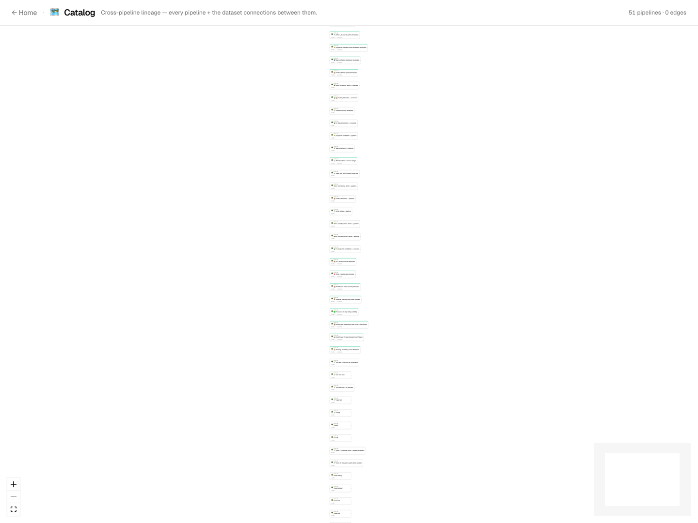
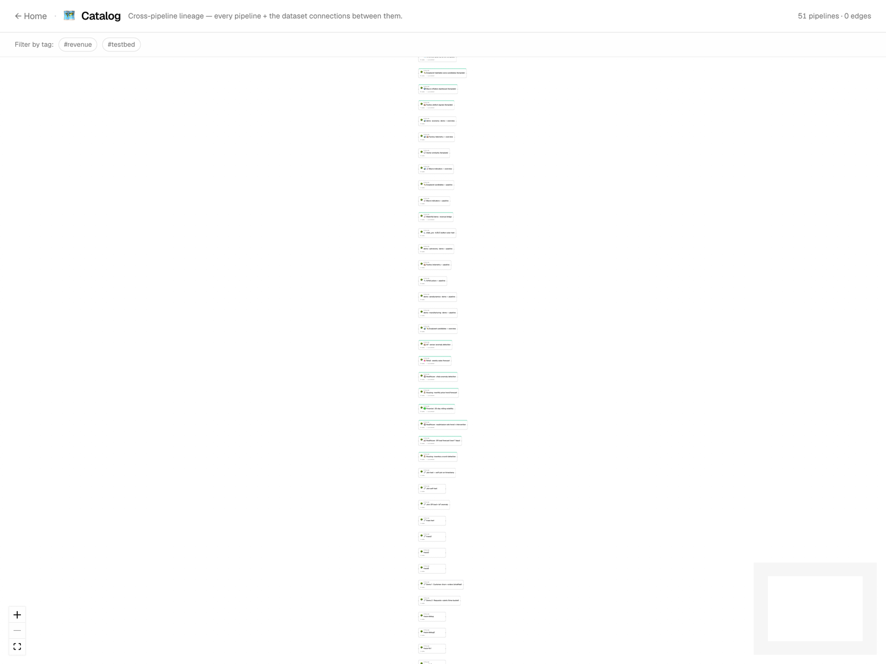
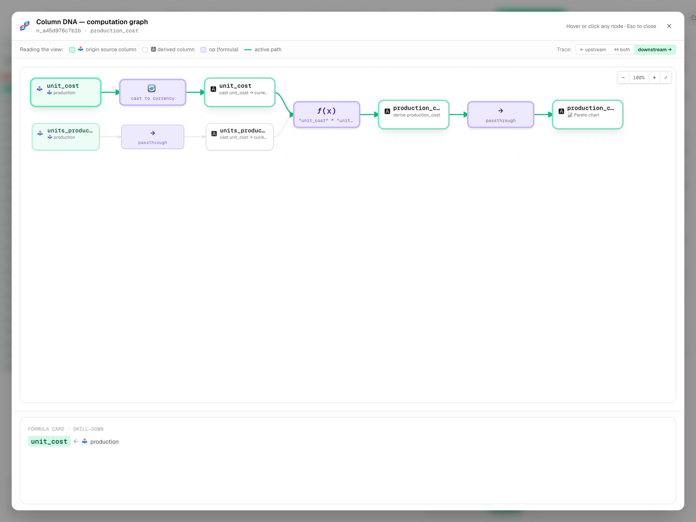
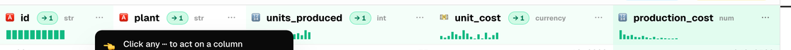

# 🗺 Lineage and the catalog

DIG tracks **where each value comes from** at three zoom levels and
shows the trace in three matched views. Pick the view that fits the
question you're asking — they share the same data and the same
selection state.

| Zoom level   | View                  | Use when…                                                     |
|---           |---                    |---                                                            |
| Workspace    | **Catalog**           | "Which pipelines feed which datasets?"                        |
| Pipeline     | **Sankey**            | "Which steps and columns flow into this terminal?"            |
| Column       | **Column DNA**        | "Which upstream values shaped this single output column?"     |

---

## The catalog — workspace-wide lineage

The Catalog draws a meta-graph: every pipeline is a node, every
dataset that crosses pipelines is an edge. Edges are labelled with
the dataset name and (when the schema is registered) the number of
columns that flow through.

The right-hand side panel pops open when you click an edge or a
node and shows the matching dataset / pipeline payload — the columns
the edge carries, plus a jump link to the editor.

### Filtering by tag

Pipelines can carry tags (set in the editor toolbar). The chip-strip
above the canvas shows every tag in the workspace; clicking one
restricts the canvas to pipelines that carry it.

Tags compose with intersection: if you select `demo` and `housing`,
only pipelines tagged with **both** stay visible.

---

## Sankey — pipeline-scoped flow

Inside the editor, the **Sankey** tab renders the active pipeline as
a column-by-column flow diagram. Bands widen with the row count;
hover any band to see which input column it came from.

Zoom and pan with the trackpad or mouse wheel. The selection state
is shared with the canvas: clicking a band highlights the
corresponding step in the strip, and vice versa.

---

## Column DNA — the bipartite walk

The **Column DNA** drawer answers the focused question: *what made
this single column?* The bipartite layout pairs columns on the left
with the steps that produced them on the right, with arrows showing
the per-column dependency.

A toggle flips the walk direction: **upstream** (what shaped this
column) or **downstream** (which downstream columns inherit from
it). Downstream-walk is the one to reach for before renaming a
column — it makes "what will I break?" visible at a glance.

---

## The impact badge

Whenever you rename, drop, or recast a column in the editor, an
amber **impact badge** appears next to the affected node. It counts
the downstream columns that inherit from the change and links
straight to the Column DNA drawer with the walk pre-loaded.

The number is computed from the column-lineage tree, so it covers
both direct references and transitive ones — a column that's
renamed is still tracked through joins, aggregates, and CTE
projections downstream.

---

## Where to dig deeper

- The compute engine and execution model: [`ARCHITECTURE.md`](ARCHITECTURE.md).
- The pipeline document on disk (and how column lineage is stored):
  [`PIPELINE_FORMAT.md`](PIPELINE_FORMAT.md).
- Save semantics and run history that the lineage views read from:
  [`SAVE_AND_VERSIONS.md`](SAVE_AND_VERSIONS.md).
