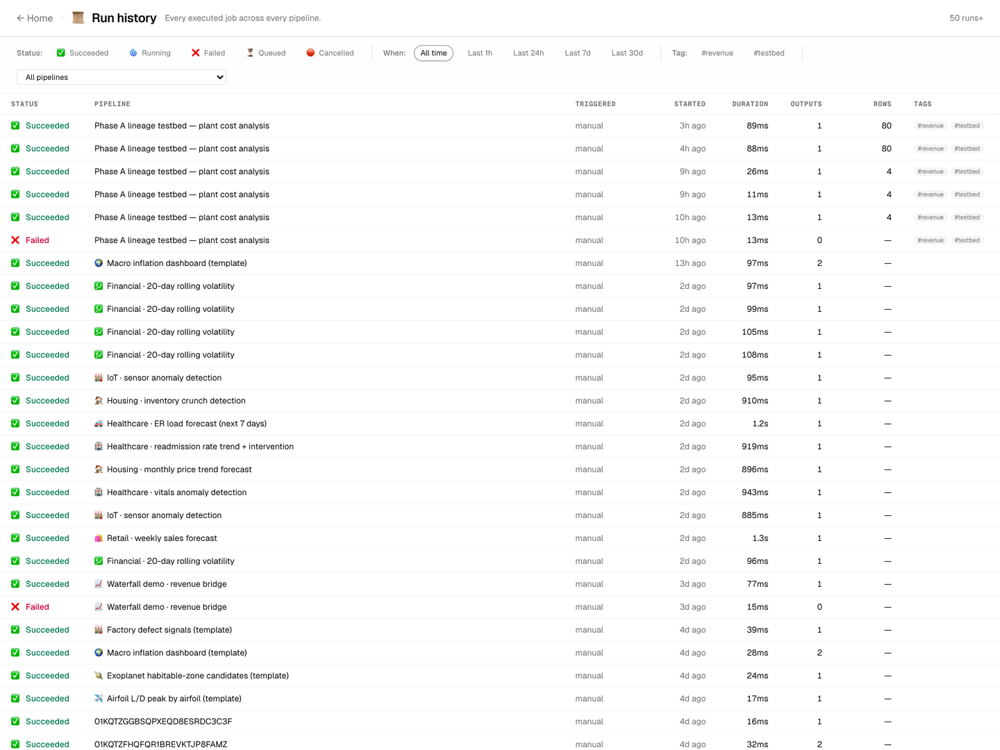
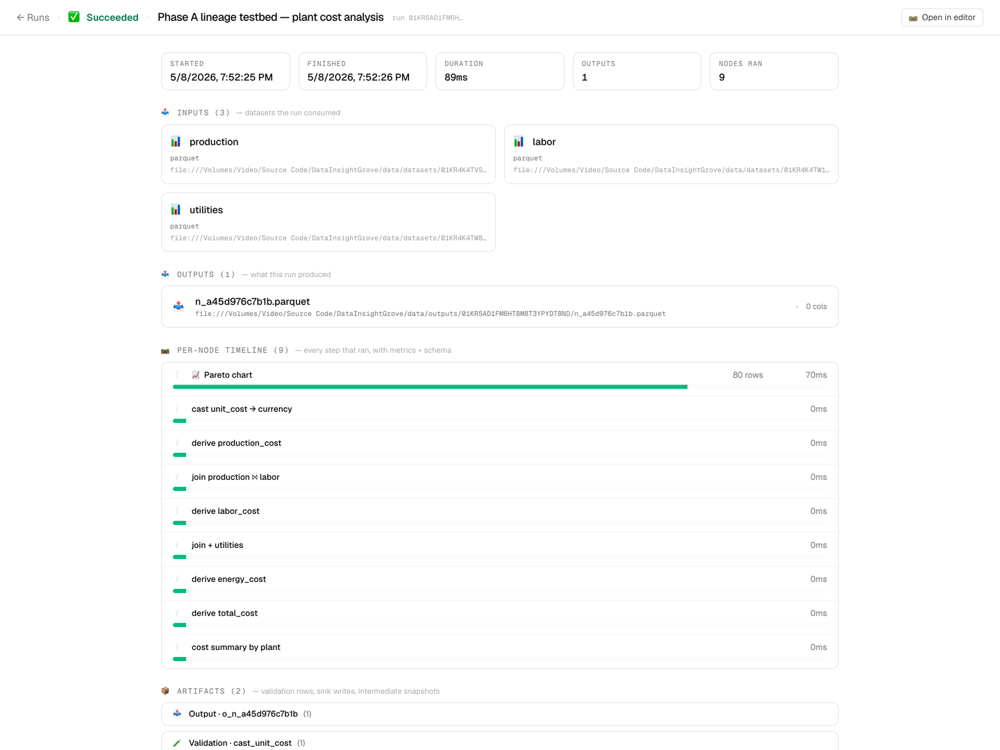

# 💾 Save, Save As, and version history

DIG distinguishes between **autosave** (transient, for crash recovery)
and **explicit Save** (a labelled checkpoint you intend to keep). The
distinction matters because autosaves accumulate fast — by the time
you've finished a 30-minute editing session there are dozens of them,
and without a way to pick out "the version I want to come back to" the
history view becomes useless.

## TL;DR

| Action | Trigger | Stored as | Retention |
|---|---|---|---|
| Edit any field | (automatic) | `triggered_by="autosave"` | Last 5 only |
| Click **💾 Save** | toolbar / `⌘S` | `triggered_by="manual_save"` + optional label | Up to 50 |
| Click **📋 Save As** | toolbar / `⌘⇧S` | New pipeline (fresh id, etag=1) | Independent history |

A labelled `manual_save` is **always** kept — it can never be evicted
by a flurry of autosaves. That's the guarantee that lets you trust
"Save before adding the rolling window" as a real anchor instead of
a trivia note that disappears overnight.

## The three buttons

```
[ ← back ]  🛤  Pipeline name        ● Synced  v40   💾 Save   📋 Save As   …
```

The toolbar's compact strip carries each control with the same icon
used elsewhere in DIG, so the muscle memory transfers across pages.



### 💾 Save

Opens a small dialog with one optional text field:

```
┌─ 💾 Save checkpoint ──────────────────────────────────┐
│  Optional label — helps you find this version later  │
│  in run history.                                      │
│                                                       │
│  ┌────────────────────────────────────────────────┐  │
│  │ e.g. before adding the rolling-window step    │  │
│  └────────────────────────────────────────────────┘  │
│                                                       │
│                              Cancel    💾 Save        │
└───────────────────────────────────────────────────────┘
```

- **Empty label** → still creates a labelled checkpoint, just without a
  description. Useful as a "lock it in" gesture before risky edits.
- **Filled label** → shown in the run-history entry and the "Saved" toast.

Keyboard: **⌘S** (macOS) / **Ctrl-S** (Windows/Linux). Always opens the
dialog; never silently saves so you can't miss the chance to label.

### 📋 Save As

Same dialog shape, label is **required**:

```
┌─ 📋 Save As — new pipeline ───────────────────────────┐
│  Cloned with the current state. The new pipeline    │
│  gets its own history, runs, and id.                 │
│                                                       │
│  ┌────────────────────────────────────────────────┐  │
│  │ Copy of <current pipeline name>               │  │
│  └────────────────────────────────────────────────┘  │
│                                                       │
│                              Cancel    📋 Clone       │
└───────────────────────────────────────────────────────┘
```

**What gets copied:** the entire document — datasets, nodes, params,
metadata (including `publishedAsStep` and `sampling`). What does NOT
copy over: run history, scheduled triggers, webhooks (they're scoped
to the pipeline id which is freshly minted).

After clone, the editor navigates to the new pipeline so you don't lose
your place.

Keyboard: **⌘⇧S** / **Ctrl-Shift-S**.

## Autosave behaviour

Every edit (typing, dragging, toggling) triggers a 500ms-debounced PUT
that bumps the etag and creates a snapshot tagged `autosave`. The
backend keeps **only the 5 most recent autosaves** per pipeline and
treats them as ephemeral.

This means:

- Crash recovery still works — refresh the page and the latest
  autosave loads.
- Cross-tab sync still works — the WebSocket emits on every save,
  including autosaves.
- The history view doesn't drown — labelled `manual_save` checkpoints
  rise to the top and stay there.

## Retention policy in detail

History is stored in the `pipeline_history` table. Two independent
retention budgets (one DELETE per category, run on every save):

| `triggered_by` | Kept | When pruned |
|---|---|---|
| `autosave` | last 5 | every save |
| `manual_save` | last 50 | only when count > 50 |
| `run_start` | last 50 (with the rest) | every save |
| `import` / `restore` | last 50 (with the rest) | every save |

The `DIG_PIPELINE_HISTORY_MAX` env var controls the 50 cap (default
`50`, minimum `2`). The autosave cap is fixed at 5 — bumping it any
higher just creates noise.

### Dedup carve-out

By default the engine deduplicates snapshots whose document hash is
unchanged from the previous one — saves your DB from filling up with
identical autosaves when you're just clicking around. **Labelled saves
are exempt:** if you Save with a note, the snapshot lands even when the
document bytes are identical to the last autosave. Otherwise the first
autosave-after-Save would silently steal the label.

## What the dialog feels like in practice

1. You build a pipeline. Autosaves fire as you type — you barely notice.
2. You hit a "good place" — pipeline runs cleanly, results look sane.
3. **⌘S** → label "after fixing the timezone bug" → click Save.
4. Continue editing. Autosaves keep firing.
5. Editor crashes / you accidentally delete the wrong step / your
   collaborator pushes a stale doc.
6. Open Run history → your labelled save is right there, exactly the
   bytes you remember. Click → Restore.

The model is identical to "named tags vs. unnamed commits" in git. You
don't need to plan when to commit; autosaves do that. You name the ones
that matter.

A single run shows everything that came out of it — outputs, metrics,
artifacts, and (when something failed) the exact node and the
upstream snippet of error output:



## Edge cases worth knowing

- **Save during in-flight autosave**: the autosave finishes first, then
  Save is sent with the post-autosave etag. No conflict, just an extra
  history row in between.
- **Saving an unchanged doc**: still creates a labelled snapshot. Useful
  for "I've reviewed this and approve" markers.
- **Save As of an unsaved doc**: the editor force-flushes the dirty doc
  as an autosave first, then clones from the persisted state. You won't
  silently lose un-flushed edits.
- **Cycle detection** (sub-pipelines): if your save would create a
  pipeline-step cycle, the server returns 409 with a specific reason
  and the editor surfaces a 12-second toast pointing at the offending
  step. See [SUB_PIPELINES.md](SUB_PIPELINES.md#cycle-detection).
- **Stale etag** (multi-tab): if another tab saved while yours had
  unsynced edits, your next save gets 409 "stale etag" and the toast
  prompts you to reload. WebSocket sync usually catches this before you
  hit Save.

## API surface

- `PUT /pipelines/{id}` — accepts optional `triggeredBy` (`manual_save`
  | `autosave` | `import` | `restore`) and `changeReason` (free text,
  honoured only when `triggeredBy == "manual_save"`).
- `POST /pipelines/{id}/clone` — body `{ name, fromSnapshotId? }`.
  When `fromSnapshotId` is set, clones from a specific history snapshot
  instead of the live document. Returns the new pipeline doc with
  fresh `etag=1`.
- `GET /pipelines/{id}/history` — lists snapshots ordered by
  `created_at desc`. Each entry carries `triggeredBy` and
  `changeReason`, so a UI can display only labelled saves.
