# Visualization catalog

Every chart-producing step in DIG, in one place — what each one renders,
which columns it expects, and any non-standard data shape (polygon WKB,
OHLC tuples, etc.) so you know what to feed it before you wire it up.

Steps are organised by **source**: built-in steps ship with DIG itself;
others arrive when you install a pack from Settings → Packs.

> **Notation**
> - **★ required** — the param must be set (the validator rejects the
>   pipeline otherwise).
> - **★~ conditional** — the param is required only when another param
>   takes a specific value (e.g. `geometry_col` is required only when
>   `mode = choropleth`).
> - **○ optional** — the step picks a sensible default if you leave it
>   blank.
> - The **Example row** column shows one representative tuple of the
>   input. Multiple rows of similar shape make the chart.

---

## Built-in steps

### 🖼 `export_to_image` v1.1.0

The general-purpose chart step. Renders to PNG/SVG via matplotlib +
seaborn. The `kind` param selects the chart type — most kinds need only
one column (`x`), some need two or three.

**Static params (every kind)**

| Param | Required | Notes |
|---|---|---|
| `kind` | **★** | One of: `auto · histogram · density · box · violin · bar_counts · stacked_bar · percent_stacked_bar · scatter · line · hexbin · heatmap · scatter3d · pair · joint · bubble` |
| `format` | **★** | `png` or `svg` |
| `title` | ○ | Chart title |
| `width` / `height` / `dpi` | ○ | Pixel size |
| `hue` | ○ | Column whose values colour-group every point/bar |
| `max_points` | ○ | Sample down before rendering — keeps a 200k-row scatter under a second |

**Per-kind column requirements**

| Kind | Columns the kind reads | Example row | Notes |
|---|---|---|---|
| `histogram` | `x` (numeric) | `{x: 87.5}` | One numeric column; binned automatically. |
| `density` | `x` (numeric) | `{x: 87.5}` | Same shape as histogram; smoothed via KDE. |
| `box`, `violin` | `x` (categorical or numeric) ± `hue` (categorical) | `{x: "A", hue: "control"}` | Distribution per group. |
| `bar_counts` | `x` (categorical) | `{x: "California"}` | Bar height = row count per category. |
| `stacked_bar` / `percent_stacked_bar` | `x` (categorical) + `hue` (categorical) | `{x: "Q1", hue: "Web"}` | Sub-bars by `hue`; percent variant normalises to 100 %. |
| `scatter` | `x` (numeric) + `y` (numeric) ± `hue` | `{x: 1850, y: 320000, hue: "single-family"}` | Two-axis scatter. |
| `line` | `x` (ordinal/date) + `y2` (numeric) ± `hue` | `{x: "2024-05-21", y2: 325000}` | Note `y2` not `y` — the manifest carries one `y` slot per kind so the params panel hides irrelevant ones. |
| `hexbin` | `x` (numeric) + `y3` (numeric) | `{x: 1850, y3: 320000}` | Honeycomb 2-D density; alternative to scatter when overplotting hides structure. |
| `heatmap` | `x` (categorical) + `y4` (categorical) + `value` (numeric) | `{x: "Mon", y4: "ICU", value: 17.2}` | Each cell = one row. |
| `scatter3d` | `x`, `y5`, `z` (all numeric) | `{x: 1850, y5: 320000, z: 4.5}` | Three numerics → 3-D scatter. |
| `pair` | `columns` (list of numeric column names) | `{sepal_length: 5.1, sepal_width: 3.5, petal_length: 1.4}` | Pairwise scatter grid across N columns. |
| `joint` | `x` (numeric) + `y` (numeric) | `{x: 1850, y: 320000}` | Joint distribution: scatter + marginal histograms. |
| `bubble` | `x` (numeric) + `y` (numeric) + `value` (numeric, sets dot size) ± `hue` | `{x: 1850, y: 320000, value: 4.5, hue: "CA"}` | Like scatter, but bubble size encodes a fourth dimension. |

**Example outputs**

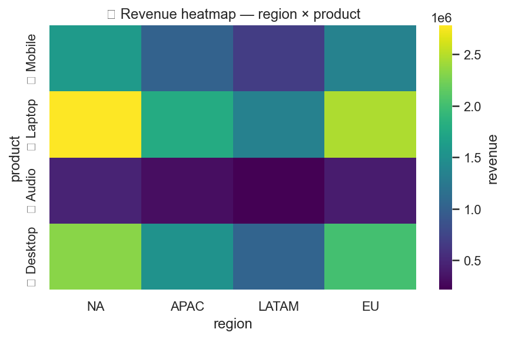

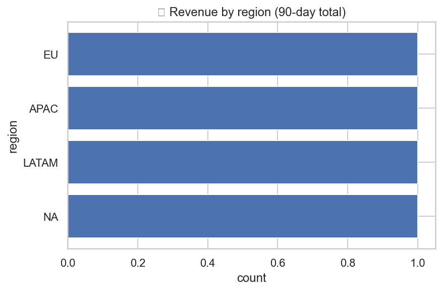

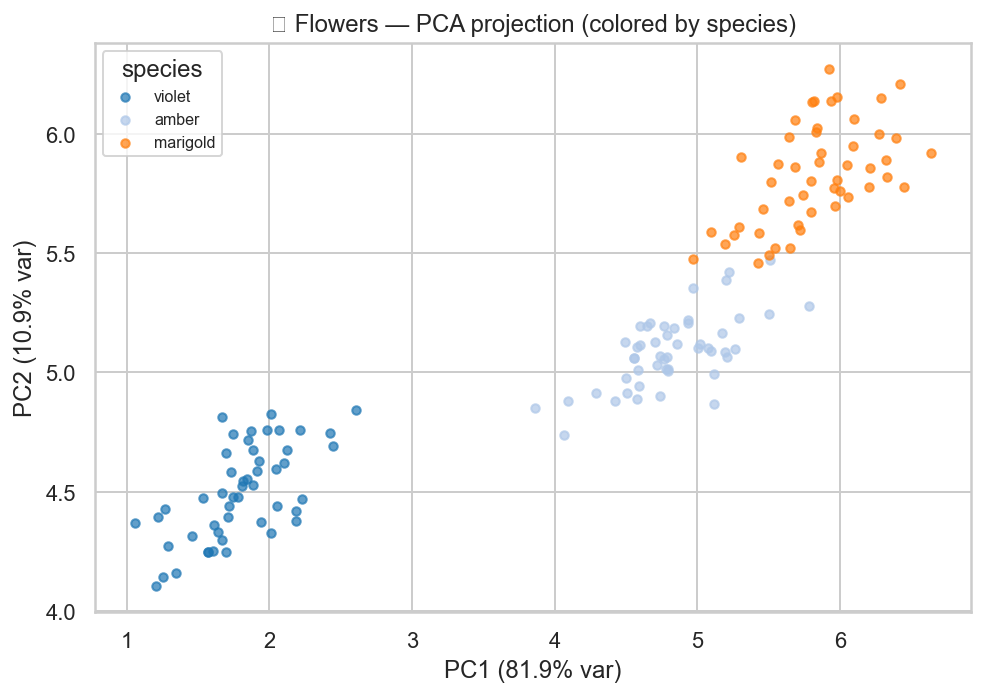

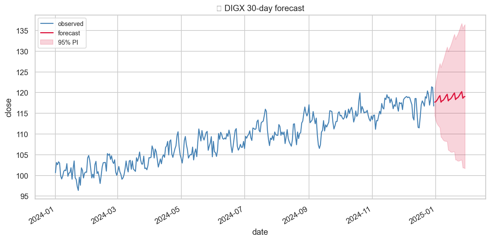

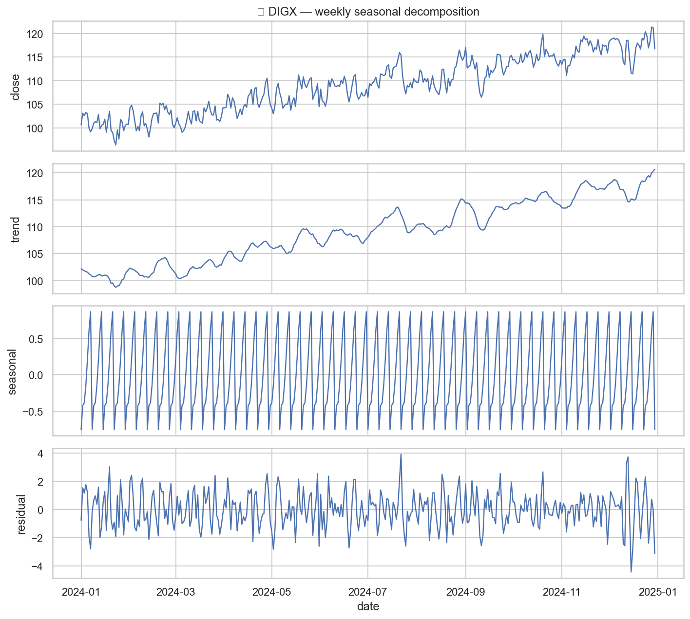

---

### 🗺 `export_to_map` v1.1.0

Interactive Leaflet HTML or static matplotlib PNG. **Four modes** —
each needs different columns. WKT-string geometry columns are
auto-coerced to WKB internally, so you can plug in a CSV string column
without a separate parse-geometry step.

**Mode 1 — `points` (default)**

> One marker per row at lat/lon. The mode the housing demo's `🗺 Listings map` runs in.

| Param | Required | Notes |
|---|---|---|
| `mode` | **★** | `"points"` |
| `format` | **★** | How the location column encodes coords. `lat_lon` for `"37.77,-122.42"`, `lon_lat` for the GeoJSON axis order, `wkt_point` for `"POINT(-122.42 37.77)"`, `separate_columns` to pick a lat column and a lon column individually. |
| `location` | **★~** (unless `format=separate_columns`) | Column with the coordinates |
| `lat_col` / `lon_col` | **★~** (only when `format=separate_columns`) | The two columns |
| `name_col` | ○ | Tooltip headline column |
| `comment_col` | ○ | Tooltip body column |
| `marker_color` | ○ | CSS-color hex (only `#rgb` / `#rrggbb` / named colors / `rgb()` / `hsl()` allowed) |
| `marker_radius` | ○ | Default `7` |
| `tile_provider` | ○ | `osm` · `carto-light` · `carto-dark` · `esri-natgeo` |
| `format_out` | ○ | `html` (interactive) or `png` (static) |

**Example row**

| listing_id | loc_str | popup_label | popup_comment |
|---|---|---|---|
| `LIST-000150` | `37.77,-122.42` | `1588 Madison Blvd · $1.2M` | `single-family · 3 bed · 1971 sqft` |

**Example output**

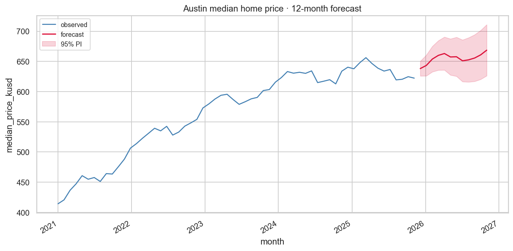

---

**Mode 2 — `choropleth`**

> Color-coded polygon regions by a numeric value. The mode the housing demo's `🌈 State choropleth` runs in.

| Param | Required | Notes |
|---|---|---|
| `mode` | **★** | `"choropleth"` |
| `format` | **★** | Set this anyway (validator-enforced); the value is ignored in choropleth mode. |
| `geometry_col` | **★~** | Column holding **WKB-encoded polygons** OR **WKT-string polygons** (auto-detected). |
| `value_col` | **★~** | Numeric column that drives the colour ramp |
| `name_col` | ○ | Tooltip headline |
| `color_scale` | ○ | `viridis` · `magma` · `cividis` · `plasma` · `Greens` · `Blues` · `Reds` · `OrRd` · `YlGnBu` |

**Example row** (WKT — what `samples/housing-states-demo.csv` ships):

| state | name | geometry_wkt | avg_price | n_listings |
|---|---|---|---|---|
| `CA` | `California` | `POLYGON((-117.13 32.53, -114.60 32.72, -114.13 34.30, ..., -117.13 32.53))` | `653669.90` | `515` |

**Non-standard data shape**: each `geometry_wkt` value must be a single
well-formed WKT polygon (no leading whitespace, no MULTIPOLYGON unless
you split it row-wise upstream). Shapely-parseable. If the data is
already in WKB bytes, the step picks that up too without any
configuration change.

**Example output**

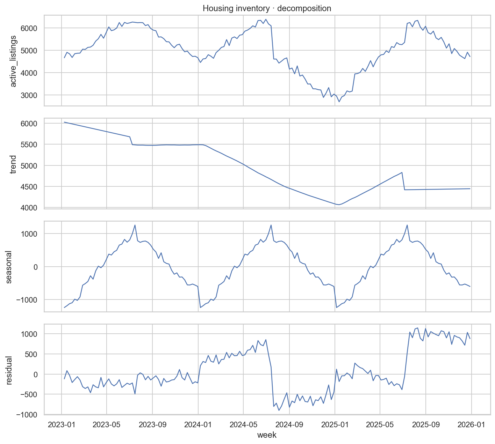

(The bundled housing demo's `🌈 State choropleth` renders the same
shape — open it via Home → 🌱 Try with sample data → 🏘 housing →
focus the `🌈 State choropleth` step in the editor.)

---

**Mode 3 — `heat`**

> Kernel-density overlay built from lat/lon points. Heavier than `points`
> mode when you have 10k+ markers.

| Param | Required | Notes |
|---|---|---|
| `mode` | **★** | `"heat"` |
| `format` | **★** | Same `lat_lon` / `lon_lat` / `wkt_point` / `separate_columns` as `points` |
| `location` (or `lat_col`+`lon_col`) | **★~** | Same as points mode |
| `value_col` | ○ | If set, each point's contribution is weighted by this column |

**Example row**: same as points mode (lat/lon coordinates).

---

**Mode 4 — `arc`**

> Origin → destination lines on a globe. Useful for flight routes,
> shipment lanes, migration data.

| Param | Required | Notes |
|---|---|---|
| `mode` | **★** | `"arc"` |
| `format` | **★** | Set to `lat_lon` (or any value — ignored in arc mode) |
| `origin_lat_col`, `origin_lon_col` | **★~** | Origin coordinates |
| `dest_lat_col`, `dest_lon_col` | **★~** | Destination coordinates |

**Example row**:

| route_id | origin_lat | origin_lon | dest_lat | dest_lon | passengers |
|---|---|---|---|---|---|
| `SFO→JFK` | `37.62` | `-122.38` | `40.64` | `-73.78` | `184` |

**Non-standard shape**: arc mode needs **four** numeric columns per row,
not two. A dataset with a single location column won't support it —
the step's error message tells you so + offers the recovery path.

---

### 🌌 `umap` v1.0.0

Adds `UMAP_1` / `UMAP_2` columns and (optionally) renders a 2-D
embedding image so you can see clusters before downstream filtering /
labelling.

| Param | Required | Notes |
|---|---|---|
| `columns` | ○ (defaults to all numerics) | Columns to embed — the model fits on these |
| `n_neighbors` | ○ | Default `15`; tune higher for global structure |
| `min_dist` | ○ | Default `0.1`; tune higher for less tight clustering |
| `color_by` | ○ | Column whose values colour each point in the rendered image |
| `render` | ○ | When `true`, produces the inline preview image |
| `max_rows` | ○ | Caps rows fed into UMAP — protect runtime on 100k+ datasets |
| `scale` | ○ | Z-score input columns first |

**Example row** (the iris-style input):

| sepal_length | sepal_width | petal_length | petal_width | species |
|---|---|---|---|---|
| `5.1` | `3.5` | `1.4` | `0.2` | `setosa` |

After UMAP runs the output adds `UMAP_1`, `UMAP_2` (and `color_by` value
flows through unchanged). The rendered image is the 2-D scatter of
those two derived columns.

**Example output** (PCA is the linear cousin; UMAP renders a similar
scatter, generally with tighter clusters):

---

## `business_charts` pack

> Install from Settings → Packs. Adds 7 visualisation steps.

### 🎯 `bullet_chart` v1.0.0

Edward Tufte's compact target-vs-actual chart. One row = one bullet.

| Param | Required | Notes |
|---|---|---|
| `labelColumn` | **★** | Row label (the bar's name) |
| `actualColumn` | **★** | Actual numeric value (the bar length) |
| `targetColumn` | **★** | Target numeric value (the marker overlay) |
| `poorMaxColumn` / `okMaxColumn` / `goodMaxColumn` | ○ | Quantitative bands shading the background |

**Example row**:

| KPI | Actual | Target | Poor max | OK max | Good max |
|---|---|---|---|---|---|
| `Revenue Q1` | `1.8M` | `2.0M` | `1.2M` | `1.6M` | `2.0M` |

---

### 📈 `funnel_chart` v1.0.0

Sequential conversion funnel — each row is a stage, bars shrink left-to-right.

| Param | Required | Notes |
|---|---|---|
| `stage` | **★** | Stage label |
| `value` | **★** | Numeric count at that stage |

**Example row**:

| stage | value |
|---|---|
| `Landed` | `42000` |
| `Signed up` | `5300` |
| `Activated` | `1800` |
| `Paid` | `420` |

Drop-off labels (`-87 %`, `-66 %`, `-77 %`) are rendered automatically
between bars.

---

### 🌡 `gauge_chart` v1.0.0

Speedometer with a needle. One row = one gauge.

| Param | Required | Notes |
|---|---|---|
| `labelColumn` | **★** | Gauge title |
| `valueColumn` | **★** | Numeric value the needle points to |
| `minValue`, `maxValue` | ○ | Range; defaults to column's observed min/max |
| `redMax`, `amberMax` | ○ | Thresholds for the red / amber / green arc boundaries |

**Example row**:

| KPI | Score |
|---|---|
| `Customer NPS` | `42` |

---

### 🟦 `mosaic_marimekko` v1.0.0

Two-dimensional part-to-whole. Column widths follow the row group's
total; column heights follow the column group's share within that row.

| Param | Required | Notes |
|---|---|---|
| `rowGroup` | **★** | Categorical column for the horizontal split |
| `columnGroup` | **★** | Categorical column for the vertical split |
| `valueColumn` | **★** | Numeric value to allocate |

**Example row**:

| segment | channel | revenue |
|---|---|---|
| `Enterprise` | `Direct` | `820000` |
| `SMB` | `Partner` | `175000` |

---

### 📈 `pareto_chart` v1.0.0

Sorted bar chart + cumulative-percentage line on a secondary axis. The
"80/20" chart.

| Param | Required | Notes |
|---|---|---|
| `label` | **★** | Category label |
| `value` | **★** | Numeric weight per category |
| `top_n` | ○ | Limit to the top N (rest folded into "Other") |

**Example row**:

| defect_type | n_incidents |
|---|---|
| `Sensor drift` | `1240` |
| `Power surge` | `380` |

---

### 🥧 `pie_donut` v1.0.0

| Param | Required | Notes |
|---|---|---|
| `labelColumn` | **★** | Slice label |
| `valueColumn` | **★** | Numeric value setting slice angle |
| `variant` | ○ | `pie` (default) or `donut` |
| `centerLabel` | ○ | Text shown inside the donut hole |
| `showPercents` | ○ | Append `%` to each slice label |

**Example row**:

| category | spend |
|---|---|
| `Engineering` | `2_400_000` |
| `Sales` | `1_800_000` |

---

### 📈 `waterfall_chart` v1.0.0

Cumulative-contribution bridge: positives stack up, negatives stack down.

| Param | Required | Notes |
|---|---|---|
| `label` | **★** | Bar label |
| `value` | **★** | Signed numeric value (positive = up step, negative = down step) |

**Example row**:

| step | delta |
|---|---|
| `Starting revenue` | `5_000_000` |
| `New deals` | `+800_000` |
| `Churn` | `-300_000` |
| `Upsell` | `+150_000` |
| `Ending revenue` | (auto) |

A trailing "Total" bar is appended automatically.

---

## `time_series_pro` pack

> Install from Settings → Packs. Adds 3 time-series visualisations.

### 🕯 `candlestick_chart` v1.0.0

Financial OHLC chart. **Five columns per row** are required — anything
less and the step rejects the input.

| Param | Required | Notes |
|---|---|---|
| `dateColumn` | **★** | Date or datetime column (one bar per row) |
| `openColumn` | **★** | Opening price |
| `highColumn` | **★** | Session high |
| `lowColumn` | **★** | Session low |
| `closeColumn` | **★** | Closing price |
| `volumeColumn` | ○ | Drives the secondary volume sub-panel |

**Non-standard shape**: this is the only chart in DIG that demands
**all four OHLC fields per row**. If your data is tick-level, pre-roll
it with `group_aggregate` (`first`/`max`/`min`/`last` per day) before
piping in.

**Example row**:

| date | open | high | low | close | volume |
|---|---|---|---|---|---|
| `2026-04-15` | `184.20` | `186.05` | `183.10` | `185.40` | `12_300_000` |

---

### 🪞 `horizon_chart` v1.0.0

Compact small-multiples for many time series at once. Each series is
folded into 3 colored bands (above) + 3 mirrored (below) the median.

| Param | Required | Notes |
|---|---|---|
| `dateColumn` | **★** | Time axis |
| `groupColumn` | **★** | One row of horizon bands per group value |
| `valueColumn` | **★** | Numeric value plotted |
| `bands` | ○ | Default `3` — bands above and below median |

**Example row** (long format — one row per (date, group) pair):

| date | sensor_id | reading |
|---|---|---|
| `2026-05-01` | `sensor-7` | `38.4` |
| `2026-05-01` | `sensor-8` | `41.1` |

---

### 🌊 `stream_graph` v1.0.0

Stacked area chart, center-baselined ("wiggle" algorithm). Use when
relative shape matters more than zero baseline.

| Param | Required | Notes |
|---|---|---|
| `dateColumn` | **★** | Time axis |
| `groupColumn` | **★** | Series identifier (one stream layer per group) |
| `valueColumn` | **★** | Stream height at each date |
| `color_scale` | ○ | `viridis` · `plasma` · `Spectral` · `tab20` |

**Example row** (same long format as horizon):

| date | product | revenue |
|---|---|---|
| `2026-05-01` | `Pro` | `48_200` |
| `2026-05-01` | `Team` | `12_400` |

---

## Data-shape cheat sheet

| Shape | Charts that use it |
|---|---|
| Single numeric column | `histogram`, `density`, `gauge_chart` |
| Categorical + count (long format) | `bar_counts`, `funnel_chart`, `pareto_chart`, `pie_donut`, `waterfall_chart` |
| Two numerics → 2-D plot | `scatter`, `hexbin`, `line`, `joint` |
| Three numerics → 3-D plot | `scatter3d` |
| `(date, group, value)` long-format time series | `horizon_chart`, `stream_graph` |
| OHLC quintuple per row | `candlestick_chart` |
| Lat/lon coordinates | `export_to_map` (points / heat) |
| Origin + destination coordinate pairs | `export_to_map` (arc) |
| **WKB / WKT polygon column + numeric value** | `export_to_map` (choropleth) |
| Two categoricals + numeric (cross-tabulated) | `heatmap`, `mosaic_marimekko` |
| Many numeric features per row | `umap`, `pair` |

---

## More example renders

Additional chart families captured from running DIG demos:

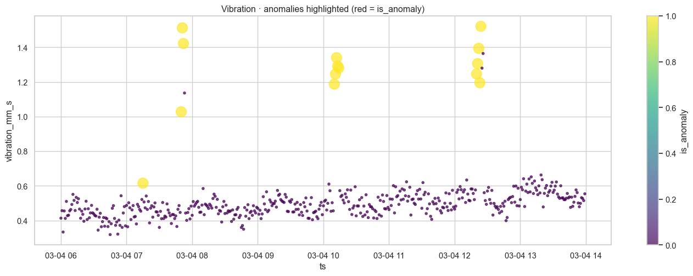

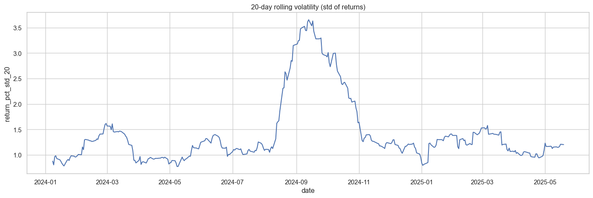

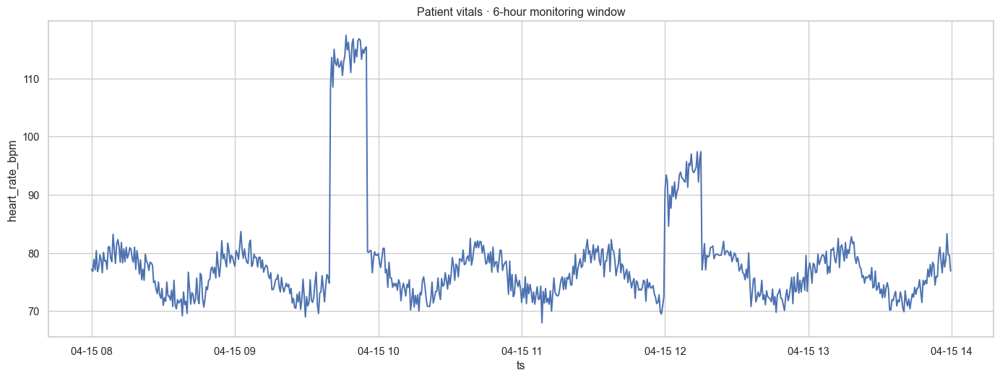

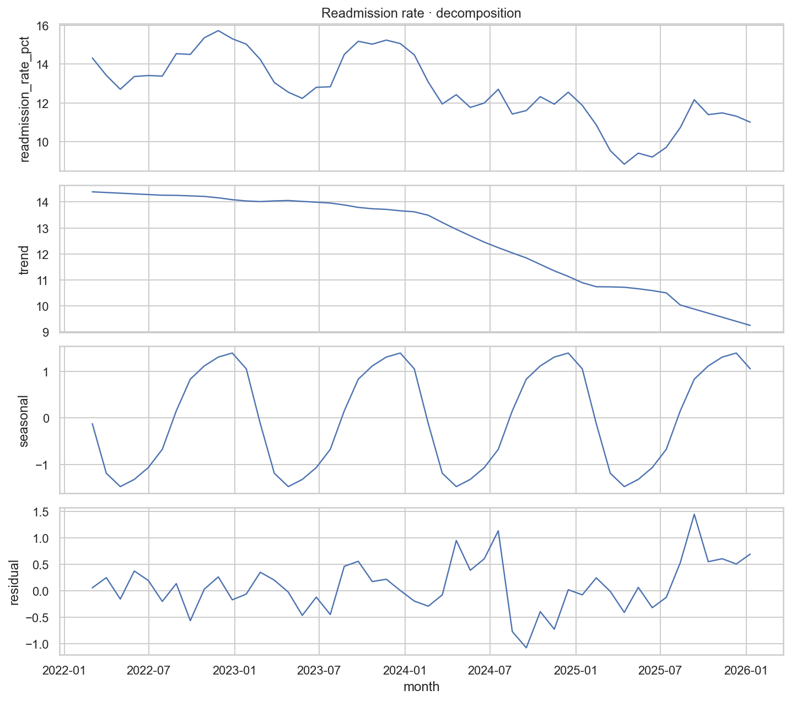

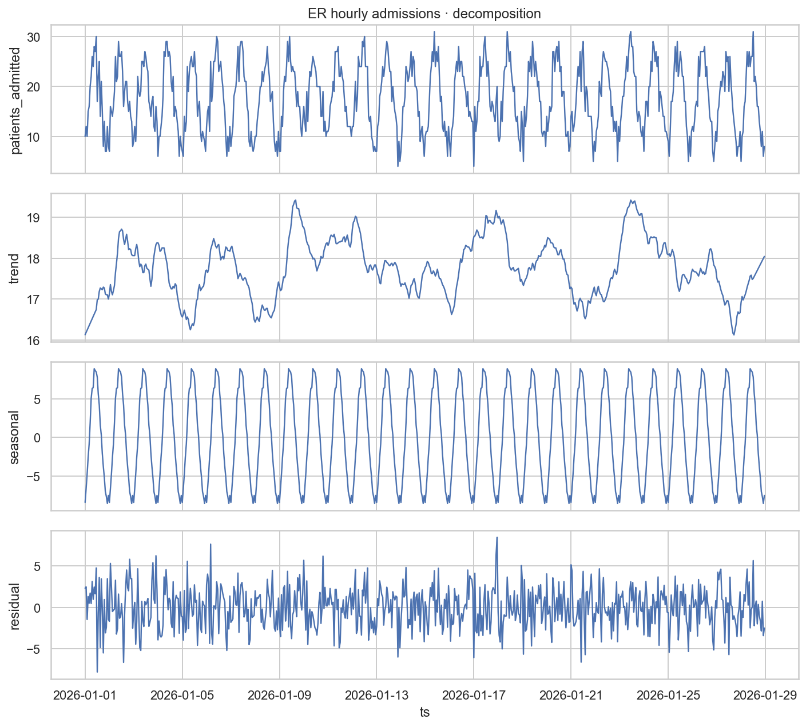

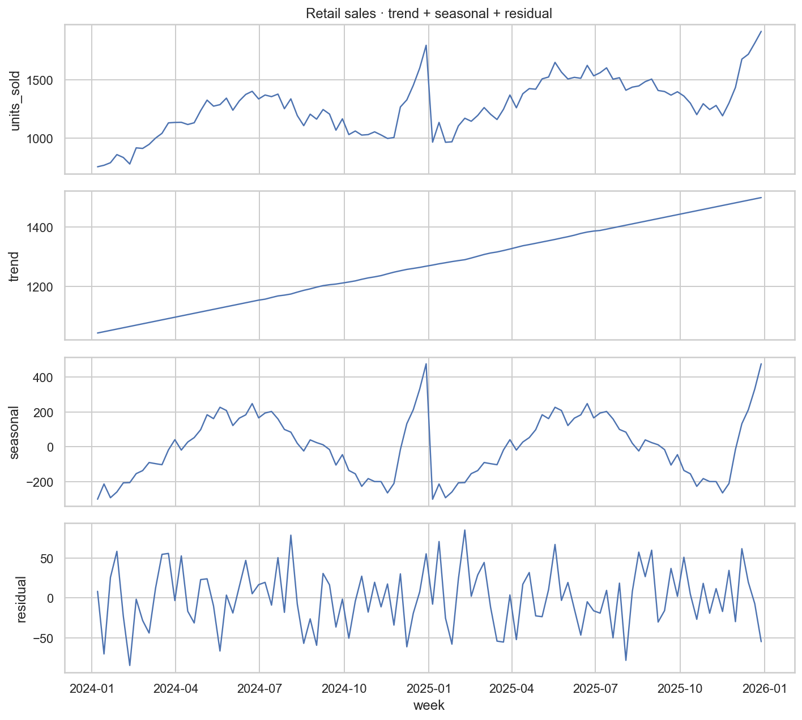

> If a chart isn't pictured above, the fastest way to see it is to
> open one of the bundled demos that uses it (Home → 🌱 Try with sample
> data) and focus the corresponding step in the editor — the inline
> preview renders immediately on the backend without writing a run.
