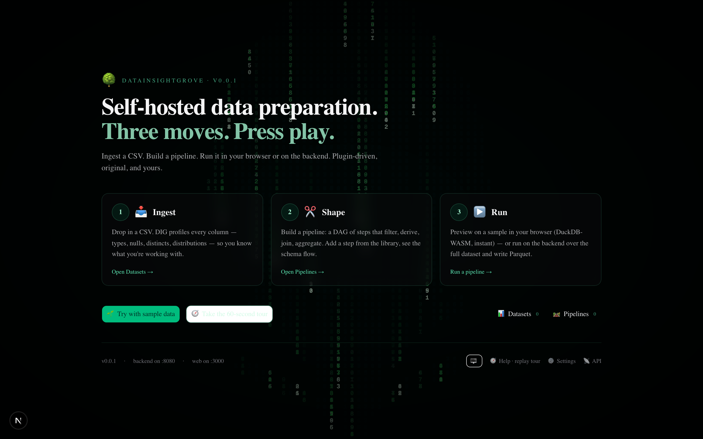
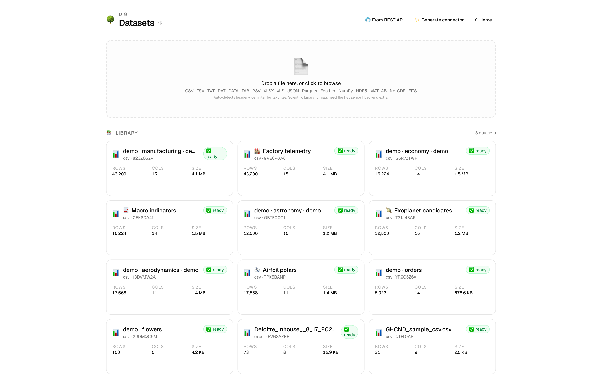
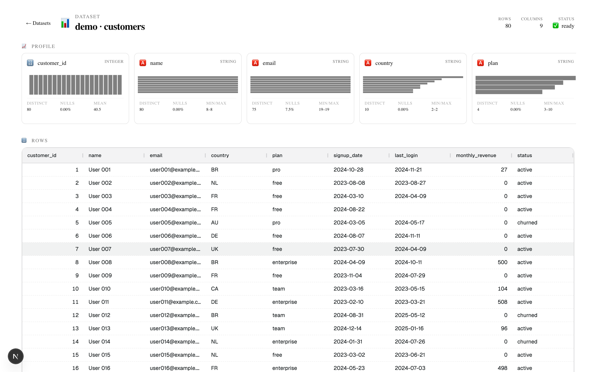
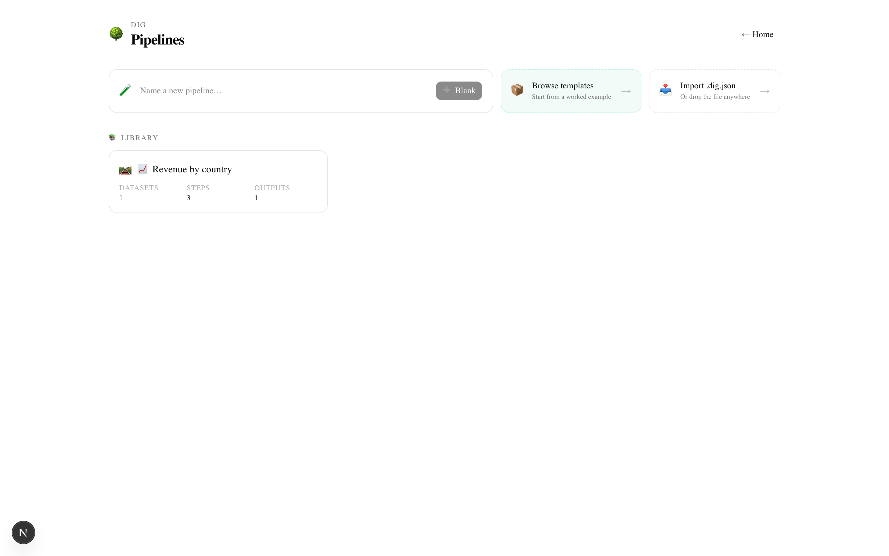
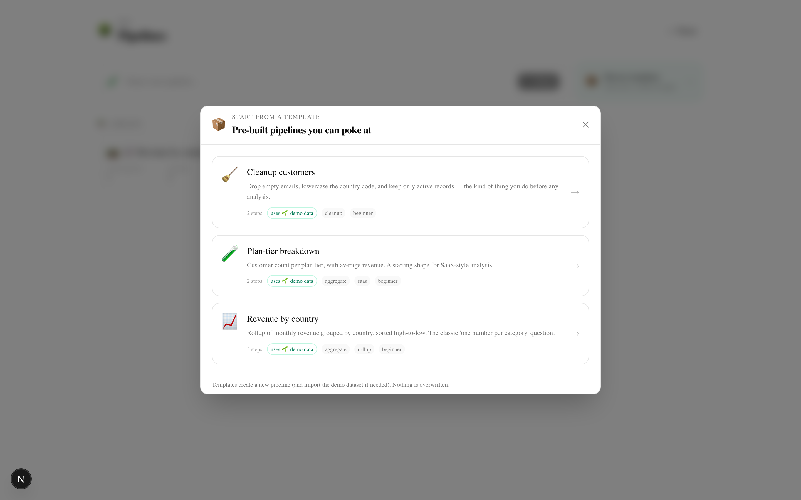
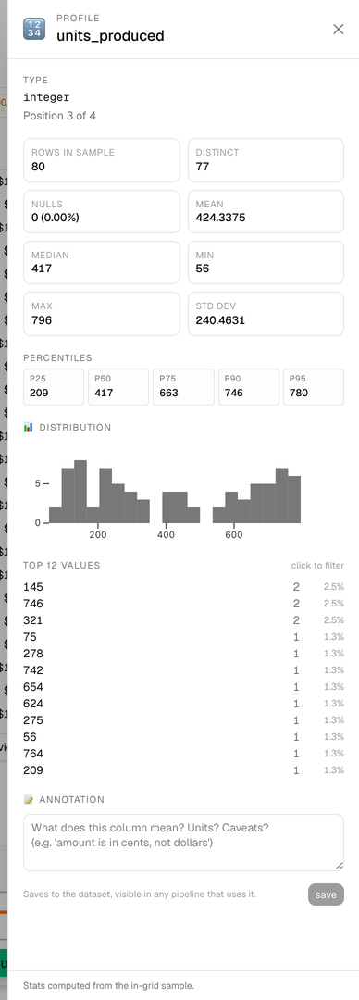
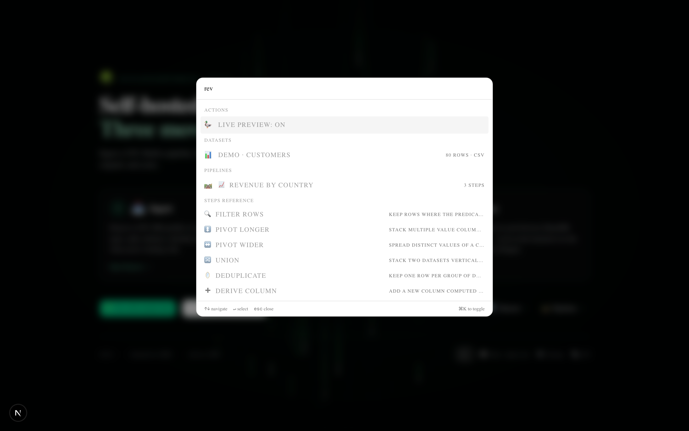
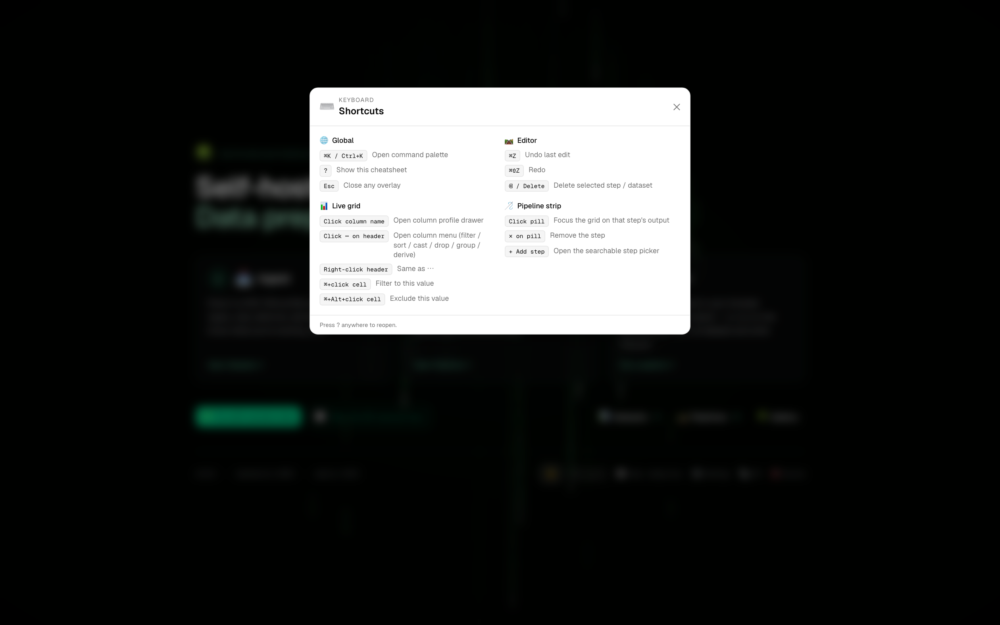
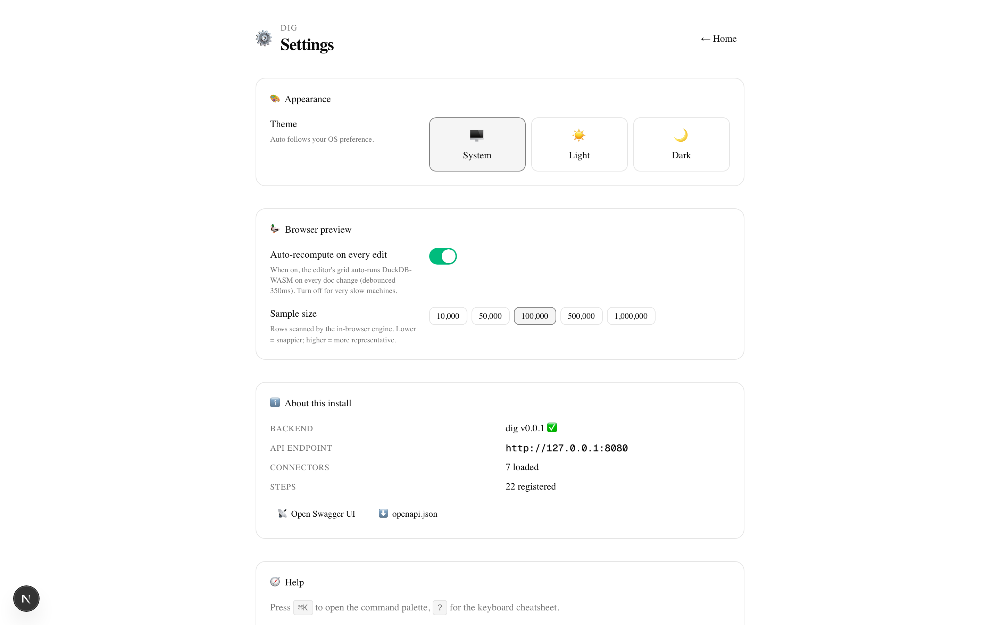
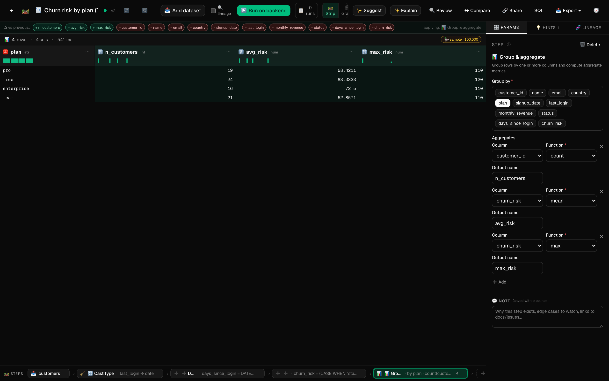

# Getting started with DIG

> *Data preparation for the rest of us.*

This is your first 10 minutes with **DataInsightGrove (DIG)** — from a fresh install to a working pipeline you can poke at. By the end you'll have ingested a CSV, applied a few transforms, run them on the full data, and exported the result. No SQL knowledge needed; every change is reversible with ⌘Z.

The page is friendly to people coming from spreadsheets — *if you've used Excel filters, sort, formulas, and pivot tables, you already know the operations DIG performs*; we just record them as a reusable pipeline rather than as a one-off action. If you're a data engineer, you can skim the pictures and skip to the [tutorials](tutorials.md) for worked end-to-end examples.

> **Already installed and running?** The home page has a **🧭 60-second tour** that covers the same ground in your live editor. The pipeline list page has a **📦 Browse templates** button — one click and you're in a working pipeline with sample data.

---

## 0 · Install and start

Run **one** command:

```bash
cd DataInsightGrove
./install.sh
```

The guided installer:

1. **Detects your environment** — checks for Homebrew (macOS), Python 3.11+, pnpm, plus the optional JDBC tooling (cmake + JDK + Ant). Reports each as ✓ or ✗.
2. **Asks about JDBC support** — adds the Oracle / MS SQL / DB2 / Sybase connector. NOT needed for CSV / Parquet / Postgres / MySQL / SQLite / DuckDB — say *no* unless you specifically need a JDBC database.
3. **Prints a plan** — exactly what it'll install, in order. Asks once before changing anything.
4. **Installs** — system tools (via `brew` / `apt` / `dnf` / `pacman`), then the project's `.venv` + `node_modules`.
5. **Offers to start DIG** — accept and the installer launches the API + web UI, prints the URL, exits cleanly.

The installer is idempotent — re-run any time to verify or repair the environment. Tools already on your PATH are reported and skipped.

### Useful flags

| Flag | Meaning |
|---|---|
| `-y` / `--yes` | Accept the recommended default at every prompt |
| `--jdbc` | Skip the JDBC prompt, install it |
| `--no-jdbc` | Skip the JDBC prompt, don't install it |
| `--no-start` | Skip the start-now prompt, finish after install |
| `--rebuild` | Wipe `backend/.venv` and `frontend/node_modules` before reinstalling |
| `--non-interactive` | CI-friendly: equivalent to `-y --no-start` |
| `-h` / `--help` | Print the full help text |

### Day-to-day (after install)

```bash
./start.sh    # bring up API + web (detached)
./stop.sh     # graceful TERM, escalates to KILL after 5s
make status   # is it up? where? (uses scripts/dig-status.sh)
make dev      # foreground mode with prefixed logs (Ctrl-C to stop)
```

Open [http://localhost:3000](http://localhost:3000).

> 💡 The installer is the only command most users need. Power users can skip straight to the underlying primitives — [`scripts/dig-bootstrap.sh`](../scripts/dig-bootstrap.sh) for system tools and [`scripts/dig-install.sh`](../scripts/dig-install.sh) for project deps. Both are documented inline.

### Port configuration

DIG defaults to **API on `127.0.0.1:8090`** and **web UI on `127.0.0.1:3000`**. If either port is taken (another project, an existing dev server, etc.), use any of these — they're all equivalent ways to override the same setting:

```bash
# At install time — persisted to ~/.config/dig/config.json
./install.sh --api-port 8090 --web-port 4000

# At every start — persisted with --save
./start.sh --api-port 8090 --save

# One launch only (not persisted)
./start.sh --api-port 8090

# Via env var (highest priority — overrides config + defaults)
DIG_API_PORT=8090 ./start.sh

# Manual edit
$EDITOR ~/.config/dig/config.json
```

**One source of truth**: every script (`start`, `stop`, `restart`, `restart_all`, `restart-web`, `status`), the backend's own `dig-api` launcher, the Mac `.app`, and the frontend's API client all read from the same chain — env > `~/.config/dig/config.json` > built-in defaults. There is **no** scattered hardcoded port anywhere; if you find one, that's a bug — please open an issue.

Full lifecycle reference: [`docs/lifecycle.md`](lifecycle.md).

**Mac app** (optional native wrapper that runs the same scripts and opens a window):

```bash
make mac-app                                       # builds DataInsightGrove.app
open mac/build/DataInsightGrove.app                # double-click also works
```

The app only ships on macOS — Linux users use the shell scripts directly.

---

## 1 · The home page — three moves

DIG is built around three steps that read left-to-right:

> **1. Ingest → 2. Shape → 3. Run**

A faint Matrix-style green tree backdrops the hero. The first time you visit, a 60-second guided tour opens automatically (skip anytime, replay from the footer).



The fastest path: click **🌱 Try with sample data**. DIG imports a small bundled CSV (80 customers) and drops you on its detail page.

---

## 2 · Ingest — drop a CSV or use a sample



- **Drop zone**: drag any `.csv`, `.tsv`, or `.txt` (UTF-8). Ingestion runs in the background; the card flips from `⏳ ingesting` to `✅ ready`.
- **📚 Library**: every ingested dataset, with row count, column count, and size at a glance.

Click any card to open the dataset detail view. The **profile strip** above the grid shows one card per column (type, distinct/null counts, mini histogram or top-values bar):



The grid is virtualized (AG Grid Community + infinite row model), so 50 GB datasets stream from the backend without choking the browser.

---

## 3 · Shape — build a pipeline

Open **🛤 Pipelines**. You have two ways in:

- Type a name + **➕ Blank** to start from scratch.
- Click **📦 Browse templates** to start from a worked example.



The Templates dialog ships three starters that work with the bundled demo dataset (it gets imported automatically if you don't already have it):



Clicking any template creates a new pipeline pre-wired and opens it.

---

## 4 · The editor — data on top, steps on bottom

DIG's editor is **data-first**: the live result of your current pipeline is in the top half, and the strip of steps that produced it runs across the bottom. Every edit auto-recomputes via DuckDB-WASM in your browser, so the grid is always showing what your pipeline actually produces.


**Top bar**: pipeline name (rename inline) · save indicator · undo/redo (⌘Z / ⌘⇧Z) · 📥 Add dataset · ▶️ Run on backend · 📋 Run history.

**Live grid (top)**:
- Header status: rows × cols × elapsed ms · 🦆 sample badge.
- Click a column **name** → slide-out **📊 column profile drawer** with type, distinct/null counts, mean/median/min/max, distribution chart, and top values.

  

- Click a column **⋯ chevron** (or right-click the header) → column-action menu: 🔍 Filter NULL/non-NULL, ↕️ Sort, 🔄 Cast, ✏️ Rename, ✂️ Drop, 📊 Group by, ➕ Derive. Each action becomes a step in the pipeline.
- ⌘+click on any cell → "filter to this value." ⌘+alt+click → "exclude this value."
- A **🟢 / 🟡 diff strip** above the grid summarises what the focused step changed — added/dropped/renamed columns and the row-count delta.

**Step strip (bottom)** — the chronological pills representing your pipeline:
- Each pill shows the step's emoji + label + a brief param summary + the row count at that step.
- A `+247` or `−1,247` chip on each pill shows row-count delta vs the previous step.
- **Click any pill** to focus the grid above on that step's output. This is your time-travel debugger — step through the pipeline, see exactly what each transform produced.
- **✕** removes a step. **➕ Add step** at the end opens the searchable step library (slash-command-style picker).

**Right panel** — three tabs:
- **🎛 Params**: the form for the selected step. The filter step uses a **visual filter builder** (column + operator + value, with AND/OR) by default; click `</> SQL mode` to drop into raw SQL.
- **💡 Hints**: rule-based observations from the column profile — high null %, date-shaped strings, low-cardinality categoricals, constant columns. Each hint has a one-click **Apply** that adds the right step. Labelled "rule-based · not predictive" because that's what they are: deterministic heuristics, not ML.
- **🧬 Lineage**: per-node inferred schemas — the column flow through the pipeline.

### Run it — two ways

- **Auto-preview** (always on): every edit triggers a 350ms-debounced re-run via DuckDB-WASM in your browser. The grid shows the result in real time.
- **▶️ Run on backend** runs the full dataset through DuckDB on the server, optionally writing each output to disk via the configured sink. WebSocket pushes live progress; the **📋 Run history** popover lists every run with timing and re-open links.

The same pipeline produces byte-identical output in both engines (DIG ships parity tests for every step).

---

## 5 · The transform toolkit (51 built-in steps + 16 connectors, plus 160+ optional pack steps)

> See [`docs/STEPS.md`](STEPS.md) for the full auto-generated catalog.

| Category | Steps |
|---|---|
| ✂️ shape | filter_rows, select_columns, rename_columns, sort_rows, sample_rows, split_column |
| 🧹 clean | cast_type, replace_text, clean_whitespace, deduplicate, coalesce_columns, upper_string |
| ➕ derive | derive_column, extract_pattern, extract_date_parts, bin_numeric |
| 🔗 combine | join, union |
| 📊 aggregate | group_aggregate, pivot_wider, pivot_longer, window_aggregate |
| 📤 output | **export_to_file** (csv / parquet / excel / json / ndjson) · **export_to_db** (sqlite / postgres / mysql) · **export_to_image** (matplotlib + seaborn — scatter / histogram / heatmap / 3-D scatter / hexbin / line / bar) |

Connectors: **csv · parquet · excel · json · https · sqlite · postgres · mysql**. The HTTPS connector reads remote CSV/Parquet/JSON over the web (cached locally). SQLite / Postgres / MySQL connectors read a table or custom SQL.

### 📤 Export steps in detail

The three output steps are pure-Polars terminal steps — i.e. they consume the input frame, do their side effect (write a file / write a DB table / render an image), and pass the data through unchanged so the run record still gets a parquet snapshot.

- **`export_to_file`** — pick `csv` · `tsv` · `parquet` · `excel` · `json` · `ndjson`. Path defaults to the run's output dir, derived name. Parquet supports `zstd` / `snappy` / `gzip` / `uncompressed`.
- **`export_to_db`** — params: `uri` (e.g. `sqlite:///path.db`, `postgresql://user@host/db`, `mysql://user@host/db`), `table`, `if_exists` (`append` / `replace` / `fail`). Passwords in URIs are auto-redacted in the run record.
- **`export_to_image`** — uses matplotlib + seaborn to render to PNG or SVG. Pick:
  - **1 column** → histogram (numeric) or top-K bar (categorical)
  - **2 columns** → scatter / line / hexbin (`x`, `y`)
  - **3 columns** → heatmap (`x`, `y`, `value`) or 3-D scatter (`x`, `y`, `z` plus optional `value` for color)
  - `kind: "auto"` picks one based on column types. Override the chart explicitly when you want.
  - Renders are sampled to `max_points` (default 50k) so the figure stays usable on multi-million row inputs.

After a backend run, the editor renders any image artifacts inline as preview cards under the result panel — click to open the full PNG / SVG in a new tab. File and DB exports show a download/info card.

---

## 6 · Power-user shortcuts

DIG ships two always-on overlays you can call up from anywhere:



**⌘K (or Ctrl+K) — Command palette.** Type to search across your **datasets**, **pipelines**, every **action** (toggle theme, change sample size, replay tour, refresh data) and the entire **step library**. Hit ↵ to jump.

**? — Keyboard cheatsheet.** Grouped reference of every shortcut: editor (⌘Z, ⌘⇧Z, Delete), grid (⌘+click cell, click ⋯, click column name for the profile drawer), pipeline strip (click pill to focus, right-click for Edit/Duplicate/Insert/Delete).



**Right-click a step pill** in the bottom strip for a context menu: 🎛 Edit params · 📑 Duplicate · ➕ Insert step after · 🗑 Delete.

---

## 7 · Settings + dark mode



`/settings` (or **⚙️ Settings** in the home footer) holds:

- **🎨 Theme**: System / Light / Dark — switches the entire app instantly, persists in localStorage, follows OS preference under "System."
- **🦆 Browser preview**: toggle live auto-recompute on/off; pick the in-browser sample size (10k → 1M rows).
- **ℹ️ About**: backend health, connector + step counts, links to Swagger UI / openapi.json.
- **🧭 Help**: reset onboarding (replays the welcome tour and the column-chevron tooltip).

Dark mode applied to the editor:



---

## 8 · Export & import pipelines

In the editor toolbar, click **📤** to download the current pipeline as a `.dig.json` file (a self-contained envelope: name, etag, doc, exported-at). Anyone can drop that file onto the `/pipelines` page (anywhere — the whole page is a drop zone) or click **📥 Import .dig.json** to recreate it locally. A fresh ULID is assigned; dataset URIs are kept verbatim, so re-point them via **📥 Add dataset** if needed.

---

## 9 · Multi-session collaboration

Open the same pipeline in two browser tabs. Edit in one — within ~1s the other tab syncs via WebSocket. Conflicts use ETag (`If-Match`) so a stale save returns 409 with a "your copy is stale, reload?" toast. Editing is last-write-wins; there are no live cursors.

---

## 10 · Custom steps — drop a plugin folder

To add your own step, drop a folder under `plugins/steps/<id>/`:

```
my_step/
├── manifest.json     ← validated against shared/schemas/step-manifest.schema.json
└── step.py           ← class MyStep(Step) + `step = MyStep(...)`
```

Restart the backend; the step appears in the library and the canvas. A complete worked example lives at [`plugins/steps/upper_string/`](../plugins/steps/upper_string/) — ~25 lines of Python.

Full reference: [`docs/PLUGIN_AUTHORING.md`](PLUGIN_AUTHORING.md).

---

## 11 · Where things live on disk

```
DataInsightGrove/
├── data/                    ← gitignored runtime data
│   ├── uploads/             ← original uploaded CSVs
│   ├── datasets/            ← cached Parquet (one per dataset)
│   ├── outputs/             ← per-run pipeline outputs
│   ├── cache/               ← downloaded HTTPS sources
│   └── dig.sqlite           ← metadata
├── samples/                 ← bundled demo CSV + starter templates
├── plugins/                 ← your own step + connector plugins
└── …
```

Override the data directory with `DIG_DATA_DIR=/some/path` before starting the backend.

---

## 12 · Troubleshooting

- **Blank page on `127.0.0.1:3000`.** Next 16 dev server blocks cross-origin HMR by default. We set `allowedDevOrigins` in [`frontend/next.config.ts`](../frontend/next.config.ts); add your hostname/IP if accessing from elsewhere.
- **Browser preview slow on first load.** DuckDB-WASM downloads from jsDelivr the first time (~1MB, cached). Backend Run still works offline.
- **Dataset stuck in `ingesting`.** Check `data/dig.sqlite` and the API logs. A bad row surfaces as `failed` with the error.
- **Want to start fresh?** `rm -rf data/` and restart. Nothing else holds state.

---

## What's next

- Full architecture: [`docs/ARCHITECTURE.md`](ARCHITECTURE.md).
- Write your own steps: [`docs/AUTHORING_GUIDE.md`](AUTHORING_GUIDE.md) (deep walkthrough) or [`docs/PLUGIN_AUTHORING.md`](PLUGIN_AUTHORING.md) (short reference).
- Pipeline JSON format: [`docs/PIPELINE_FORMAT.md`](PIPELINE_FORMAT.md).
- JDBC connector + step setup (Java + JAR): [`docs/JDBC_SETUP.md`](JDBC_SETUP.md).
- UI guidelines (motion + emojis): [`docs/UI_GUIDELINES.md`](UI_GUIDELINES.md).

You can replay the in-app tour any time from the **🧭 Help · replay tour** link in the home-page footer.
