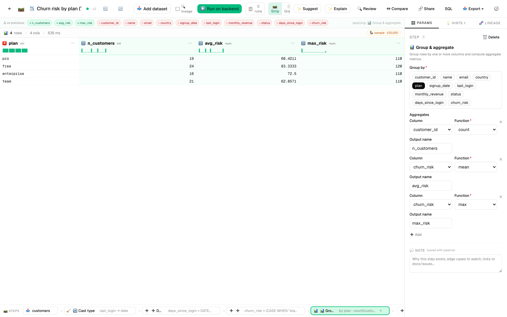
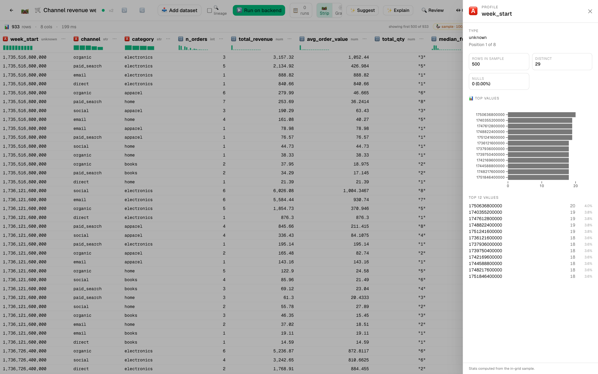
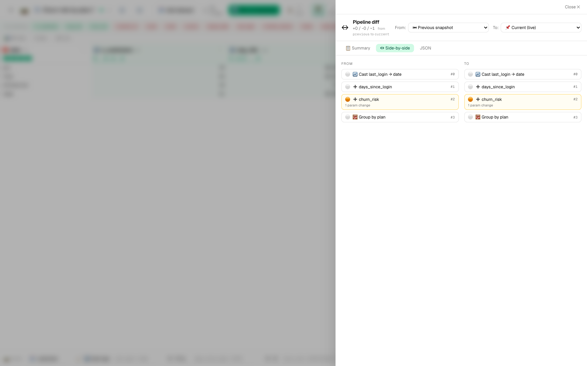
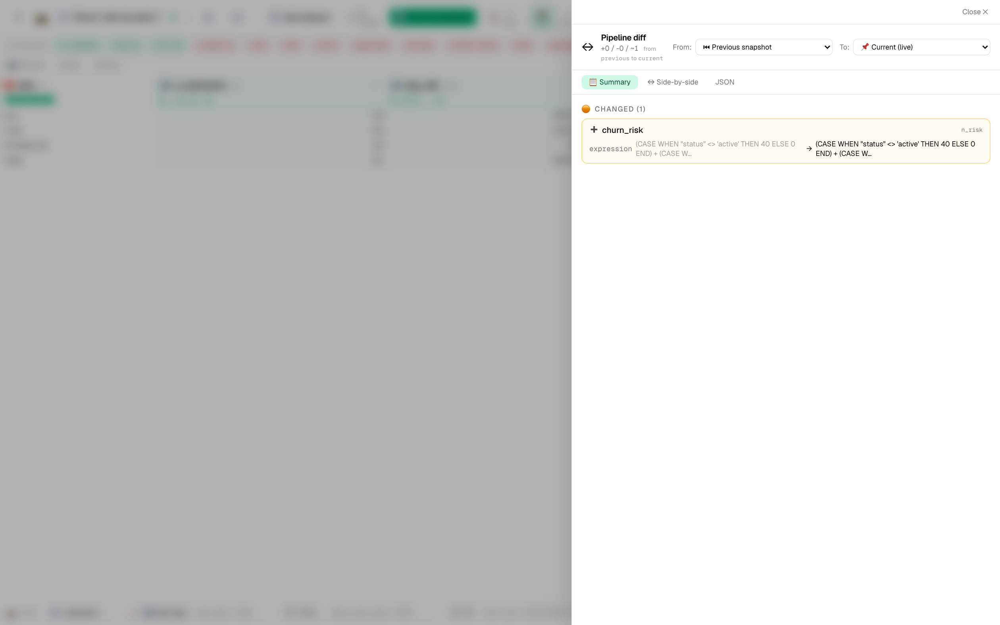
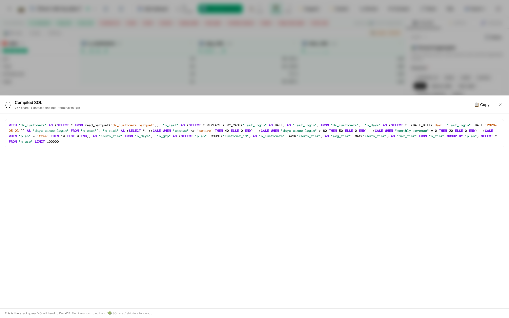

# 📉 Tutorial 1 — Customer churn risk score

**Goal:** start from a raw customer table, compute a per-customer churn risk score, group it by plan, render a chart, and run AI review on the finished pipeline to catch any quality issues you'd miss by eye.

**Dataset:** [`samples/customers-demo.csv`](../../samples/customers-demo.csv) — 80 mock customers with `customer_id`, `name`, `country`, `plan`, `monthly_revenue`, `status`, `signup_date`, `last_login`.

**Features in focus:** derive_column · group_aggregate · expectations · AI Pipeline Review · pipeline diff

**Estimated time:** 15 minutes.

---

## What "churn risk" means here

We'll define a simple deterministic score (0–100) per customer:

- `+40` if `status != 'active'`
- `+30` if `last_login` is more than 30 days old
- `+20` if `monthly_revenue == 0`
- `+10` if `plan == 'free'`

Real models would use a logistic regression or an ML pipeline; we use the deterministic score because the point of this tutorial is the pipeline shape, not the score itself.

---

## Steps

1. **Import the dataset.** *Datasets → Import* → drop `customers-demo.csv`. The profile generates and you'll see histograms above each column header.

   *(After all 8 steps below the editor will look like this — note the inline sparklines on the categorical `plan` column and the numeric aggregate columns:)*

   

2. **New pipeline.** *Pipelines → ➕ New pipeline*. Name it `Churn risk by plan`.

3. **Add `cast_type` for `last_login`.** The CSV reads it as a string; we need it as a date. Connect to the dataset, set:
   - **Column:** `last_login`
   - **Target type:** `date`

4. **Add `derive_column` — `days_since_login`.** Connect downstream of the cast. Set:
   - **Name:** `days_since_login`
   - **Expression:** `DATE_DIFF('day', last_login, CURRENT_DATE)`

5. **Add `derive_column` — `churn_risk`.** Connect after the previous derive. Set:
   - **Name:** `churn_risk`
   - **Expression:**
     ```sql
     (CASE WHEN status <> 'active' THEN 40 ELSE 0 END) +
     (CASE WHEN days_since_login > 30 THEN 30 ELSE 0 END) +
     (CASE WHEN monthly_revenue = 0 THEN 20 ELSE 0 END) +
     (CASE WHEN plan = 'free' THEN 10 ELSE 0 END)
     ```

   Click the column header for `churn_risk` after the live preview updates — you'll see the inline sparkline shows a bimodal distribution (most customers very low or very high). That's already an insight you wouldn't have spotted from raw rows.

6. **Add `expectations` step.** This is the data-quality gate. Connect after the derive. Set:
   - **Assertions:**
     - `churn_risk >= 0 AND churn_risk <= 100` (sanity)
     - `customer_id IS NOT NULL`

7. **Add `group_aggregate`.** Connect downstream. Set:
   - **By:** `plan`
   - **Aggregations:**
     - `customer_id` · `count` · alias `n_customers`
     - `churn_risk` · `mean` · alias `avg_risk`
     - `churn_risk` · `max` · alias `max_risk`

8. **Add `export_to_image`.** Connect from the aggregate. Set:
   - **Chart kind:** `bar_counts`
   - **X column:** `plan`
   - **Y column:** `avg_risk`
   - **Title:** `Average churn risk by plan`

9. **Add an output** pointing at the image step.

10. **▶️ Run on backend.** When the run finishes, the artifacts panel shows the bar chart.

---

## Run AI Review on the finished pipeline

Click **🔍 Review** in the toolbar. The reviewer runs against your configured AI provider (set in *Settings → ✨ AI*). Typical findings on this pipeline:

- 🟡 *"`days_since_login` uses CURRENT_DATE which makes the pipeline non-deterministic — pinning a reference date would make runs reproducible."*
- 🔵 *"Consider an `expectations` assertion that `n_customers >= 1` per plan to catch empty-bucket regressions."*

Click **Apply** on a finding you want — DIG opens the pipeline diff drawer with the proposed change side-by-side. Accept and the pipeline updates. Dismiss the rest.

   

---

## Trace lineage on the result

Right-click the `avg_risk` column header in the live grid → **🔗 Trace lineage…**. The drawer shows:

```
📥 customers-demo.csv
  └─ status, monthly_revenue, plan, last_login (4 columns)
      └─ 🔄 cast_type (last_login → DATE)
          └─ ➕ derive (days_since_login = DATE_DIFF…)
              └─ ➕ derive (churn_risk = CASE … expression)
                  └─ 🧮 group_aggregate (mean(churn_risk) → avg_risk)
```

This is the symmetric answer to per-row lineage: "this column came from these four input columns through these four transforms." Pair it with the inline histogram in the column header and you have a complete answer to *what is this number?*

   *(For a richer column profile drawer, click any column header — the right-side panel shows distribution, top values, and stats.)*
   > 

---

## Save a snapshot, then change the score weights

Click **↔ Compare** → the diff drawer opens with "no changes since last save." That's the baseline. Now go back to the `churn_risk` derive step and change the `+30` to `+50` for `days_since_login > 30`. The save autosaves.

Click **↔ Compare** again — the diff now shows a single `param_changed` entry with the before/after expression. Toggle to **side-by-side** to see both versions of the pipeline strip. This is what code review looks like for visual pipelines.

   
   

   The **🔍 Live SQL toggle** (Engineer mode) shows the same pipeline as a single DuckDB query — useful when you want to share the SQL with a colleague who lives in psql:

   

---

## Share to the gallery

Click **🔗 Share** in the toolbar. Fill:
- **Title:** Customer churn risk score
- **Tags:** churn, customers, beginner
- **Visibility:** Unlisted

Click **🔗 Share** to publish. The link is copied to your clipboard. Open it in a new tab — you've just produced a shareable, runnable artifact.

---

## What you learned

- Multi-step derive expressions composing into a meaningful score.
- `expectations` step as the always-on data-quality gate.
- AI Pipeline Review surfaces issues a human eye misses.
- Pipeline diff shows what changed between two versions.
- Column lineage answers "where did this number come from?" structurally.
- Sharing as a template makes the work re-runnable by anyone.

> 💡 **Tip:** When you change the `churn_risk` weights, the AI Review's findings update with re-runs — try clicking **🔄** in the review panel after changes to see if any old findings have been resolved.
