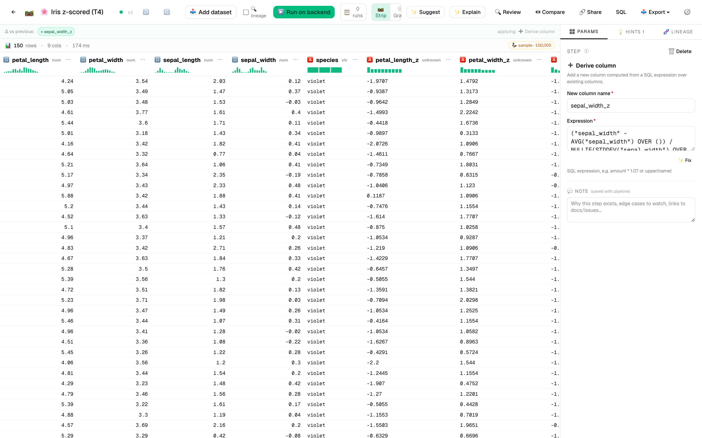
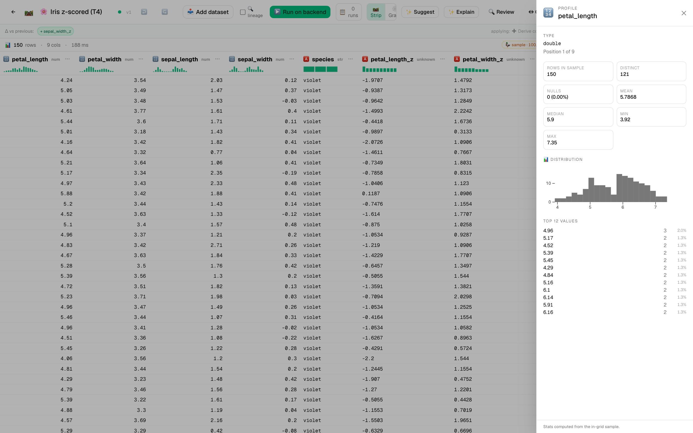
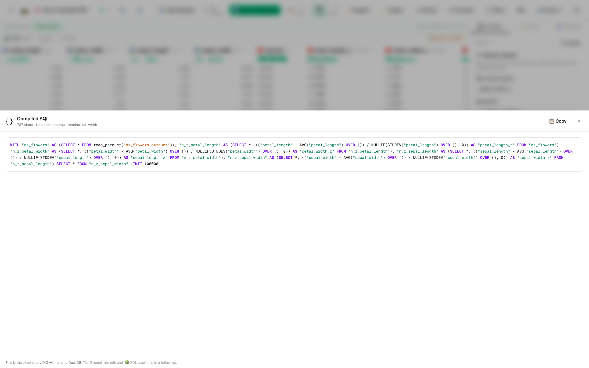

# 🌸 Tutorial 4 — ML feature engineering + k-means clustering

**Goal:** take the iris dataset, normalize the four numeric features, project to 2D with PCA, cluster with k-means, and produce a labeled scatter plot. Along the way, use column lineage to trace how each output column was derived.

**Dataset:** [`samples/flowers-demo.csv`](../../samples/flowers-demo.csv) — the classic Fisher iris (150 rows, 4 numeric features, 1 categorical species column).

**Features in focus:** cast_type · derive_column · pca · kmeans · column lineage · share to gallery

**Estimated time:** 20 minutes.

---

## Steps

1. **Import** `flowers-demo.csv`.

2. **New pipeline:** `Iris clustering`.

3. **Add `cast_type` × 4 (or one composite).** The four numeric columns may already read as `double` from CSV inference — open the dataset profile to confirm. If any read as string, cast each to `double` (the smart-picks dropdown shows it as the top suggestion).

4. **Normalize each numeric column to z-scores** with four `derive_column` steps (or one `math_equation` step if you prefer):

   ```sql
   (petal_length - AVG(petal_length) OVER ()) / NULLIF(STDDEV(petal_length) OVER (), 0)
   ```

   …repeated for the other three numeric columns. Output names: `petal_length_z`, `petal_width_z`, `sepal_length_z`, `sepal_width_z`.

5. **Add `pca` step** for dimensionality reduction. Set:
   - **Columns:** `petal_length_z, petal_width_z, sepal_length_z, sepal_width_z`
   - **Components:** `2`
   - **Output prefix:** `pc`

   The output adds two columns: `pc_1`, `pc_2`. Click each header — the inline sparkline shows the bimodal/trimodal structure that makes iris a textbook clustering example.

   *(Even just after the four z-score derives — before PCA — the editor shows real iris data with sparklines on each numeric column:)*

   

   *(The grid grows two columns: pc_1, pc_2. Watch the inline sparklines on each header — they show the bimodal/trimodal structure that makes iris a textbook clustering example.)*

6. **Add `kmeans` step.** Set:
   - **Columns:** `pc_1, pc_2`
   - **K:** `3` (we know iris has 3 species — in practice you'd try several K values and pick by elbow)
   - **Output column:** `cluster`

7. **Trace lineage on the cluster column.** Right-click the `cluster` header → **🔗 Trace lineage**. You'll see a deep stack:

   ```
   📥 flowers-demo.csv
     └─ petal_length, petal_width, sepal_length, sepal_width
         └─ 🔄 cast_type × 4 → DOUBLE
             └─ ➕ derive × 4 → z-scores
                 └─ 📉 pca → pc_1, pc_2
                     └─ 🌸 kmeans (k=3) → cluster
   ```

   This is what an analytical pipeline looks like end-to-end. The lineage drawer makes it auditable.

   *(The lineage drawer slides in from the right. The profile drawer for any iris z-scored column shows a histogram + top values:)*

   

   And the Live SQL view of the z-scored pipeline shows how the four window functions chain into one DuckDB query:

   

8. **Add `export_to_image`.** Set:
   - **Chart kind:** `scatter`
   - **X column:** `pc_1`
   - **Y column:** `pc_2`
   - **Color by:** `cluster`
   - **Title:** `Iris clusters in PCA space`

9. **▶️ Run on backend.** The scatter plot appears in artifacts. Compare to ground-truth species — k-means typically nails the clean cluster (versicolor) and confuses the two overlapping ones (setosa / virginica) somewhat.

   *(The scatter plot lands as a PNG in the artifacts panel. There's a known scatter screenshot under `docs/images/tutorials/tutorial-pca-flowers.png` that shows the same kind of output.)*

   

---

## Compare to ground truth: how good was the clustering?

10. **Add a second `group_aggregate`** (parallel branch — connect from the kmeans output):
    - **By:** `species, cluster`
    - **Aggregations:** `*` · `count` · alias `n`

    The output is a 3×3 contingency table. Pure clusters would have one nonzero per row. Iris in 2D PCA gets ~94% accuracy — see for yourself.

11. **Add a second output** pointing at the contingency table.

12. **▶️ Re-run.** Both artifacts appear: the scatter plot and the 3×3 table.

   *(Per-tutorial screenshot pending. The contingency table appears as a small data grid in the artifacts panel; clicking it opens a full preview.)*

---

## Run AI review on the ML pipeline

Click **🔍 Review**. Typical findings on this pipeline:

- 🔵 *"Z-score normalization is sample-based; if you re-run on a subset of rows the means + stddevs will differ. For deployment, freeze the means/stddevs from a training run."*
- 🟡 *"PCA is sensitive to feature scaling — confirm all four z-score columns have similar variance after normalization."*
- 🔵 *"K=3 is hardcoded — consider parameterizing if you'll re-use this pipeline for other datasets."*

These are the kinds of remarks a senior reviewer would make on a code PR. The reviewer surfaces them as part of normal saving.

---

## Share to the gallery

**🔗 Share**:
- **Title:** Iris clustering pipeline (PCA + k-means)
- **Tags:** ml, clustering, pca, kmeans, classic
- **Visibility:** Public

This template is genuinely educational — anyone learning DIG who comes across it gets a full ML feature-engineering walkthrough they can fork and adapt to their own data.

---

## What you learned

- Multi-column normalization with `derive_column` + window functions.
- `pca` for dimensionality reduction (and how to read the output as new columns).
- `kmeans` clustering on PCA components.
- Column lineage on derived ML features traces back through every transform.
- Side-by-side ground-truth comparison via parallel pipeline branch.
- AI review surfaces ML-specific concerns (training/serving skew, scaling sensitivity).

> 💡 **Tip:** For real ML work, replace this pipeline's normalization with a `feature_normalize` step that reads pinned mean/stddev from a sidecar JSON — that way training-time and inference-time runs use the same statistics. The reviewer will stop flagging the warning.
