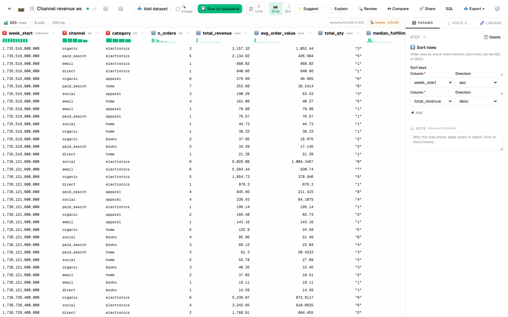
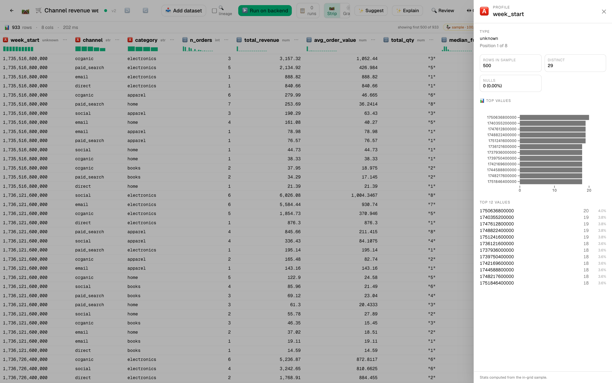
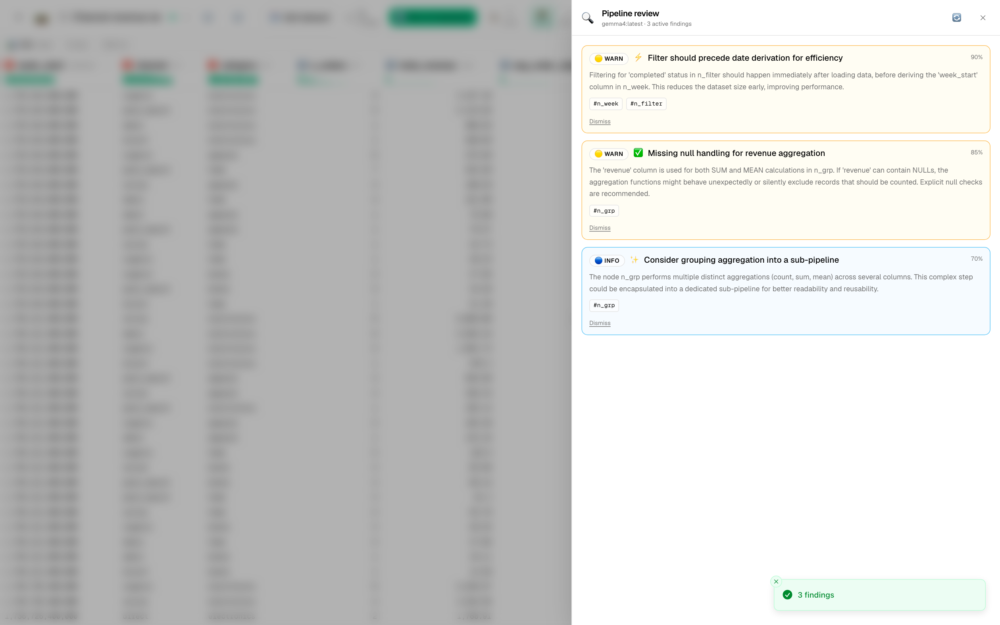
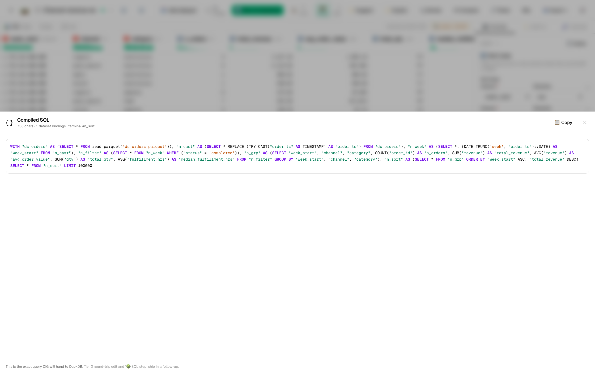

# 🛒 Tutorial 6 — E-commerce channel revenue + AI-driven cleanup

**Goal:** take the rich `orders-demo.csv` (5,023 e-commerce orders with built-in data quality wrinkles), clean it, compute revenue by channel × category × week, surface the data quality issues with the AI Reviewer, and ship the result as a CSV the team can pivot in their tool of choice.

**Dataset:** [`samples/orders-demo.csv`](../../samples/orders-demo.csv) — 5,023 orders × 14 columns. Generated deterministically (seed=42) so re-runs produce identical numbers. Includes:
- 3% missing `customer_email` (NULL values)
- Long-tail `fulfillment_hrs` distribution (some 100+ hour outliers)
- Mix of completed / refunded / cancelled `status` values
- Weekly seasonality + late-November / late-December holiday spikes

**Features in focus:** filter_rows · cast_type · expectations · group_aggregate · pivot · CSV export · **AI Pipeline Reviewer** · pipeline diff · column lineage

**Estimated time:** 25 minutes.

---

## Why this tutorial exists

The other tutorials use 80- or 150-row datasets that don't really exercise the AI Reviewer's "missing expectations" finding category. `orders-demo.csv` is sized + flawed enough to be realistic — the kind of dataset where the Reviewer earns its keep. You'll see findings like:

- 🟡 *"3% of rows have NULL `customer_email` — the downstream group_by_email aggregate will silently drop these rows. Add an `expectations` step or filter explicitly."*
- 🟠 *"`fulfillment_hrs` has a heavy right tail (max 200+, p99 80) — using `mean` aggregation will be dominated by outliers. Consider median or trimmed mean."*

You only get those findings on data that actually has problems. So we use this dataset.

---

## Steps

1. **Import the orders dataset.** *Datasets → Import* → drop `orders-demo.csv`. Watch the per-column profile generate. The header histograms tell you a lot at a glance:
   - `country` — 10 categorical bars
   - `channel` — 5 bars (organic dominant)
   - `qty` — heavily skewed toward 1
   - `revenue` — long tail
   - `fulfillment_hrs` — long tail, lognormal-shaped

2. **New pipeline:** `Channel revenue weekly`.

3. **Add `cast_type` for `order_ts` → `datetime`.** CSV ingest reads it as string; cast for the date-truncation we're about to do.

4. **Add `derive_column` to extract the ISO week.** Set:
   - **Name:** `week_start`
   - **Expression:** `DATE_TRUNC('week', order_ts)::DATE`

5. **Add `filter_rows` to drop refunded + cancelled orders.** Predicate:
   ```sql
   status = 'completed'
   ```

   The live grid drops to ~85% of original rows. The `status` column header sparkline now shows a single bar (only one value left).

6. **Add `expectations` step — the data-quality gate.** Set assertions:
   - `revenue > 0`
   - `qty >= 1`
   - `country IS NOT NULL`
   - `customer_email IS NOT NULL OR status = 'cancelled'` *(refused orders sometimes lack email — explicitly allow it)*

   Each assertion runs at execution time and contributes a row to the run's artifacts panel. If anything fails, the run fails loudly.

7. **Add `group_aggregate`.** Set:
   - **By:** `week_start, channel, category`
   - **Aggregations:**
     - `order_id` · `count` · alias `n_orders`
     - `revenue` · `sum` · alias `total_revenue`
     - `revenue` · `mean` · alias `avg_order_value`
     - `qty` · `sum` · alias `total_qty`
     - `fulfillment_hrs` · `median` · alias `median_fulfillment_hrs`

   Notice we use `median` not `mean` for fulfillment — the long tail would distort the mean.

8. **Add `sort_rows`.** Sort by `week_start` ascending, then `total_revenue` descending — so each week's rows are listed top-revenue-first.

9. **Add `export_to_file`.** Set:
   - **Format:** `csv`
   - **Path:** `weekly-channel-revenue.csv`

10. **Add an output** pointing at the CSV step.

11. **▶️ Run on backend.** The run completes in ~2-3 seconds. The artifacts panel shows the CSV card.

   

   Click any column header to open the rich profile drawer — particularly useful on `total_revenue` (long tail) and `median_fulfillment_hrs` (skewed) to confirm the distribution before downstream consumers do:

   

---

## 🔍 Run AI Pipeline Review

Click **🔍 Review** in the toolbar. With this richer dataset the reviewer typically surfaces:

- 🔴 *"`group_aggregate` uses `mean` on `revenue` (`avg_order_value`) which is sensitive to outliers — your data has a long right tail in revenue. Consider also computing P95 or median."*
- 🟡 *"No `expectations` assertion on `total_revenue >= 0` post-aggregation. A negative total would indicate a data corruption issue that's worth catching loudly."*
- 🟡 *"3% of rows had NULL `customer_email` and are still in the dataset (the expectation allows them). If downstream users need email, add a column annotation noting this."*
- 🔵 *"The week-start derive uses `DATE_TRUNC('week', ...)` which defaults to ISO weeks (Monday start). If your business reports run on Sunday-start weeks, the totals will look 'shifted' relative to your dashboards."*

These are the kinds of nitpicks a senior reviewer would surface in PR review. Click **Apply** on any you want; the diff drawer shows the proposed change before commit.



> 💡 **Engineer-mode tip:** the `{} SQL` toolbar button shows the entire pipeline as a single DuckDB query. Useful when you want to copy/paste into psql or share with a SQL-native colleague who doesn't want to learn DIG's UI:
>
> 

---

## ↔ Compare versions

Save the pipeline. Now go back and change the median to `mean` in step 7 (i.e. accept the AI's first finding the *opposite* way to see what the diff looks like). Save again.

Click **↔ Compare** → side-by-side. You'll see a `🟠 param_changed` row on the group_aggregate step with the before/after `aggregations` array fully expanded.


This is what code review looks like for a visual pipeline.

---

## 🔗 Trace lineage on `total_revenue`

Right-click the `total_revenue` column header → **🔗 Trace lineage**. The drawer shows:

```
📥 orders-demo.csv
  └─ revenue (numeric column)
      └─ ✂️ filter_rows (status = 'completed')
          └─ 🧮 group_aggregate (sum(revenue) → total_revenue)
```

Now imagine the lineage on `median_fulfillment_hrs` — it walks back through `fulfillment_hrs` from the source. Click any node to jump to it in the editor.

---

## Schedule it weekly

12. *Schedules* → ➕ New schedule:
    - **Pipeline:** `Channel revenue weekly`
    - **Cron:** `0 9 * * 1` (Monday 9am)

   The schedule writes a new dated CSV (`weekly-channel-revenue-2026-W18.csv`) every Monday morning. After 2-3 weeks the column-header sparklines start showing **distribution diff overlays** — Monday-on-Monday changes pop visually.

---

## 🔗 Share

**🔗 Share**:
- **Title:** E-commerce channel revenue (weekly)
- **Tags:** ecommerce, revenue, weekly, data-quality
- **Visibility:** Public

This template is genuinely useful — it's a reusable shape for any orders table. Recipients fork it, point at their own orders dataset, and have a working channel-revenue rollup in 2 minutes.

---

## What you learned

- A realistic dataset (5,000+ rows, multiple data-quality issues) exercises features the small samples can't.
- `expectations` is the always-on data-quality gate — assertions become part of the pipeline's contract.
- AI Pipeline Review surfaces real findings on real data — it's not a toy on this dataset.
- Median > mean for skewed distributions — use the histogram + sparkline to spot which is which before aggregating.
- CSV export is the universal sink — Sheets / Snowflake / BigQuery / Postgres are all one step swap away when you have credentials.

> 💡 **Tip:** If you're benchmarking DIG's perf, this is the dataset to use. It's small enough for in-browser DuckDB-WASM (sub-second preview) but large enough that backend-vs-browser parity tests give you meaningful timings. The bundled scheduled run completes in ~50ms on backend DuckDB.
