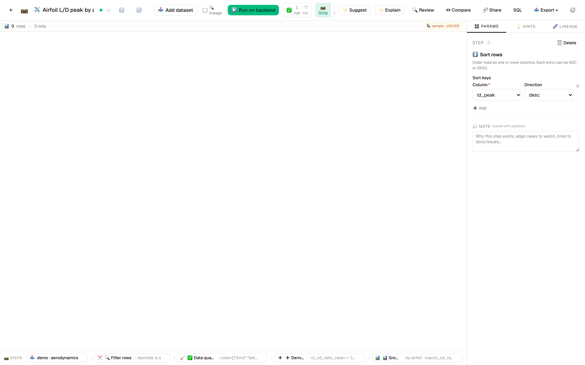
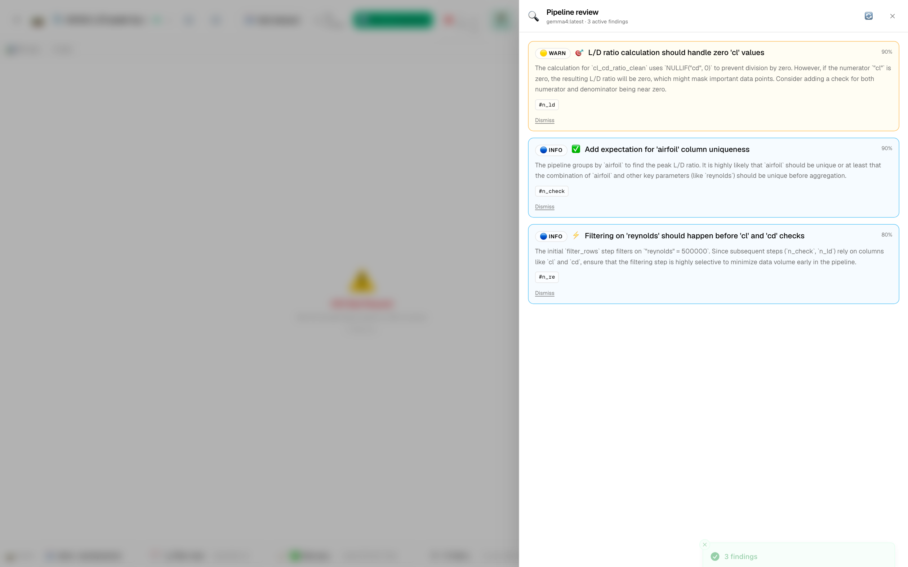
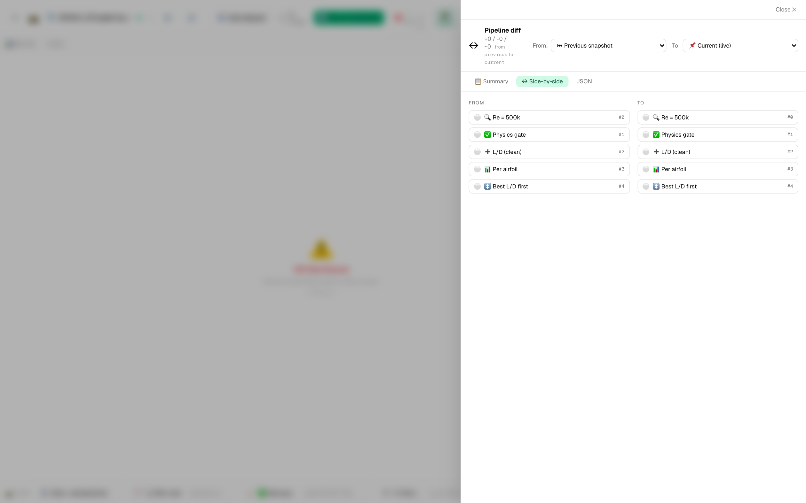

# ✈️ Tutorial 7 — Airfoil aerodynamics: drag polars + L/D peak detection

**Goal:** take `aerodynamics-demo.csv` (17,568 rows of stylized wind-tunnel measurements over 12 NACA airfoils × 6 Reynolds numbers × 61 angles of attack × 4 replicate runs), filter to a target Reynolds, find the maximum lift-to-drag ratio per airfoil, surface stall onset, and ship a comparison chart that shows which airfoil wins at this Re.

**Dataset:** [`samples/aerodynamics-demo.csv`](../../samples/aerodynamics-demo.csv) — 17,568 rows × 11 columns, ≈1.38 MB. Generated deterministically (seed=42) so re-runs produce identical numbers. Contents:
- `airfoil` — 12 NACA designations (`NACA-0012`, `NACA-2412`, `NACA-4415`, `NACA-23012`, etc.)
- `reynolds` — 6 levels (5×10⁴ → 3×10⁶)
- `alpha_deg` — −10° to +20° in 0.5° steps
- `run_id` — 4 replicate wind-tunnel passes per condition (so a `mean / median` choice actually matters)
- `cl`, `cd`, `cm` — lift, drag, pitching-moment coefficients
- `cl_cd_ratio` — pre-computed L/D
- `flow_regime` — `laminar` / `transitional` / `turbulent`
- `stalled` — boolean post-stall flag
- `transition_pt_chord` — boundary-layer transition x/c (1.5% missing — sensor dropouts)

**Features in focus:** filter_rows · group_aggregate · expectations · pivot_wider · derive_column · export_to_image · CSV export · **AI Pipeline Reviewer** · pipeline diff · column lineage

**Estimated time:** 25 minutes.

---

## Why this tutorial exists

A spreadsheet plots one polar at one Reynolds. What it can't do without pain:

- Compare drag polars **across Reynolds** for the same airfoil — every Re slice is a separate sheet.
- Detect **L/D peak per airfoil** programmatically — eyeballing it doesn't scale to 12 profiles.
- Surface **stall onset** as a per-airfoil derived metric, not a global threshold.
- Run **expectations** that fail loudly when sensor dropouts land below the noise floor (cd ≤ 0).

---

## Steps

1. **Import the dataset.** *Datasets → Import* → drop `aerodynamics-demo.csv`. Column profiles render as the file streams in. Header histograms tell you a lot at a glance: `airfoil` (12 categorical bars), `reynolds` (6 discrete spikes), `cl` (bimodal — negative- and positive-alpha lobes), `cd` (long right tail from post-stall drag spikes).

   

2. **New pipeline:** `Airfoil L/D peak by airfoil`.

3. **Add `filter_rows` to pin the Reynolds.** Predicate:
   ```sql
   reynolds = 500000
   ```
   The grid drops to ~16.7% of original rows — exactly the Re=5×10⁵ slice. The `reynolds` column-header sparkline collapses to one bar.

4. **Add `expectations` — guard against sensor weirdness.** Rules:
   - `cl` `between` (min: −2, max: 2)
   - `cd` `between` (min: 0.0001, max: 0.5) — the 1% wrinkle in the data sometimes pushes cd just below zero; the assertion catches it
   - `alpha_deg` `between` (min: −15, max: 25)
   - `cl_cd_ratio` `not_null`

   Each rule has severity `error`. Set **Fail run on any error-severity violation** so the pipeline stops loudly if the upstream wind-tunnel feed regresses.

   

5. **Add `derive_column` for `cl_cd_ratio_clean`.** The dataset already carries the ratio, but recomputing post-filter makes lineage unambiguous. Set:
   - **Name:** `cl_cd_ratio_clean`
   - **Expression:** `"cl" / NULLIF("cd", 0)`

   `NULLIF` protects against the rare cd≈0 row that survives the expectation.

6. **Add `group_aggregate` to find max L/D + stall onset per airfoil.** Set:
   - **Group by:** `airfoil`
   - **Aggregations:** `cl_cd_ratio_clean·max·ld_peak`, `cl·max·cl_max`, `cd·min·cd_min`, `stalled·count·stalled_rows`

   `stalled_rows` divided by 244 (61 alphas × 4 runs) gives the post-stall fraction per airfoil.

7. **Add `sort_rows`.** Sort by `ld_peak` descending — the airfoil with the highest peak L/D is row 1.

8. **Add `pivot_wider`** off the *filtered* branch (not the aggregate): identifier `alpha_deg`, names from `airfoil`, values from `cl_cd_ratio_clean`, collision = `mean` (averages the 4 replicate runs). You now have one column per airfoil with alphas as rows — the shape a multi-line chart wants.

9. **Add `export_to_image`** — `line`, X=`alpha_deg`, Y=`NACA-2412` (legend overlays the rest), title `L/D vs α at Re=500k`, `png` 1200×750.

10. **Add `export_to_file`** — `csv`, path `airfoil-ld-peak.csv`.

11. **Add an output** pointing at the CSV step.

12. **▶️ Run on backend.** Completes in ≈3 seconds. The artifacts panel shows the PNG + CSV cards.

   Click the `cl_cd_ratio_clean` column header to open the rich profile drawer — the long tail is the giveaway that mean-based aggregations on this column will mislead:

   

   The exported chart artifact opens with one click:

   

---

## 🔍 Run AI Pipeline Review

Click **🔍 Review** in the toolbar. On this dataset the reviewer typically surfaces:

- 🟠 *"`group_aggregate` aggregates `stalled` with `count` — but `stalled` is a boolean, so `count` returns the row count not the true-count. Use `sum(CAST(stalled AS INTEGER))` or filter to `stalled = true` first."*
- 🟡 *"Stall onset is implied by `stalled_rows` but never derived as an angle. Consider a follow-up `derive_column` that computes `MIN(alpha_deg) FILTER (WHERE stalled = true)` per airfoil — that's the actionable number."*
- 🟡 *"`transition_pt_chord` has a ~1.5% NULL rate. The current pipeline doesn't reference it, but if a downstream consumer joins on it the missing rows will silently drop. Add a `null_fraction` expectation now to lock the contract."*
- 🔵 *"The `filter_rows` predicate hard-codes `reynolds = 500000`. Consider parameterizing via a pipeline variable so the same template covers all six Re levels."*

These are the kinds of nitpicks an aero lead would catch in code review. Click **Apply** on any to see the diff before commit.



---

## ↔ Compare versions — Re=500k vs Re=1M

Save the pipeline. Now go back to step 3 and change the predicate to `reynolds = 1000000`. Save again.

Click **↔ Compare** → side-by-side. You'll see a `🟠 param_changed` row on the `filter_rows` step with the predicate diff. The downstream impact is dramatic — at Re=1M the laminar bucket is shallower, so `cd_min` drops and `ld_peak` rises across the board. The numerical diff is in the artifacts of both runs.



This is what code review looks like for an aero data pipeline.

---

## 🔗 Trace lineage on `cl_cd_ratio_clean`

Right-click the `cl_cd_ratio_clean` column header → **🔗 Trace lineage**. The drawer shows:

```
📥 aerodynamics-demo.csv
  ├─ cl (numeric column)
  └─ cd (numeric column, NULLIF wrapped)
      └─ ✂️ filter_rows (reynolds = 500000)
          └─ ✅ expectations (cd > 0.0001)
              └─ ➕ derive_column (cl / NULLIF(cd, 0))
```

The lineage is what an external auditor wants to see when the wind-tunnel team asks "is the L/D number on the dashboard the *raw* L/D or the cleaned one?". Click any node to jump to it in the editor.

---

## Schedule it overnight

13. *Schedules* → ➕ New schedule:
    - **Pipeline:** `Airfoil L/D peak by airfoil`
    - **Cron:** `0 3 * * *` (every night at 3am)

   The wind-tunnel team typically lands the day's CSV at ~02:30 local. Running at 03:00 gives the rollup + chart ready for the morning standup, with the expectations layer guaranteeing the run only succeeds when the data passes the contract.

---

## 🔗 Share

**🔗 Share**:
- **Title:** Airfoil L/D peak by airfoil at fixed Re
- **Tags:** aerospace, airfoil, polar, reynolds, expectations
- **Visibility:** Public

The template is immediately useful to anyone with airfoil polar data — fork it, point at your own CSV, swap the `reynolds` value, get the same rollup + chart in two minutes.

---

## What you learned

- A polar dataset (multi-Re, multi-airfoil, replicate runs) is the right shape to exercise filter → expectations → derive → group → pivot in one pipeline.
- `expectations` with per-rule severity enforces physics constraints (`cl ∈ [−2, 2]`, `cd > 0`) as contract assertions, not nice-to-haves.
- Stall onset is per-airfoil, not a global cutoff — the AI Reviewer pushes you to derive it as a metric.
- The `pivot_wider` shape (alphas as rows, airfoils as columns) is the canonical input for any "compare-across-X" chart.

> 💡 **Tip:** When scaling this template to a real wind-tunnel feed, add a `filter_rows` upstream of `expectations` to drop the tare-subtraction rows (alpha=0, no airflow) — they pass `cd > 0` but distort `cd_min`.
