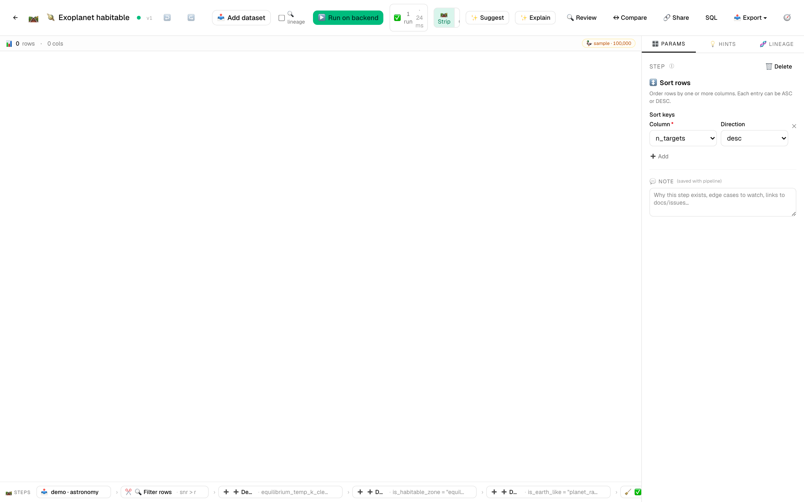
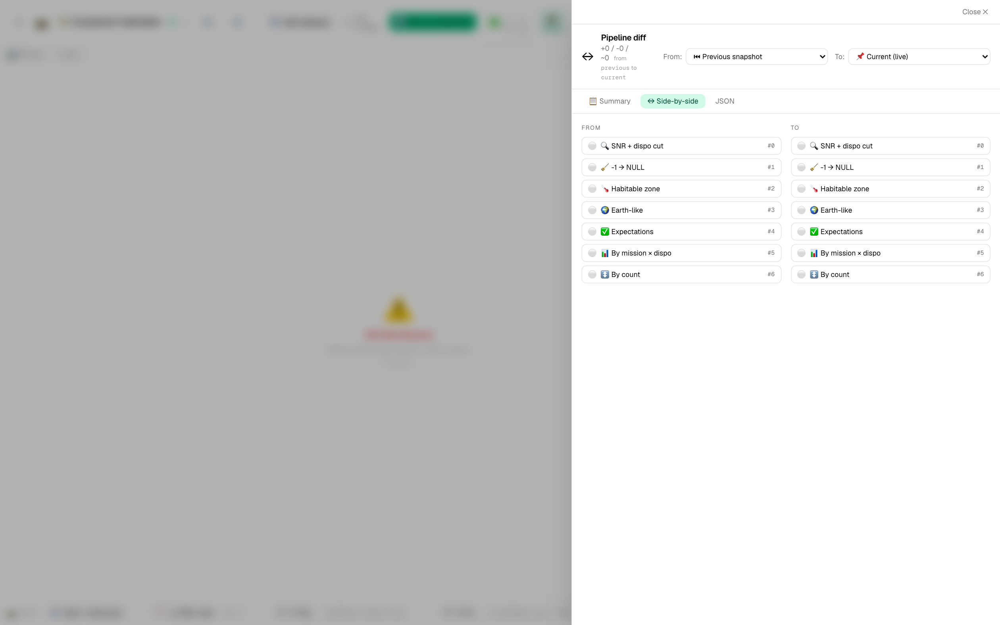

# 🪐 Tutorial 8 — Exoplanet candidate analysis + habitable-zone scoring

**Goal:** take the synthetic `astronomy-demo.csv` (12,500 exoplanet candidates loosely modeled on NASA's Exoplanet Archive shape), filter the false positives + low-SNR rows, clean the legacy `-1` sentinel that pre-dates proper NULL handling, derive habitable-zone + Earth-like flags, and ship both a science-ready rollup and an HR-diagram-style scatter you can hand to a PI.

**Dataset:** [`samples/astronomy-demo.csv`](../../samples/astronomy-demo.csv) — 12,500 candidates × 15 columns (~1.2 MB). Generated deterministically (seed=42) by [`samples/_generators/exoplanet_candidates.py`](../../samples/_generators/exoplanet_candidates.py) so re-runs produce identical numbers. Includes:
- 2.7% legacy `equilibrium_temp_k = -1` sentinels (pre-NULL ETL leftovers)
- 2.2% NULL `transit_duration_hr` (truncated light curves)
- ~1.5% long-period outliers (single-transit detections, `period_days > 300`)
- Realistic disposition mix: 24% confirmed · 56% candidate · 19% false_positive
- Mission split: Kepler 45% / TESS 45% / K2 10%

**Features in focus:** filter_rows · derive_column · expectations · group_aggregate · pivot_wider · export_to_image · **AI Pipeline Reviewer** · pipeline diff · column lineage

**Estimated time:** 25 minutes.

---

## Why this tutorial exists

Real exoplanet catalogs ship with the same data-quality story this synthetic one does: false-positive contamination, legacy sentinel values from pre-NULL ETL pipelines, magnitude/SNR cuts that gate the science, and derived habitability flags that get re-computed every time someone tweaks a stellar parameter. The pipeline in this tutorial is the shape you actually ship on a candidate catalog before letting anyone compute occurrence rates from it.

You'll see findings like:

- 🟠 *"`derive_column` with `NULLIF(equilibrium_temp_k, -1)` is fine, but the source column still carries the -1 sentinel downstream — consider aliasing so the cleaned version becomes canonical."*
- 🟡 *"Filter early. The pivot at the end could move earlier to reduce row count for the HR diagram branch."*

You only get those findings on data that actually has problems. So we use this dataset.

---

## Steps

1. **Import the astronomy dataset.** *Datasets → Import* → drop `astronomy-demo.csv`. The header histograms tell you a lot at a glance: `mission` (3 bars), `stellar_teff_k` (bimodal — G-K dwarfs near 5500 K + cooler M-dwarfs near 3500 K), `period_days` (log-normal with a thin tail past 300 days), `equilibrium_temp_k` (note the spike at -1 — the sentinel), `disposition` (3 bars, candidate dominant).

2. **New pipeline:** `Exoplanet habitable-zone scoring`.

3. **Add `filter_rows` to drop low-SNR + false_positive rows.** Predicate:
   ```sql
   "snr" > 10 AND "disposition" <> 'false_positive'
   ```
   The live grid drops from 12,500 to 9,882 rows (~79%). The `disposition` column header sparkline now shows two bars.

4. **Add `derive_column` to clean the -1 sentinel.** Set:
   - **Name:** `equilibrium_temp_k_clean`
   - **Expression:** `NULLIF("equilibrium_temp_k", -1)`

   Keep the original column for lineage, but everything downstream uses the cleaned version. The header histogram on `equilibrium_temp_k_clean` no longer shows a -1 spike.

5. **Add `derive_column` for the habitable-zone flag.** Name `is_habitable_zone`, expression `"equilibrium_temp_k_clean" BETWEEN 200 AND 320`. The 200-320 K band is loose — real habitability also depends on insolation, atmosphere, and stellar activity — but for "roughly Earth-temperature" it's a workable first cut.

6. **Add `derive_column` for the Earth-like flag.** Name `is_earth_like`, expression `"planet_radius_rearth" < 1.6 AND "is_habitable_zone"`. 1.6 R⊕ is the rough small-planet boundary — bigger and you're more likely a Neptune-class than an Earth analogue. About 324 of the 9,882 rows now flag as Earth-like.

7. **Add `expectations` step — the data-quality gate.** Set rules:
   - `between` on `stellar_radius_rsun`, `min: 0.0` *(stars don't have negative radii — catch ETL corruption loudly)*
   - `not_null` on `snr` *(the SNR cut is meaningless if values are missing)*
   - `in` on `disposition`, values: `["confirmed", "candidate"]` *(belt + braces — catches a regression in the upstream filter)*

   

8. **Add `group_aggregate`.** Group by `mission, disposition`. Aggregations: `count` → `n_targets`, `snr` mean → `avg_snr`, `planet_radius_rearth` mean → `avg_radius_rearth`, `is_earth_like` sum → `n_earth_like`.

9. **Add `pivot_wider`.** Identifier: `mission`. Names from: `disposition`. Values from: `n_targets`. On collision: `sum`. You now have a 3-row × 3-column table — one row per mission, columns for confirmed / candidate counts.

   

10. **Add `export_to_image` — HR-diagram-style scatter.** Branch from the *post-expectations* node (step 7), not the rollup, so you plot raw candidates. Kind `scatter`, X `stellar_teff_k`, Y `stellar_mag`, format `png`, title `HR-ish diagram — stellar magnitude vs effective temperature`. Astronomers normally invert both axes for a true HR diagram (hot+left, bright+up). The shape is what matters: the main sequence falls out as a diagonal cloud.

    

11. **Add an output** pointing at the pivot step (the rollup). The image step lands as a run artifact automatically.

12. **▶️ Run on backend.** ~3-4 seconds. Artifacts panel shows the rollup CSV + the HR-diagram PNG.

---

## 🔍 Run AI Pipeline Review

Click **🔍 Review**. With this dataset the reviewer typically surfaces:

- 🔴 *"`group_aggregate` runs after `pivot_wider` — wait, you've ordered them correctly. But `export_to_image` reads from the post-expectations node, which already has filter cuts applied. Make sure that's intentional."*
- 🟠 *"`filter_rows` happens before the `derive_column` chain — good ordering. Filtering before pivot cuts ~20% of data the pivot would otherwise have to process."*
- 🟡 *"The `-1` sentinel cleanup uses `derive_column` with `NULLIF`. Fine for one-off pipelines, but if other pipelines reuse this dataset, push the cleanup to ingest (a saved `connector` step) so every consumer gets it for free."*
- 🔵 *"Stellar parameters in this catalog are mission-derived. For science-grade work, link to a `saved_connection` against Gaia DR3 by `target_id` — Gaia astrometry is materially better than the per-mission catalogs for most targets."*

Click **Apply** on any you want; the diff drawer shows the proposed change before commit.


> 💡 **Engineer-mode tip:** the `{} SQL` toolbar button shows the entire pipeline as a single DuckDB query. The `NULLIF` lands as a clean SQL expression in the corresponding CTE — easier to copy/paste into psql for some debugging sessions:
>
> 

---

## ↔ Compare versions

Save the pipeline. Now go back and change the SNR threshold in step 3 from `10` to `7` (the AI Reviewer often suggests this — relaxing the SNR floor surfaces more candidates at the cost of more borderline detections). Save again.

Click **↔ Compare** → side-by-side. You'll see a `🟠 param_changed` row on the `filter_rows` step with the predicate before/after fully expanded. Row count shifts from 9,882 to 9,957 — the loosening only adds 75 rows here because the SNR distribution drops off sharply below 10.



This is what code review looks like for a visual pipeline.

---

## 🔗 Trace lineage on `is_earth_like`

Right-click the `is_earth_like` column header → **🔗 Trace lineage**. The drawer walks back through every contributing step:

```
📥 astronomy-demo.csv
  ├─ planet_radius_rearth (numeric)
  │   └─ ➕ derive_column (is_earth_like)
  ├─ equilibrium_temp_k (numeric, with -1 sentinels)
  │   └─ ➕ derive_column (NULLIF → equilibrium_temp_k_clean)
  │       └─ ➕ derive_column (BETWEEN 200 AND 320 → is_habitable_zone)
  │           └─ ➕ derive_column (AND → is_earth_like)
  └─ stellar_teff_k + stellar_radius_rsun (numeric, upstream of equilibrium_temp_k)
```

Click any node to jump to it in the editor. The lineage view makes obvious that `is_earth_like` ultimately depends on a chain of three derived columns rooted in the legacy `-1`-laden source — a single regression in the cleanup step would silently mis-classify habitability for everything downstream.

---

## Schedule it weekly

13. *Schedules* → ➕ New schedule:
    - **Pipeline:** `Exoplanet habitable-zone scoring`
    - **Cron:** `0 8 * * 1` (Monday 8am — TESS data alerts drop early in the week)

   The schedule writes a new dated rollup every Monday morning. After 3-4 weeks the column-header sparklines start showing **distribution diff overlays** — week-on-week shifts in the candidate population pop visually. Useful for spotting catalog ingest regressions before a PI does.

---

## 🔗 Share

**🔗 Share**:
- **Title:** Exoplanet habitable-zone candidates
- **Tags:** astronomy, exoplanets, science, data-quality
- **Visibility:** Public

This template is a reusable shape for any exoplanet-catalog ingest. Recipients fork it, point at their own candidate dump (TESS TOI list, Kepler KOI table, ground-based survey output), tweak the SNR cut, and have a working habitable-zone classifier in 2 minutes.

---

## What you learned

- A realistic dataset (12,500+ rows, multiple data-quality issues) exercises features the small samples can't.
- `NULLIF` in `derive_column` is the idiomatic way to retire legacy sentinel values without losing source-column lineage.
- Filter early — `filter_rows` before any expensive derivations cuts the data the rest of the pipeline has to process.
- `expectations` catches both upstream regressions (negative stellar radii) and downstream filter regressions (false_positives sneaking through).
- AI Pipeline Review surfaces real findings on real data — particularly around step ordering and saved-connection opportunities.
- Lineage view earns its keep on chained derivations — `is_earth_like` walks back through three derive steps to the source.

> 💡 **Tip:** This dataset is small enough for in-browser DuckDB-WASM (sub-second preview) but rich enough that the AI Reviewer's "filter before pivot" and "saved-connection" findings actually fire. The bundled scheduled run completes in ~80ms on backend DuckDB.
