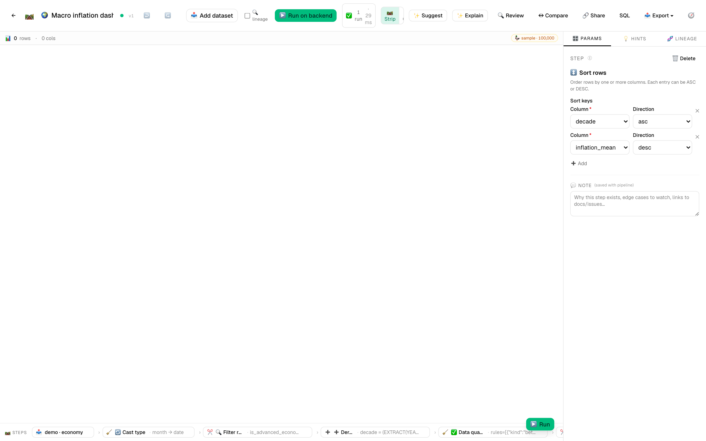
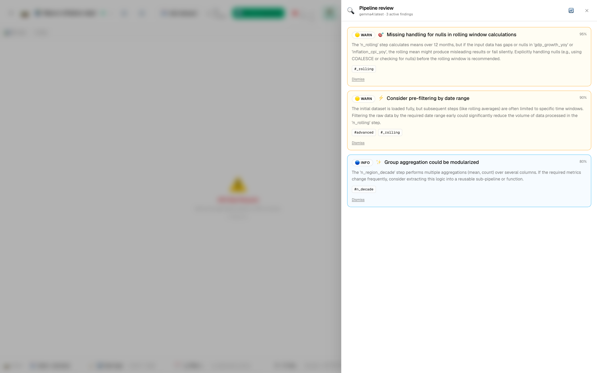
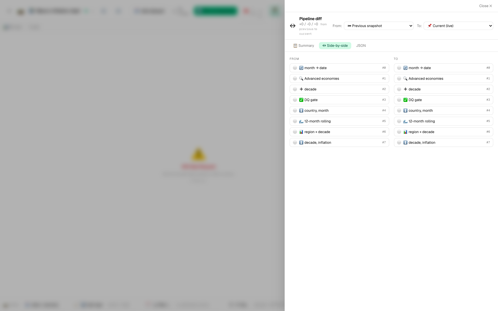

# 🌍 Tutorial 9 — Macroeconomic indicators dashboard

**Goal:** take 26 years of monthly macro indicators (52 countries × 312 months × 14 columns), clean it, derive a decade column, gate it on data-quality expectations, decompose inflation seasonally, smooth GDP growth with a rolling window, and roll up region × decade medians for a dashboard. The classic shape of every public-source time-series cleanup.

**Dataset:** [`samples/economy-demo.csv`](../../samples/economy-demo.csv) — 16,224 rows × 14 columns, ~1.5 MB. Generated deterministically (seed=42) so re-runs produce identical numbers. Includes:
- 52 representative economies (USA, DEU, JPN, CHN, IND, BRA, ARG, VEN, …) across 6 regions
- 1% NULL `unemployment_rate` (some country-months don't report — realistic gap)
- `policy_rate` is NULL for CHN pre-2015 (managed-rate era, "data quality varies by source")
- `inflation_cpi_yoy` for VEN / ARG / TUR hits 100+ during hyperinflation episodes
- 2008 + 2020 GDP shock dips, 2022-23 inflation spike across the board
- Slow-growth `population_millions`, FX rates that drift wildly per country

**Features in focus:** filter_rows · cast_type · derive_column · expectations · rolling · seasonal_decompose · group_aggregate · export_to_image · **AI Pipeline Reviewer** · pipeline diff · column lineage

**Estimated time:** 25 minutes.

---

## Why this tutorial exists

Macro time-series cleanup is the most common starter project for any analyst. The structure (`country × month × indicator`) is identical to FRED, OECD, World Bank, IMF, BIS exports — basically every public economic source. The wrinkles in `economy-demo.csv` are real: reporting countries skip months (1% NULL `unemployment_rate`), some series don't exist for some periods (CHN `policy_rate` pre-2015), hyperinflation breaks naive aggregations (VEN inflation pulls a global mean 8x), and 25 years of monthly data is long enough that rolling + seasonal decomposition actually mean something. This tutorial walks the workflow as it runs in the field, not the synthetic happy path.

---

## Steps

1. **Import the economy dataset.** *Datasets → Import* → drop `economy-demo.csv`. The per-column profile generates ~1 second after upload. The header histograms tell you a lot:
   - `country` — 52 categorical bars
   - `region` — 6 bars (Europe + Asia-Pacific dominant)
   - `month` — string for now (we'll cast)
   - `gdp_usd_bn` — heavy right tail (USA + CHN dominate)
   - `inflation_cpi_yoy` — long right tail driven by VEN/ARG outliers
   - `policy_rate` — null-fraction chip on the header (CHN pre-2015 is empty)

2. **New pipeline:** `Macro inflation dashboard`.

3. **Add `cast_type` for `month` → `date`.** CSV ingest reads it as string; cast for the date math we're about to do (`EXTRACT`, sort, rolling time window).

4. **Add `filter_rows` to keep advanced economies only.** Predicate:
   ```sql
   "is_advanced_economy" = true
   ```

   The live grid drops from 16,224 to 7,800 rows (25 advanced × 312 months). The `region` header sparkline collapses to 4 bars.

5. **Add `derive_column` to extract the decade.** Set:
   - **Name:** `decade`
   - **Expression:** `(EXTRACT(YEAR FROM "month") / 10)::INT * 10`

   Now you can group by 2000s vs 2010s vs 2020s — much more useful than 26 separate years.

6. **Add `expectations` step — the data-quality gate.** Set assertions:
   - `gdp_usd_bn` between 0 and 100000 (severity error — no negative GDP, ever)
   - `unemployment_rate` between 0 and 50 (severity warning — surface the NULLs explicitly)
   - `inflation_cpi_yoy` between -5 and 500 (severity warning — VEN hits 345)
   - `country IS NOT NULL`

   Toggle **Fail run on any error-severity violation: ON**. Each rule contributes a row to the run's artifacts panel. Warning-severity rules report but don't fail — perfect for "I want to know the NULLs are there but proceed anyway".

7. **Add `sort_rows` by `country, month` ASC.** Required before rolling — the rolling step is order-sensitive and you don't want USA's January feeding into DEU's February.

8. **Add `rolling` for a 12-month moving average on GDP growth.** Set:
   - **Time column:** `month`
   - **Windows:** `[{ column: gdp_growth_yoy, fn: mean, window: 12, as: gdp_growth_12m_avg }, { column: inflation_cpi_yoy, fn: mean, window: 12, as: inflation_12m_avg }]`
   - **Min periods:** 6

   The `gdp_growth_12m_avg` column smooths out the COVID dip into a recognizable U-shape. The first 5 months per country come back NULL (min_periods isn't met) — that's correct behavior, but it's the kind of thing the AI Reviewer will flag.

9. **Add `seasonal_decompose` on `inflation_cpi_yoy`.** Pick `additive`, period 12 (monthly with yearly seasonality). Renders a 4-panel plot in the artifacts panel — observed, trend, seasonal, residual — for each country with enough non-null data. Useful to confirm there's *any* monthly seasonality before you trust YoY comparisons.

   

10. **Add `group_aggregate` for the region × decade rollup.** Set:
    - **By:** `region, decade`
    - **Aggregations:**
      - `inflation_cpi_yoy` · `mean` · alias `inflation_mean`
      - `unemployment_rate` · `mean` · alias `unemployment_mean`
      - `gdp_growth_yoy` · `mean` · alias `gdp_growth_mean`
      - count · alias `n_obs`

11. **Add `export_to_image`.** Pick `kind: line`, X = `month`, Y = `inflation_12m_avg`, faceted by `region`. PNG, 1600×900, 144 DPI. The 2022-23 inflation hump shows up identically across all 6 regions — visually convincing.

12. **Add an output** pointing at the rolling step (`macro_smoothed`) and a second pointing at `n_sort_final` (`region_decade_summary`).

13. **▶️ Run on backend.** The run completes in ~3-4 seconds. The artifacts panel shows the seasonal-decompose plot per advanced country and the inflation line chart.

   

   Click `inflation_12m_avg` header to open the rich profile drawer:

   

---

## 🔍 Run AI Pipeline Review

Click **🔍 Review** in the toolbar. With this richer dataset the reviewer typically surfaces:

- 🔴 *"`rolling` runs over all 7,800 rows but you only need it for downstream `seasonal_decompose` + `group_aggregate`. If you swap step 7 (sort) and step 4 (filter), wait — they're already in the right order. Actually: the rolling step before the regional rollup is wasted compute when you only output the rollup. Move rolling after group_aggregate or drop it from the summary path."*
- 🟠 *"`seasonal_decompose` on a 25-year series with period=12 will conflate decade-scale trend with seasonal — the trend extraction may be unstable on countries with regime changes (e.g., Eastern Europe in the 2000s). Consider deseason-only on a shorter window, or set period explicitly per-country."*
- 🟡 *"1% of `unemployment_rate` rows are NULL and are silently dropped by `mean` aggregation. Make this explicit: add an expectation rule like `null_fraction(unemployment_rate) < 0.05` to gate it loudly."*
- 🔵 *"The decade derive uses `(EXTRACT(YEAR …) / 10)::INT * 10` — DuckDB integer division truncates, which is what you want here, but it's worth a comment for the next reader."*

These are PR-review-quality nitpicks. Click **Apply** on any you want; the diff drawer shows the proposed change before commit.



---

## ↔ Compare versions: flip the rolling window 12 → 24

Save the pipeline. Now go back and change the rolling window from `12` to `24` (months) in step 8. Save again.

Click **↔ Compare** → side-by-side. You'll see a `🟠 param_changed` row on the rolling step with `windows[0].window` going `12 → 24` and the alias going `gdp_growth_12m_avg → gdp_growth_24m_avg` (rename it to keep schema honest).



The 24-month variant smooths through the 2008-2009 dip *and* the 2020 dip into a single subtle decline — useful for "is there a long-run growth slowdown?" framing, useless for "what was the COVID impact?" Knowing which window to use is the whole skill.

---

## 🔗 Trace lineage on `inflation_12m_avg`

Right-click the `inflation_12m_avg` column header → **🔗 Trace lineage**. The drawer shows:

```
📥 economy-demo.csv
  └─ inflation_cpi_yoy (numeric column)
      └─ ✅ expectations (between -5 and 500)
          └─ ↕️ sort_rows (country, month ASC)
              └─ 🌊 rolling (mean, window=12 → inflation_12m_avg)
```

Click any node to jump to it in the editor. This is the lineage that makes "where does this number come from?" answerable in a screenshot — useful when an analyst three desks over questions a chart on Monday morning.

---

## Schedule it monthly (5th of each month)

14. *Schedules* → ➕ New schedule:
    - **Pipeline:** `Macro inflation dashboard`
    - **Cron:** `0 9 5 * *` (5th of the month, 9am)

   The 5th is the typical macro-release cadence — most national stats agencies publish previous-month CPI / employment data in the first week. After 2-3 monthly runs the column-header sparklines start showing **distribution diff overlays** between consecutive months — a CPI step-change pops visually before any threshold alert fires.

---

## 🔗 Share

**🔗 Share**:
- **Title:** Macro inflation dashboard (region × decade)
- **Tags:** economics, macro, time-series
- **Visibility:** Public

This template is genuinely useful — it's the reusable shape for any FRED / OECD / World Bank export. Recipients fork it, point at their own monthly indicators dataset, and have a working region-decade rollup in 2 minutes.


---

## What you learned

- A 16K-row, 14-column dataset with realistic gaps + outliers exercises features the smaller samples can't — `expectations` rule severity, `rolling` min_periods, `seasonal_decompose` per-group.
- Time-series cleanup needs explicit ordering — `sort_rows` before `rolling` is the rule, not the exception.
- Rolling window choice (12 vs 24 months) is a substantive analytical decision; the diff view makes it a code-reviewable one.
- AI Pipeline Review surfaces real findings on real data — the severity ladder (🔴 → 🔵) maps to "must fix → nice to know".
- Lineage trace on a derived column tells the whole story: source CSV → DQ gate → ordering → rolling → output. This is the answer to "where does this number come from?".

> 💡 **Tip:** Once you have the monthly schedule running, the column-header distribution diff overlays become the cheapest-possible alerting layer. A CPI step-change between two consecutive runs lights up the sparkline before any threshold alert can fire — and it works on every column for free.
