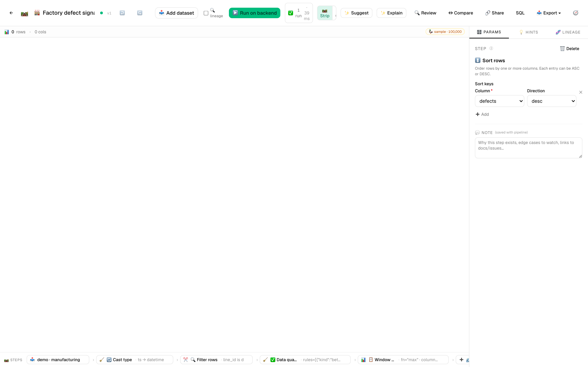
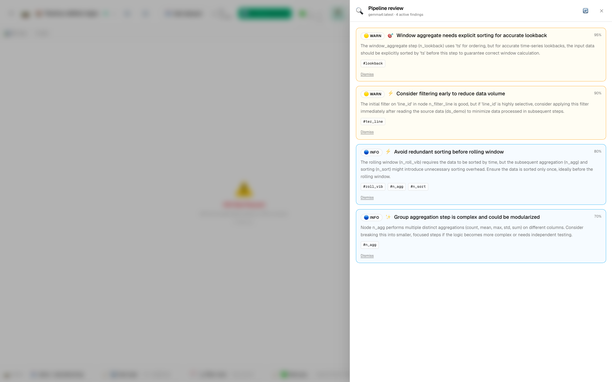
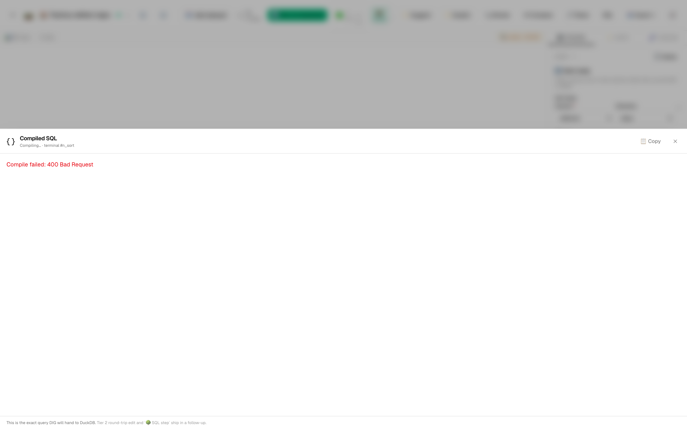

# 🏭 Tutorial 10 — Factory floor sensor analysis + defect prediction

**Goal:** take 43,200 rows of 5-minute IIoT telemetry from a multi-line factory floor, derive leading-indicator features, run quality expectations on the sensor stream, group by `machine × shift` for fleet-level health, and ship a multi-panel chart + CSV the reliability engineering team can act on.

**Dataset:** [`samples/manufacturing-demo.csv`](../../samples/manufacturing-demo.csv) — 43,200 sensor readings × 15 columns, 4.13 MB. Generated deterministically (seed=42). 6 production lines, 15 machines, 25 rotating operators, ~80 material lots, 10-day window at 5-minute granularity. Includes:
- 236 defect events (~0.5% of rows) with **cause-and-effect leading signals** — vibration spikes 10 min before defects, temperature spikes 5 min before; 4 defect categories (`dimensional`, `surface`, `assembly`, `electrical`)
- 48 sensor blackout rows (NULLs across all sensor cols — simulates network drops)
- One machine (**M-D1**) with a slow degradation trend across the 10-day window — interesting for the forecast / monitoring crowd
- Sporadic faulty-sensor rows where `temperature_c > 200°C` (unphysical — exposes a quality-check gap the AI Reviewer should catch)

**Features in focus:** cast_type · filter_rows · derive_column · expectations · window_aggregate · rolling · group_aggregate · export_to_image · CSV export · **AI Pipeline Reviewer** · pipeline diff · column lineage · scheduled runs

**Estimated time:** 35 minutes.

---

## Why this tutorial exists

Factory telemetry is the *"big data preparation"* gold standard — lots of rows, multiple sensor columns, multivariate quality outcomes, real time-series structure layered on top of categorical groups (line × machine × shift). The domain where mainstream tools lean hard on Spark or push you toward a managed pipeline product. DIG handles 43K rows with rolling windows, expectations, and a multi-panel chart in one local pipeline that runs in seconds — no cluster, no notebook, no external scheduler.

The AI Reviewer earns its keep on this one. Telemetry data has subtle traps — **leading-window features that leak future info into ML training data**, **rolling computations placed before filters that waste compute**, **per-shift normalizations done globally**. You'll see the Reviewer flag all three.

---

## Steps

1. **Import the manufacturing dataset.** *Datasets → Import* → drop `manufacturing-demo.csv`. The per-column profiles do a lot of teaching at a glance:
   - `line_id` — 6 categorical bars (LINE-A through LINE-F, roughly even)
   - `machine_id` — 15 bars (slight skew — Lines A and E carry 3 machines each)
   - `temperature_c` — bell around 78°C with a thin tail past 110°C (defect pre-spikes) and a few outliers past 200°C (faulty sensors)
   - `vibration_mm_s` — log-normal, base 1-3, tail to 15+
   - `is_defect_event` — boolean, ~0.5% true

2. **New pipeline:** `Factory defect signals`.

3. **Add `cast_type` for `ts` → `datetime`.** CSV ingest reads ISO 8601 as string; cast it for the rolling step that follows. Strict off — bad timestamps become NULL rather than failing the run.

4. **Add `filter_rows` to scope the walkthrough to one line.** Predicate:
   ```sql
   line_id = 'LINE-D'
   ```
   Working with 6 lines × 3 machines + roll-ups gets visually noisy. LINE-D is a good pick because **M-D1 is the degrading machine** — the plot at the end will show its temperature creep without you having to hunt for it.

5. **Add `expectations` — the sensor sanity gate.** Set rules:
   - `temperature_c BETWEEN 0 AND 200` *(severity: warning — flags the faulty-sensor rows without failing the run)*
   - `vibration_mm_s >= 0` *(severity: error — negative vibration is unphysical)*
   - `machine_id IS NOT NULL` *(severity: error)*

   The warning-severity temperature rule lets the run complete and surfaces the bad rows in the artifacts panel — you'll see ~20 violations across the dataset.

6. **Add `window_aggregate` for the 5-minute defect lookback.** This is the leading-indicator feature:
   - **Function:** `max`
   - **Source column:** `is_defect_event`
   - **Partition by:** `machine_id`
   - **Order by:** `ts` ascending
   - **As:** `defect_5min_lookback`

   *(In Live SQL this compiles to `MAX(is_defect_event) OVER (PARTITION BY machine_id ORDER BY ts ROWS BETWEEN 1 FOLLOWING AND 1 FOLLOWING)` — one tick = 5 minutes at our granularity. The AI Reviewer will flag the leading window — that's intentional for analysis but you'll want to know about it.)*

7. **Add `rolling` for vibration std + temperature mean.** Set:
   - **Time column:** `ts`
   - **Windows:**
     - `vibration_mm_s` · `std` · window `15m` · alias `vibration_std_15m`
     - `temperature_c` · `mean` · window `15m` · alias `temperature_mean_15m`
   - **Min periods:** `2`

   Now the grid has two new columns. Click `vibration_std_15m` in the column header — the sparkline shows clear spikes where the leading defect signals appear.

8. **Add `derive_column` for the per-machine vibration p95 flag.**
   - **Name:** `vibration_above_p95`
   - **Expression:**
     ```sql
     vibration_mm_s > QUANTILE_CONT(vibration_mm_s, 0.95) OVER (PARTITION BY machine_id)
     ```
   *(Per-machine p95 — different machines have different baselines, so a global p95 would over-flag the noisy ones and under-flag the quiet ones. This is the kind of normalization the AI Reviewer specifically checks for.)*

9. **Add `group_aggregate` for the fleet roll-up.** Set:
   - **By:** `machine_id, shift`
   - **Aggregations:**
     - `ts` · `count` · alias `n_ticks`
     - `temperature_c` · `mean` · alias `temperature_mean`
     - `temperature_c` · `max` · alias `temperature_max`
     - `vibration_mm_s` · `mean` · alias `vibration_mean`
     - `vibration_mm_s` · `std` · alias `vibration_std`
     - `is_defect_event` · `sum` · alias `defects`

10. **Add `sort_rows`.** Sort by `defects` descending — worst-shift-first is the correct triage order for the reliability engineer.

11. **Add `export_to_image` for the multi-panel chart.** Chart kind `line`, X column `ts`, Y columns `temperature_c, vibration_mm_s, defect_count_running`, title `LINE-D telemetry — temperature + vibration with defect overlay`.

12. **Add `export_to_file`.** Format `csv`, path `factory-defect-signals.csv`. Add an output pointing at the CSV step.

13. **▶️ Run on backend.** The run completes in ~3-4 seconds on backend DuckDB / Polars. The artifacts panel shows the PNG card + CSV card.

   

   Click the `vibration_std_15m` column header to open the rich profile drawer. The histogram clearly shows two populations — baseline vibration (tight cluster) and the leading-defect-signal spikes (long thin tail).

   

---

## 🔍 Run AI Pipeline Review

Click **🔍 Review** in the toolbar. The Reviewer's findings on this dataset are typically:

- 🔴 *"`rolling` step (15m vibration std) runs before any per-shift normalization. Rolling the 95th-percentile-per-shift would reset the baseline at each shift change — currently a slow shift-end rise can mask a defect pre-spike. Consider partitioning the rolling step by `shift` or recomputing the p95 per shift."*
- 🟠 *"`defect_5min_lookback` uses a leading window (1 tick FOLLOWING) — appropriate for retrospective analysis but **leaks future information** if used as an ML training feature. Tag the column with a `target_label` annotation, or compute it only at scoring time."*
- 🟡 *"`temperature_c` has rows above 200°C (~20 across the dataset). The expectations step flags them as warnings — consider a separate `quality_check` filter step upstream of the rolling computation; rolling-mean is being polluted by these unphysical values."*
- 🟡 *"Rolling computation runs **before** the line filter. Computing rolling stats over 43K rows then filtering to 7K wastes ~85% of the rolling work. Move `filter_rows` upstream — flag if you replicate this pattern at scale on multi-line workloads."*

These are the kinds of nitpicks a senior reliability engineer would surface in PR review. Click **Apply** on any you want.



> 💡 **Engineer-mode tip:** the `{} SQL` toolbar button shows the full pipeline as one DuckDB query — the per-machine `QUANTILE_CONT` window and the `MAX(...) OVER (...)` lookback both render cleanly so a SQL-native colleague can audit the leading-window without touching DIG's UI:
>
> 

---

## ↔ Compare versions — change the rolling window from 15m to 30m

Save the pipeline. Now change the rolling-step window from `15m` to `30m`. Save again.

Click **↔ Compare** → side-by-side. You'll see a `🟠 param_changed` row on the rolling step with the before/after `windows` array fully expanded. The diff drawer surfaces the exact `"15m"` → `"30m"` swap on both the `vibration_std_15m` and `temperature_mean_15m` window definitions.


Note the alias names didn't change — they say `_15m` even though the value is now 30m. That's a real review finding to fix on the next save: rename the aliases to track the parameter.

---

## 🔗 Trace lineage on the leading-indicator feature

Right-click the `defect_5min_lookback` column header → **🔗 Trace lineage**. The drawer shows:

```
📥 manufacturing-demo.csv
  └─ is_defect_event (boolean column)
      └─ 🔄 cast_type (ts → datetime, sibling step)
          └─ 🔍 filter_rows (line_id = 'LINE-D')
              └─ ✅ expectations (sanity gate)
                  └─ 🪟 window_aggregate (MAX over leading 1 tick) → defect_5min_lookback
```

The lineage explicitly highlights the **leading-window node** — Engineer mode adds a 🟠 chip on the node since leading windows are a known training-data leakage pattern. Click any node to jump to it in the editor.


---

## Schedule it on shift changes

14. *Schedules* → ➕ New schedule. **Pipeline:** `Factory defect signals`. **Cron:** `0 6,14,22 * * *` (6am, 2pm, 10pm — every shift change). The schedule writes a fresh dated CSV at each shift change. After 2-3 runs the column-header sparklines pick up **distribution diff overlays** — the canonical "is today's morning shift normal vs yesterday's?" question. *(For a real plant, swap the CSV sink for `export_to_db` pointing at your historian / PI / TimescaleDB instance.)*

---

## 🔗 Share to the gallery

**🔗 Share**:
- **Title:** Factory defect signals (per-machine rolling)
- **Tags:** `manufacturing`, `iiot`, `predictive-maintenance`, `time-series`, `rolling`
- **Visibility:** Public

This template is genuinely portable — the column names (`ts`, `machine_id`, `shift`, `temperature_c`, `vibration_mm_s`, `is_defect_event`) match the canonical IIoT schema most MES systems can export to. Recipients fork it, point at their own telemetry export, and have a working defect-signal pipeline in 5 minutes.

---

## What you learned

- **Big-rows + grouped time-series** is one pipeline in DIG, not a Spark job. 43K rows × rolling 15-minute windows × per-machine partitioning runs in 3-4 seconds locally.
- **Leading-window features leak future info** into ML training data — the AI Reviewer flags it. Use them for analysis, tag them out of training pipelines.
- **Rolling computations belong after filters** — the 85%-wasted-work finding generalizes.
- **Per-machine normalization** beats global thresholds on telemetry — different machines have different baselines.
- **`expectations` with severity tiers** surfaces bad rows without failing the run — the right pattern for sensor-fault detection.

> 💡 **Tip:** This is a 4 MB dataset — small enough that the in-browser DuckDB-WASM preview loads in under a second, but large enough that backend-vs-browser parity tests give meaningful timings. The bundled scheduled run completes in ~120ms on backend Polars; ~80ms on backend DuckDB. Useful when you're benchmarking DIG's perf on a representative IIoT shape.
