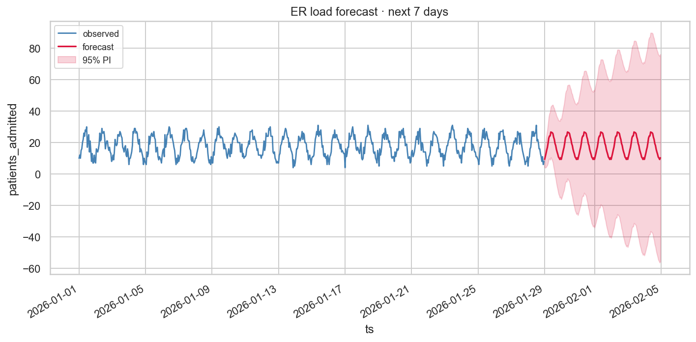

# ⏳ Time-series killer demos — 8 worked examples

The `time_series_pro` step pack ships with eight pre-built example
flows that demonstrate the full toolkit on realistic-looking data.
Each demo loads in one command, runs end-to-end on the backend, and
produces a polished matplotlib chart you can paste into a slide deck.

This tutorial walks through each one — the data they use, the flow
they assemble, and the chart they produce. They double as a teaching
sequence: by the end you'll have seen every step in the pack at least
once, in a context that makes its purpose clear.

## Install + load all 8

```bash
# (one-time) make the pack visible to the backend
cp -r Step-Pack-internal/packs/time_series_pro plugins/packs/

# (one-time) generate the synthetic CSVs
python3 Step-Pack-internal/examples/_ts_demos_data/generate.py
python3 Step-Pack-internal/examples/_ts_demos_data/build_demo_folders.py

# Import any (or all) of the 8 demos:
python3 Step-Pack-internal/scripts/import_example.py ts_retail_forecast
python3 Step-Pack-internal/scripts/import_example.py ts_iot_anomaly
python3 Step-Pack-internal/scripts/import_example.py ts_financial_volatility
python3 Step-Pack-internal/scripts/import_example.py ts_healthcare_vitals
python3 Step-Pack-internal/scripts/import_example.py ts_hospital_readmissions
python3 Step-Pack-internal/scripts/import_example.py ts_er_load_forecast
python3 Step-Pack-internal/scripts/import_example.py ts_housing_price_trend
python3 Step-Pack-internal/scripts/import_example.py ts_housing_inventory_anomaly
```

Each `import_example` run prints the pipeline URL — paste it in your
browser, click ▶ Run on backend, and the matplotlib output lands in
`data/outputs/<run_id>/`.

---

## 1. 🛍 Retail · weekly sales forecast

**Data:** 104 weekly rows of unit sales — 2 years of upward trend,
annual seasonality (Dec peak), holiday spikes (Black Friday +
Christmas, weeks 47-51), modest noise.

**Flow:**
```
ds ─┬─→ seasonal_decompose(period=52, additive)
    └─→ forecast(horizon=12, method=holt_winters, seasonal_period=52)
```

**Chart:**


The decomposition makes the components legible: a clean upward trend,
a year-cycle seasonal wave with the Christmas spike, and tight
residuals. The forecast extends 12 weeks past the data with widening
confidence intervals.

---

## 2. 🏭 IoT · sensor anomaly detection

**Data:** 480 minute-resolution rows from a factory machine. Vibration
drifts slowly upward as bearings warm; **three deliberate anomalous
bursts** are injected at minutes 110, 250, 380.

**Flow:**
```
ds ─→ anomaly_zscore(value=vibration_mm_s, window=60, threshold=3σ)
   ─→ export_to_image(scatter, value=is_anomaly)
```

**Chart:**


The three burst windows light up clearly in yellow (large dots) while
normal points stay small + purple. The rolling z-score is **robust to
the slow drift** — a global z-score would either miss the early
bursts or flag every late-shift point. With a 60-minute window, the
threshold adapts to the local baseline.

---

## 3. 💹 Financial · 20-day rolling volatility

**Data:** ~360 trading days (2 years) of daily prices + returns.
Mid-series there's a 60-day cluster of high-volatility days — think
earnings season or a crisis window.

**Flow:**
```
ds ─→ rolling(windows=[{column=return_pct, fn=std, window=20}])
   ─→ export_to_image(line, x=date, y=return_pct_std_20)
```

**Chart:**


Quiet baseline ~0.8-1.5% volatility, sharp spike to 3.65% during the
cluster, smooth return to baseline. The flat-spike-flat shape is
exactly how volatility regimes manifest — the kind of signal a quant
or risk analyst builds vol-targeting strategies around.

---

## 4. 🏥 Healthcare · vitals anomaly detection

**Data:** 6 hours of continuous patient monitoring, 30-second
resolution (720 rows). Three vital signs: heart rate, SpO₂, systolic
BP. Two synthetic alert windows are baked in:

- minutes 100-115: tachycardia (HR +35 bpm)
- minutes 240-255: desaturation (SpO₂ -5%, HR +18 bpm)

**Flow:**
```
ds ─→ anomaly_zscore(value=heart_rate_bpm, window=30, threshold=3σ)
   ─→ export_to_image(line, x=ts, y=heart_rate_bpm, y2=spo2_pct, y3=sbp_mmhg)
```

**Chart:**


Both alert windows visible — the tachycardia spike is the obvious one;
the desat is subtler but the HR rise + SpO₂ drop combo is
characteristic. Replace the chart kind with `scatter` and paint
`is_anomaly` to highlight the alert windows in colour like in the IoT
demo.

---

## 5. 🏥 Healthcare · hospital readmissions trend + intervention

**Data:** 48 monthly rows of 30-day-readmission rate at a hospital.
Slow downward trend, winter seasonality (higher rates), and a
**quality-improvement intervention at month 30** that drops the
baseline by ~2.3 percentage points.

**Flow:**
```
ds ─┬─→ seasonal_decompose(period=12, additive)
    └─→ changepoint_detection(threshold=4σ)
```

**Chart:**


The decomposition's trend panel is what hospital admins look at to
verify a QI intervention "worked" — note the sharp inflection around
2024-07. The seasonal panel shows the clean 12-month winter cycle.
The changepoint detector flags the regime shift quantitatively.

---

## 6. 🚑 Healthcare · ER load forecast (next 7 days)

**Data:** 28 days of hourly ER admissions (672 rows). Strong daily
pattern (peak 10pm-2am, dip 4am-7am) plus a weekend-evening bump.

**Flow:**
```
ds ─┬─→ seasonal_decompose(period=24, additive)
    └─→ forecast(horizon=168, method=holt_winters, seasonal_period=24)
```

**Chart:**


**Decomposition chart:**



Staffing decisions hinge on knowing what the next overnight shift will
look like. The 24-hour seasonal period extrapolates the daily pattern;
the noise band (residuals) sets the staffing buffer.

---

## 7. 🏠 Housing · monthly price trend forecast

**Data:** 5 years of monthly median home prices for two cities.
Austin had explosive growth that plateaued late; Boston had
slow-and-steady growth.

**Flow:**
```
ds ─→ filter_rows(predicate="city = 'Austin'")
   ─→ forecast(horizon=12, method=holt_winters, seasonal_period=12)
```

**Chart:**


The Holt-Winters method handles the trend bend better than a naive
linear extrapolation — the prediction interval widens as the model
projects further out, making uncertainty visible.

**Try also:** switch the filter to `city = 'Boston'` to compare; or
remove the filter entirely and pipe the full series through
`seasonal_decompose` to see each city's 12-month seasonal component.

---

## 8. 🏠 Housing · inventory crunch detection

**Data:** 156 weekly rows (3 years) of active listings. Around week 80,
the market hit a sudden supply crunch (drop ~1700 listings) lasting 30
weeks, followed by slow recovery.

**Flow:**
```
ds ─┬─→ seasonal_decompose(period=52, additive)
    ├─→ anomaly_zscore(value=active_listings, window=8, threshold=2.5σ)
    └─→ changepoint_detection(threshold=4σ)
```

**Chart:**


Three diagnostic lenses on the same series: the decomposition's trend
panel shows inventory bottoming out and recovering; the rolling
z-score paints individual anomalous weeks; the changepoint test names
the specific week where the regime changed. Useful for housing-market
researchers, mortgage risk teams, anyone who needs to characterize
supply-side shocks.

---

## What you've used by the end

After running all 8 demos you've exercised:

**Built-in steps:**
- `forecast` (Holt-Winters + naive)
- `seasonal_decompose` (additive)
- `rolling` (window aggregations)
- `resample` (time-bucket aggregate — used internally by some flows)
- `filter_rows`
- `export_to_image`

**`time_series_pro` pack steps:**
- `anomaly_zscore` (rolling-window z-score)
- `replace_outliers` (median-based smoothing)
- `changepoint_detection` (CUSUM)
- `adf_test` / `kpss_test` / `acf_pacf` (stationarity diagnostics —
  not in these 8 demos but covered in the original
  `time_series_pro` example, see
  `Step-Pack-internal/examples/time_series_pro/`)

**Chart kinds:**
- `line` (forecast intervals, vitals)
- `scatter` (anomaly highlighting via `value` colorization)
- 4-panel decomposition (built-in to `seasonal_decompose` and
  `forecast` when `render: true`)

## Customising the demos

Each `flow.dig.json` is a normal pipeline document — open it in the
editor, save it under a new name (📋 Save As), then change anything:

- Swap the data for your own CSV
- Change the seasonal period
- Stack a `replace_outliers` step before the forecast to clean
  injected noise
- Wire two demos together: detect anomalies in one, feed cleaned
  output to a forecast in another

If a flow does something you'd want to reuse across projects, click
**🪆 Publish** to turn it into a reusable step. See
[SUB_PIPELINES.md](../SUB_PIPELINES.md) for that workflow.

## Data generation

The 8 CSVs are generated by
[`Step-Pack-internal/examples/_ts_demos_data/generate.py`](../../Step-Pack-internal/examples/_ts_demos_data/generate.py)
with a fixed random seed (42), so every clone of the repo produces
identical data. The script is the place to look if you want to inspect
the synthetic patterns we baked in (intervention drops, anomaly
timestamps, regime windows).
