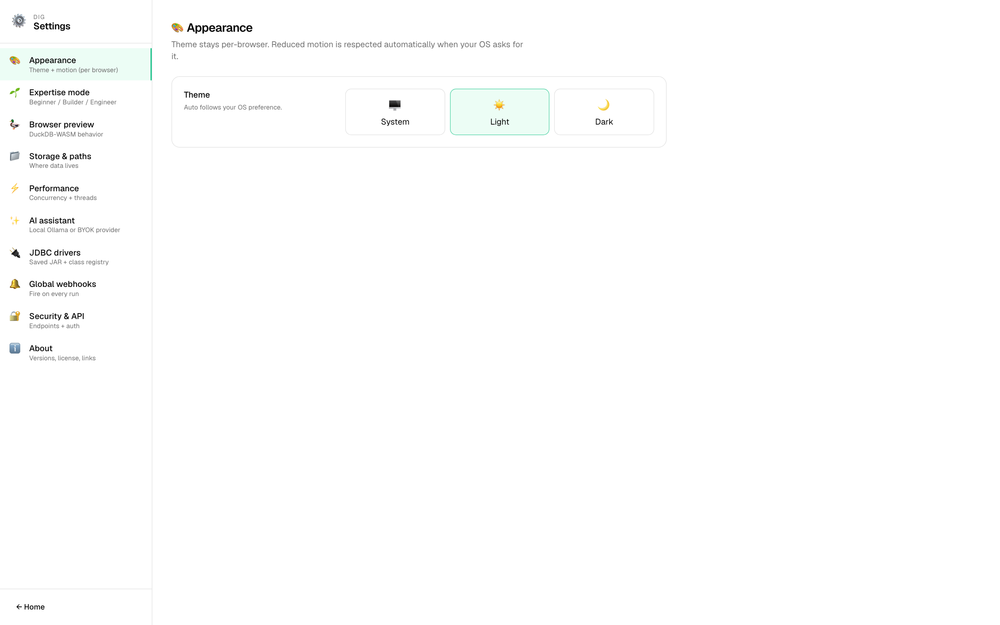
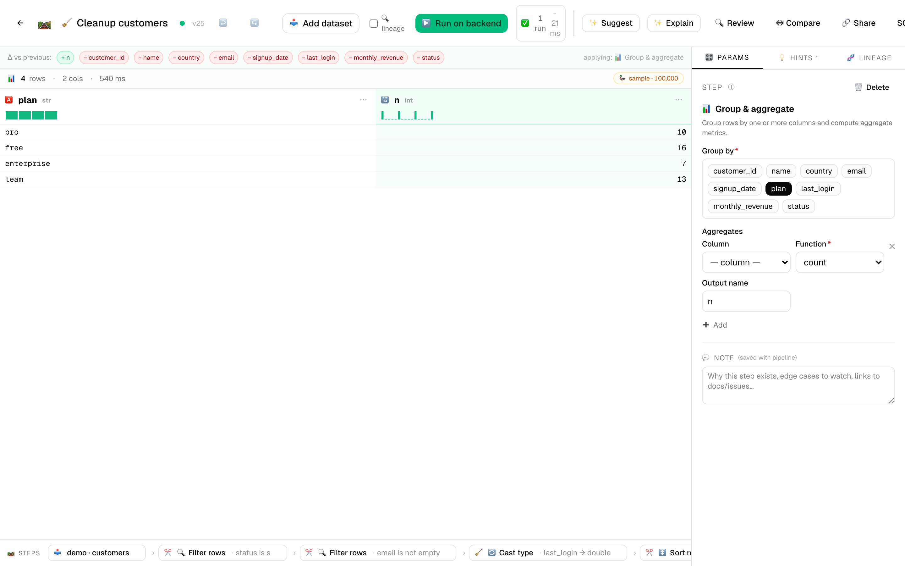
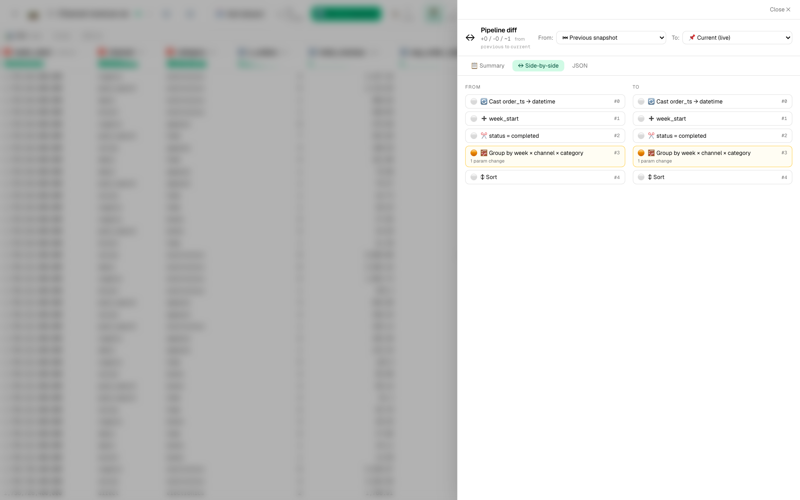
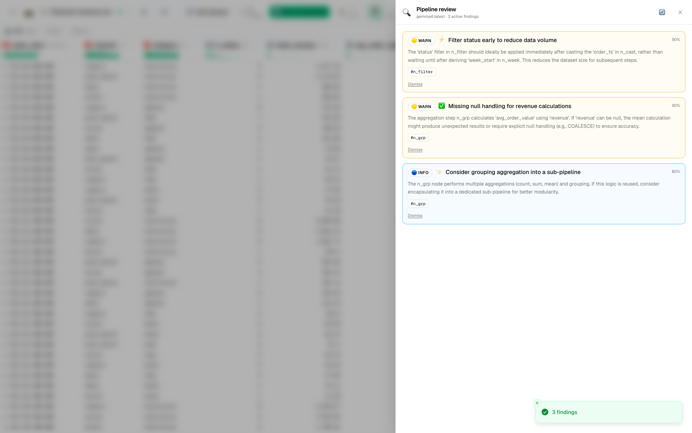
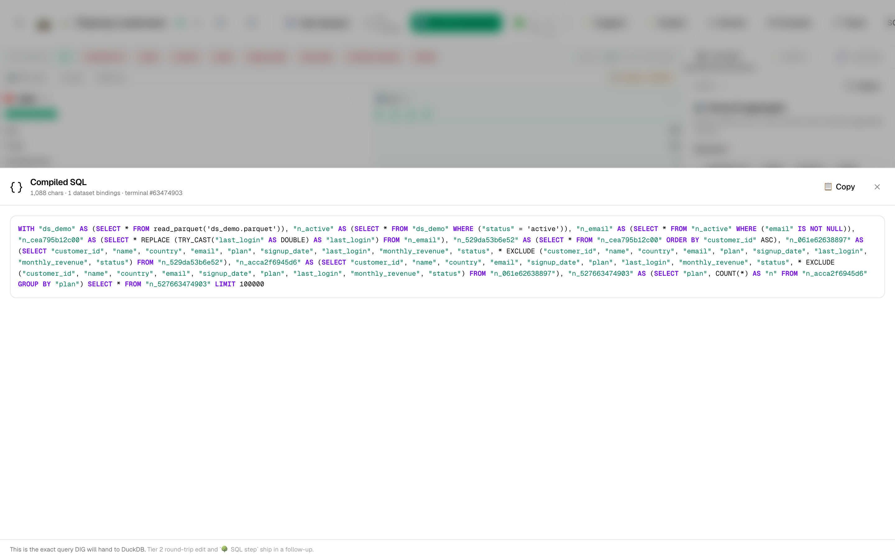
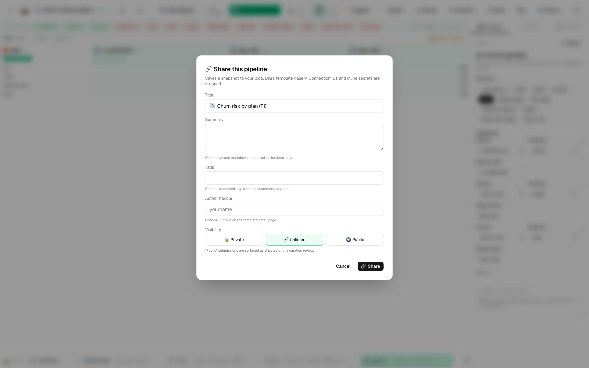
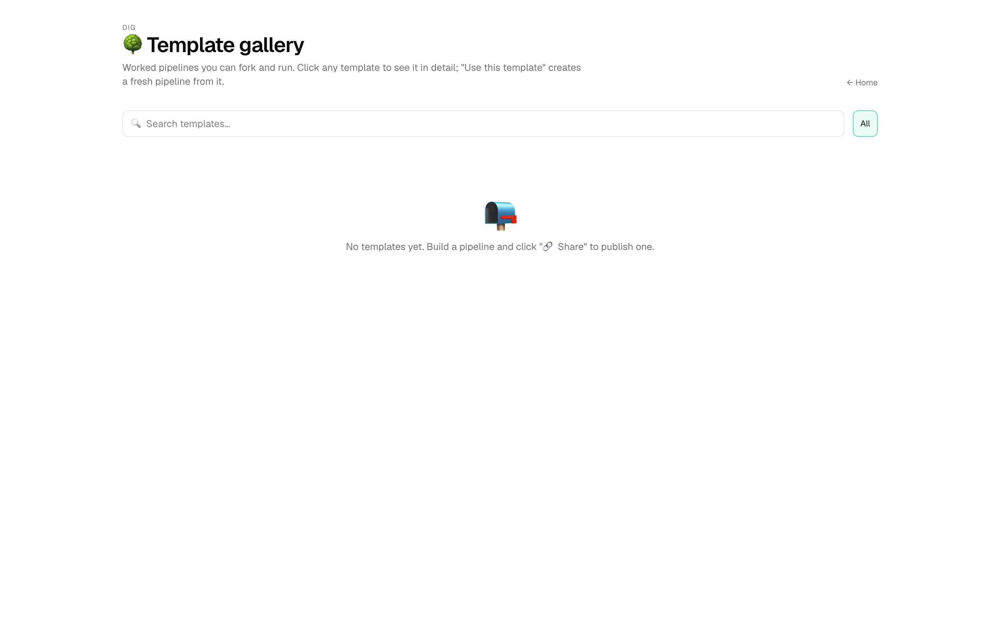
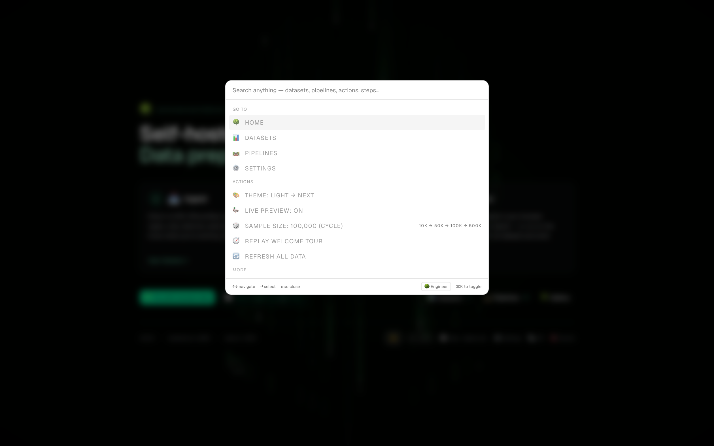

# 🌳 Real-world tutorials

Ten longer walkthroughs that take a complete scenario end-to-end — from raw data to a deployed pipeline that produces something useful. Each one uses the bundled sample datasets so you can follow along without bringing your own data.

These pair with the [first-steps tutorials](../tutorials.md) (which cover individual mechanics) and assume you've finished at least one of those — they don't re-explain how to import a CSV or open the editor.

Each tutorial showcases the advanced surfaces: adaptive UI mode switching, pipeline diff, AI review, column lineage, inline histograms, the live SQL toggle, sharing to the gallery, and the dbt + reverse-ETL connectors.

| # | Tutorial | Dataset | Features in focus |
|---|---|---|---|
| 1 | [Customer churn risk score](01-customer-churn.md) | `customers-demo.csv` | derive · group_aggregate · AI review · pipeline diff |
| 2 | [Sales seasonality + outlier alerts](02-sales-seasonality.md) | `sales-demo.csv` | seasonal_decompose · expectations · CSV export · scheduled runs |
| 3 | [Geospatial customer mapping](03-geospatial-customers.md) | `customers-demo.csv` + `cities-demo.csv` | join · pack_struct · cast to geographic · geo_distance |
| 4 | [ML feature engineering + k-means](04-ml-feature-engineering.md) | `flowers-demo.csv` | pca · kmeans · column lineage · share to gallery |
| 5 | [Stock forecast + drift monitoring](05-forecast-monitoring.md) | `stock-demo.csv` | forecast · scheduled runs · distribution diff · AI review |
| 6 | [E-commerce channel revenue + AI cleanup](06-ecommerce-channel-revenue.md) | `orders-demo.csv` | expectations · group_aggregate · AI review (rich findings) · CSV export |
| 7 | [Airfoil aerodynamics: drag polars + L/D peak](07-airfoil-aerodynamics.md) | `aerodynamics-demo.csv` | filter · expectations · derive · group_aggregate · pivot_wider · export_to_image |
| 8 | [Exoplanet candidate analysis + habitable-zone scoring](08-exoplanet-discovery.md) | `astronomy-demo.csv` | derive (NULLIF) · expectations · pivot_wider · export_to_image · AI review · column lineage |
| 9 | [Macroeconomic indicators dashboard](09-macro-indicators.md) | `economy-demo.csv` | rolling · seasonal_decompose · expectations · group_aggregate · export_to_image |
| 10 | [Factory floor sensor analysis + defect prediction](10-factory-defect-prediction.md) | `manufacturing-demo.csv` | rolling · window_aggregate · expectations · AI review · column lineage · scheduled runs |

> **New sample dataset:** `samples/orders-demo.csv` (5,023 e-commerce orders with built-in data quality wrinkles — 3% missing emails, weekly + holiday seasonality, long-tail fulfillment times) powers tutorial 6. Generated deterministically (seed=42) so re-runs produce identical numbers.

> **New sample dataset:** `samples/aerodynamics-demo.csv` (17,568 rows of stylized wind-tunnel airfoil polars across 12 NACA profiles × 6 Reynolds numbers × 61 angles of attack × 4 replicate runs, ≈1.4 MB; 1.5% missing transition-point readings simulate sensor dropouts) powers tutorial 7. Generated deterministically (seed=42) by `samples/_generators/airfoil_polars.py`.

> **New sample dataset:** `samples/astronomy-demo.csv` (12,500 synthetic exoplanet candidates loosely modeled on NASA's Exoplanet Archive — 2.7% legacy `equilibrium_temp_k = -1` sentinels, 2.2% NULL transit durations, realistic 24/56/19 disposition mix across Kepler / K2 / TESS) powers tutorial 8. Generated deterministically (seed=42) by `samples/_generators/exoplanet_candidates.py`.

> **New sample dataset:** `samples/economy-demo.csv` (16,224 monthly macro observations across 52 countries, 2000-2025, ≈1.5 MB; 1% NULL unemployment, CHN policy-rate gap pre-2015, VEN/ARG hyperinflation episodes, 2008/2020 GDP shocks) powers tutorial 9. Generated deterministically (seed=42) by `samples/_generators/macro_indicators.py`.

> **New sample dataset:** `samples/manufacturing-demo.csv` (43,200 rows of 5-minute IIoT telemetry across 6 lines × 15 machines × 25 operators, 10-day window, ≈4.1 MB; 0.5% defect events with leading-indicator vibration + temperature spikes, 48 sensor blackout NULLs, M-D1 degradation trend) powers tutorial 10 — the **largest** of the bundled samples. Generated deterministically (seed=42) by `samples/_generators/factory_telemetry.py`.

> **Mode tip:** These tutorials assume Builder mode (the default after your first 25 actions, or set explicitly in *Settings → 🌱 Expertise mode*). Tutorial 5 specifically uses Engineer-mode features (Live SQL view, raw lineage graph). Press `⌘⇧E` any time to cycle modes.

> **Tip:** Every tutorial ends with a "Share to the gallery" step so you (and the next person) can re-open the finished pipeline with one click. The shared template is also a good base for AI Pipeline Review — `🔍 Review` will surface ideas for taking each one further.

---

## 📸 Feature showcase

A quick visual tour of the new surfaces these tutorials use. Capture from a live DIG running locally; see [Lifecycle reference](../lifecycle.md) for the start scripts.

### 🌱 Expertise mode — three modes, switch any time

Settings → 🌱 Expertise mode. Beginner is the default for first-time users; Builder unlocks after 25 actions; Engineer is opt-in.

### 🛤 The new pipeline editor toolbar

Every new feature has a button: `🔍 Review` (AI Pipeline Reviewer), `↔ Compare` (Pipeline Diff), `🔗 Share` (Template Gallery), `{ } SQL` (Engineer-only — Live SQL view).

Notice the **inline column histograms** in the grid header — `plan` (categorical, 4 bars) and `n` (numeric).

### ↔ Pipeline diff — what changed between two versions

Click `↔ Compare` to open the diff drawer. Beginner mode gets the unified Summary view; Builder gets Side-by-side; Engineer adds JSON.

### 🔍 AI Pipeline Reviewer

Click `🔍 Review` to ask the configured LLM (local Ollama, OpenAI, or Anthropic) for severity-ranked findings.

### { } Live SQL view (Engineer mode)

Toggle between visual + SQL with the `{} SQL` toolbar button. Tier-1 read-only ships today; Tier-2 round-trip edit follows.

### 🔗 Share to the gallery

Click `🔗 Share` to publish your pipeline. Secrets are stripped before storage; URL is copied to your clipboard.

### 🌳 Template gallery

`/gallery` lists every template — yours and the curated set. Click one → "⚡ Use this template" forks it into your pipelines.

### ⌘K command palette + mode pill

The footer mode pill in the command palette is your fast lane between modes — `⌘⇧E` cycles directly without opening settings.

